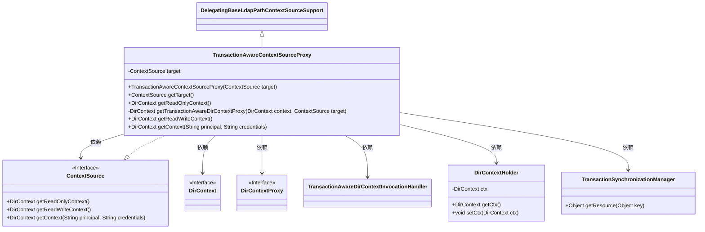
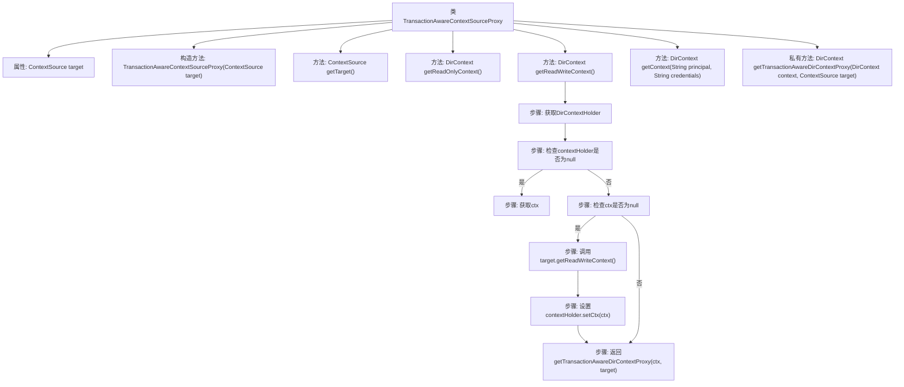

# 基础信息

|      |      |
|------|------|
| 名称 | TransactionAwareContextSourceProxy |
| 编码语言 | .java |
| 代码路径 | spring-ldap/core/src/main/java/org/springframework/ldap/transaction/compensating/manager/TransactionAwareContextSourceProxy.java |
| 包名 | org.springframework.ldap.transaction.compensating.manager |
| 依赖项 | ['java.lang.reflect.Proxy', 'javax.naming.directory.DirContext', 'org.springframework.ldap.core.ContextSource', 'org.springframework.ldap.core.DirContextProxy', 'org.springframework.ldap.core.support.DelegatingBaseLdapPathContextSourceSupport', 'org.springframework.ldap.support.LdapUtils', 'org.springframework.transaction.support.TransactionSynchronizationManager'] |
| 概述说明 | 事务感知LDAP上下文管理代理类。 |

# 说明

TransactionAwareContextSourceProxy代理类是一个用于实现事务感知的LDAP上下文管理的工具。其主要功能是确保在事务处理过程中，LDAP上下文的管理与事务状态保持一致，从而保证数据的一致性和完整性。该代理类通过拦截和管理LDAP操作，确保在事务提交或回滚时，相应的LDAP操作能够正确执行或撤销。这种机制特别适用于需要在事务中集成LDAP操作的复杂应用场景，提供了更高的可靠性和控制能力。

# 类列表 Class Summary

| 名称   | 类型  | 说明 |
|-------|------|-------------|
| TransactionAwareContextSourceProxy | class | TransactionAwareContextSourceProxy代理类，实现事务感知的LDAP上下文管理。 |

## 类 TransactionAwareContextSourceProxy

|      |      |
|------|------|
| 访问范围 | public |
| 类型 | class |
| 名称 | TransactionAwareContextSourceProxy |
| 说明 | TransactionAwareContextSourceProxy代理类，实现事务感知的LDAP上下文管理。 |

### UML类图

### 描述
`TransactionAwareContextSourceProxy` 是一个代理类，实现了 `ContextSource` 接口，并继承自 `DelegatingBaseLdapPathContextSourceSupport`。它通过 `getReadWriteContext` 方法获取事务感知的 `DirContext` 对象，并在事务上下文中管理 `DirContext` 的生命周期。该类依赖于 `TransactionSynchronizationManager` 来获取事务资源，并使用 `TransactionAwareDirContextInvocationHandler` 来处理 `DirContext` 的代理逻辑。

### 内部方法调用关系图

这段代码定义了一个`TransactionAwareContextSourceProxy`类，该类继承自`DelegatingBaseLdapPathContextSourceSupport`并实现了`ContextSource`接口。该类的主要功能是通过代理模式管理`DirContext`对象，确保在事务上下文中正确地获取和操作`DirContext`。流程图展示了`getReadWriteContext`方法的执行流程，包括获取`DirContextHolder`、检查`contextHolder`和`ctx`的状态、调用目标`ContextSource`的方法以及返回代理对象的过程。

### 字段列表 Field List

| 名称  | 类型  | 说明 |
|-------|-------|------|
| target | ContextSource | 声明一个私有ContextSource类型的目标变量。 |

### 方法列表 Method List

| 名称  | 类型  | 说明 |
|-------|-------|------|
| getTarget | ContextSource | 重写方法返回目标ContextSource对象。 |
| getReadOnlyContext | DirContext | 重写方法返回读写上下文作为只读上下文。 |
| getContext | DirContext | 重写方法获取上下文，返回目标对象的上下文。 |
| getReadWriteContext | DirContext | 获取读写上下文，若不存在则从目标获取并设置，返回事务感知代理。 |
| getTransactionAwareDirContextProxy | DirContext | 创建事务感知的DirContext代理，使用代理实例处理上下文和目标源。 |

