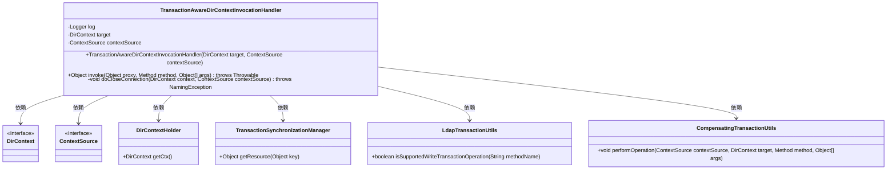

# 基础信息

|      |      |
|------|------|
| 名称 | TransactionAwareDirContextInvocationHandler |
| 编码语言 | .java |
| 代码路径 | spring-ldap/core/src/main/java/org/springframework/ldap/transaction/compensating/manager/TransactionAwareDirContextInvocationHandler.java |
| 包名 | org.springframework.ldap.transaction.compensating.manager |
| 依赖项 | ['java.lang.reflect.InvocationHandler', 'java.lang.reflect.InvocationTargetException', 'java.lang.reflect.Method', 'javax.naming.directory.DirContext', 'org.slf4j.Logger', 'org.slf4j.LoggerFactory', 'org.springframework.ldap.NamingException', 'org.springframework.ldap.core.ContextSource', 'org.springframework.ldap.transaction.compensating.LdapTransactionUtils', 'org.springframework.transaction.compensating.support.CompensatingTransactionUtils', 'org.springframework.transaction.support.TransactionSynchronizationManager'] |
| 概述说明 | TransactionAwareDirContextInvocationHandler管理DirContext事务，支持关闭和写入操作。 |

# 说明

TransactionAwareDirContextInvocationHandler是一个用于处理DirContext事务操作的处理器，它支持事务的关闭和写入功能。该处理器确保在DirContext操作中能够正确地管理事务，提供事务的完整性和一致性。通过该处理器，可以有效地控制事务的生命周期，确保在事务提交或回滚时，相关的DirContext操作能够正确地执行。这种机制在处理需要事务支持的目录服务操作时非常有用，能够提高系统的可靠性和稳定性。

# 类列表 Class Summary

| 名称   | 类型  | 说明 |
|-------|------|-------------|
| TransactionAwareDirContextInvocationHandler | class | TransactionAwareDirContextInvocationHandler处理DirContext事务操作，支持关闭和写入事务。 |


## 类 TransactionAwareDirContextInvocationHandler

|      |      |
|------|------|
| 访问范围 | public |
| 类型 | class |
| 名称 | TransactionAwareDirContextInvocationHandler |
| 说明 | TransactionAwareDirContextInvocationHandler处理DirContext事务操作，支持关闭和写入事务。 |


### UML类图



这段代码描述了一个`TransactionAwareDirContextInvocationHandler`类，它实现了`InvocationHandler`接口，用于处理与事务相关的`DirContext`操作。该类通过`invoke`方法拦截并处理各种方法调用，如`getTargetContext`、`equals`、`hashCode`、`close`等。此外，它还包含一个`doCloseConnection`方法，用于在事务不活跃时关闭上下文。该类依赖于多个其他类和接口，如`DirContext`、`ContextSource`、`DirContextHolder`、`TransactionSynchronizationManager`、`LdapTransactionUtils`和`CompensatingTransactionUtils`，以实现其功能。


### 内部方法调用关系图

```mermaid
graph TD
    A["类TransactionAwareDirContextInvocationHandler"]
    B["属性: Logger log"]
    C["属性: DirContext target"]
    D["属性: ContextSource contextSource"]
    E["构造方法: TransactionAwareDirContextInvocationHandler(DirContext target, ContextSource contextSource)"]
    F["方法: Object invoke(Object proxy, Method method, Object[] args)"]
    G["方法: void doCloseConnection(DirContext context, ContextSource contextSource)"]
    H["判断: methodName == 'getTargetContext'"]
    I["判断: methodName == 'equals'"]
    J["判断: methodName == 'hashCode'"]
    K["判断: methodName == 'close'"]
    L["判断: LdapTransactionUtils.isSupportedWriteTransactionOperation(methodName)"]
    M["执行: CompensatingTransactionUtils.performOperation(contextSource, target, method, args)"]
    N["执行: method.invoke(target, args)"]
    O["抛出异常: throw ex.getTargetException()"]
    P["获取: DirContextHolder transactionContextHolder = TransactionSynchronizationManager.getResource(contextSource)"]
    Q["判断: transactionContextHolder == null || transactionContextHolder.getCtx() != context"]
    R["执行: context.close()"]
    S["日志: log.debug('Closing context')"]
    T["日志: log.debug('Leaving transactional context open')"]

    A --> B
    A --> C
    A --> D
    A --> E
    A --> F
    A --> G
    F --> H
    H -->|是| C
    H -->|否| I
    I -->|是| Boolean.FALSE
    I -->|否| J
    J -->|是| hashCode()
    J -->|否| K
    K -->|是| G
    K -->|否| L
    L -->|是| M
    L -->|否| N
    N -->|异常| O
    G --> P
    P --> Q
    Q -->|是| R
    Q -->|否| T
    R --> S
```

这段代码定义了一个`TransactionAwareDirContextInvocationHandler`类，它实现了`InvocationHandler`接口，用于处理`DirContext`的代理调用。代码的核心逻辑在`invoke`方法中，根据不同的方法名执行不同的操作，如获取目标上下文、关闭连接、执行事务操作等。`doCloseConnection`方法用于关闭上下文，但只有在上下文不与当前事务关联时才会执行关闭操作。代码通过日志记录上下文的状态变化，确保事务的一致性。

### 字段列表 Field List

| 名称  | 类型  | 说明 |
|-------|-------|------|
| target | DirContext | 定义私有目标目录上下文变量target。 |
| contextSource | ContextSource | 定义私有变量contextSource，类型为ContextSource。 |
| log = LoggerFactory.getLogger(TransactionAwareDirContextInvocationHandler.class) | Logger | 声明私有静态日志变量，用于TransactionAwareDirContextInvocationHandler类。 |

### 方法列表 Method List

| 名称  | 类型  | 说明 |
|-------|-------|------|
| doCloseConnection | void | 关闭非事务性DirContext连接，事务性上下文保持打开。 |
| invoke | Object | invoke方法处理代理对象的方法调用，包括getTargetContext、equals、hashCode、close及事务操作。 |


