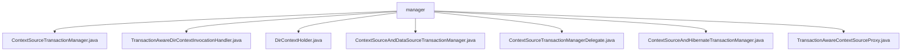

# 基础信息

|      |      |
|------|------|
| 名称 | manager |
| 编码语言 | .java |
| 代码路径 | spring-ldap/core/src/main/java/org/springframework/ldap/transaction/compensating/manager |
| 包名 | spring-ldap.core.src.main.java.org.springframework.ldap.transaction.compensating.manager |
| 概述说明 | ContextSourceTransactionManager通过委托类处理事务，提升灵活性和可维护性。TransactionAwareDirContextInvocationHandler确保DirContext事务完整。DirContextHolder管理事务中的DirContext对象。ContextSourceAndDataSourceTransactionManager已弃用，不支持嵌套事务。ContextSourceTransactionManagerDelegate管理LDAP事务和补偿操作。ContextSourceAndHibernateTransactionManager已弃用，不推荐使用。TransactionAwareContextSourceProxy确保LDAP上下文与事务状态一致。 |

# 说明

## 概述
该代码模块主要围绕LDAP（轻量级目录访问协议）事务管理展开，提供了多种类和工具来确保LDAP操作在事务中的一致性、完整性和可靠性。模块的核心设计采用了委托模式，将具体的事务操作逻辑委托给其他类执行，从而简化了核心事务管理器的复杂性，并提高了代码的可维护性和扩展性。模块中的类涵盖了事务管理器的实现、事务感知的上下文代理、事务处理器、以及上下文资源的管理等功能。此外，模块中还包含了一些已弃用的类，这些类主要用于集成LDAP与其他技术（如Hibernate和数据源）的事务管理，但由于技术演进或架构调整，这些集成方案不再推荐使用。

## 主要业务场景
1. **LDAP事务管理**：通过`ContextSourceTransactionManager`和`ContextSourceTransactionManagerDelegate`等类，模块提供了对LDAP事务的管理功能，确保在LDAP操作中事务的一致性和完整性，特别是在需要回滚或补偿时，能够有效管理和恢复上下文资源。
2. **事务感知的上下文管理**：`TransactionAwareContextSourceProxy`和`TransactionAwareDirContextInvocationHandler`等类用于实现事务感知的LDAP上下文管理，确保在事务处理过程中，LDAP上下文的管理与事务状态保持一致，从而保证数据的一致性和完整性。
3. **上下文资源管理**：`DirContextHolder`类负责管理事务中的`DirContext`对象，提供了设置和获取`DirContext`的方法，确保在事务处理过程中对`DirContext`的有效管理和访问。
4. **已弃用的集成方案**：模块中包含了一些已弃用的类，如`ContextSourceAndDataSourceTransactionManager`和`ContextSourceAndHibernateTransactionManager`，这些类主要用于集成LDAP与其他技术（如数据源和Hibernate）的事务管理，但由于技术演进或架构调整，这些集成方案不再推荐使用。

### 包内部结构视图

该流程图展示了`spring-ldap`项目中`manager`目录下的文件结构。`manager`作为根节点，包含了多个Java文件，这些文件分别处理与LDAP事务管理相关的功能。每个文件都直接依赖于`manager`目录，没有进一步的子目录层级。这种结构反映了代码的组织方式，便于管理和维护。

# 文件列表 File List

| 名称   | 类型  | 说明 |
|-------|------|-------------|
| [TransactionAwareContextSourceProxy.java](TransactionAwareContextSourceProxy.md) | file | 事务感知LDAP上下文管理代理类。 |
| [ContextSourceAndDataSourceTransactionManager.java](ContextSourceAndDataSourceTransactionManager.md) | file | 已弃用类，管理数据源与LDAP事务，不支持嵌套事务。 |
| [ContextSourceTransactionManager.java](ContextSourceTransactionManager.md) | file | ContextSourceTransactionManager继承AbstractPlatformTransactionManager，委托处理事务操作。 |
| [ContextSourceAndHibernateTransactionManager.java](ContextSourceAndHibernateTransactionManager.md) | file | Hibernate与LDAP事务管理器类已弃用，用于集成两种事务处理。 |
| [ContextSourceTransactionManagerDelegate.java](ContextSourceTransactionManagerDelegate.md) | file | ContextSourceTransactionManagerDelegate类管理LDAP事务和上下文资源，支持补偿操作。 |
| [DirContextHolder.java](DirContextHolder.md) | file | DirContextHolder类负责管理事务中的DirContext，提供设置和获取功能。 |
| [TransactionAwareDirContextInvocationHandler.java](TransactionAwareDirContextInvocationHandler.md) | file | TransactionAwareDirContextInvocationHandler管理DirContext事务，支持关闭和写入操作。 |

