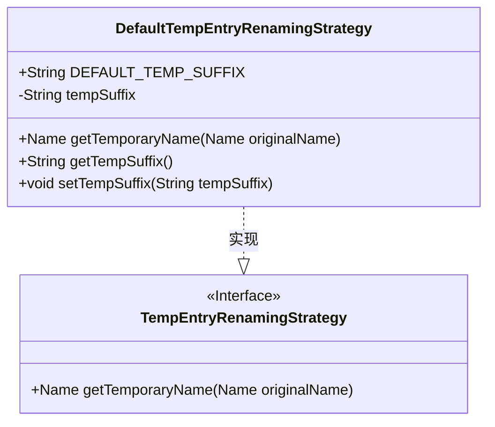
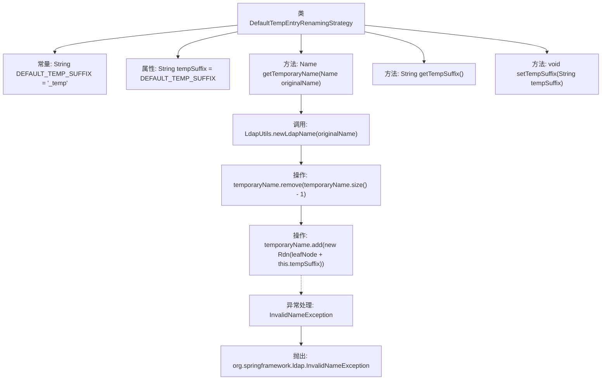

# 基础信息

|      |      |
|------|------|
| 名称 | DefaultTempEntryRenamingStrategy |
| 编码语言 | .java |
| 代码路径 | spring-ldap/core/src/main/java/org/springframework/ldap/transaction/compensating/support/DefaultTempEntryRenamingStrategy.java |
| 包名 | org.springframework.ldap.transaction.compensating.support |
| 依赖项 | ['javax.naming.InvalidNameException', 'javax.naming.Name', 'javax.naming.ldap.LdapName', 'javax.naming.ldap.Rdn', 'org.springframework.ldap.support.LdapUtils', 'org.springframework.ldap.transaction.compensating.TempEntryRenamingStrategy'] |
| 概述说明 | 默认临时条目重命名策略支持自定义后缀，默认后缀为"_temp"。 |

# 说明

默认临时条目重命名策略支持用户自定义后缀，若用户未指定，则系统自动采用默认后缀"_temp"。该策略确保临时条目在重命名时具有一致性和可识别性，便于管理和区分。

# 类列表 Class Summary

| 名称   | 类型  | 说明 |
|-------|------|-------------|
| DefaultTempEntryRenamingStrategy | class | 默认临时条目重命名策略，支持自定义后缀，默认后缀为"_temp"。 |

## 类 DefaultTempEntryRenamingStrategy

|      |      |
|------|------|
| 访问范围 | public |
| 类型 | class |
| 名称 | DefaultTempEntryRenamingStrategy |
| 说明 | 默认临时条目重命名策略，支持自定义后缀，默认后缀为"_temp"。 |

### UML类图

类图描述：
`DefaultTempEntryRenamingStrategy` 类实现了 `TempEntryRenamingStrategy` 接口，用于为临时条目生成临时名称。该类包含一个默认的临时后缀 `DEFAULT_TEMP_SUFFIX`，并通过 `getTemporaryName` 方法在原始名称的末尾添加该后缀来生成临时名称。`getTempSuffix` 和 `setTempSuffix` 方法分别用于获取和设置临时后缀。该类主要用于处理LDAP事务中的临时条目重命名。

### 内部方法调用关系图

这段代码定义了一个名为 `DefaultTempEntryRenamingStrategy` 的类，用于生成临时名称的策略。该类包含一个常量 `DEFAULT_TEMP_SUFFIX` 作为默认的临时后缀，以及一个属性 `tempSuffix` 用于存储当前使用的后缀。`getTemporaryName` 方法通过操作 `LdapName` 对象，将临时后缀添加到原始名称的末尾，并处理可能的 `InvalidNameException` 异常。`getTempSuffix` 和 `setTempSuffix` 方法分别用于获取和设置临时后缀。

### 字段列表 Field List

| 名称  | 类型  | 说明 |
|-------|-------|------|
| DEFAULT_TEMP_SUFFIX = "_temp" | String | 默认临时文件后缀为"_temp"。 |
| tempSuffix = DEFAULT_TEMP_SUFFIX | String | 定义私有字符串变量tempSuffix并初始化为DEFAULT_TEMP_SUFFIX。 |

### 方法列表 Method List

| 名称  | 类型  | 说明 |
|-------|-------|------|
| getTempSuffix | String | 方法返回对象的临时后缀字符串。 |
| setTempSuffix | void | 设置临时后缀的Java方法。 |
| getTemporaryName | Name | 方法getTemporaryName为原始名称添加临时后缀并返回新名称。 |

