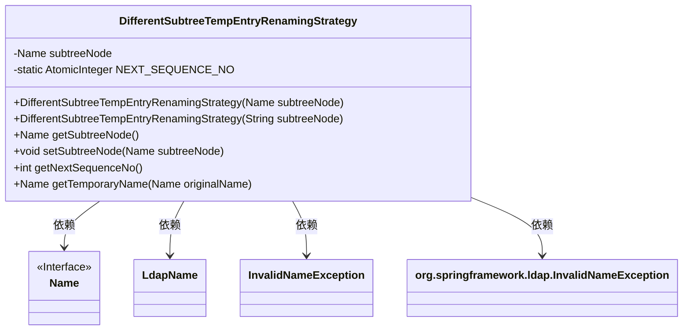
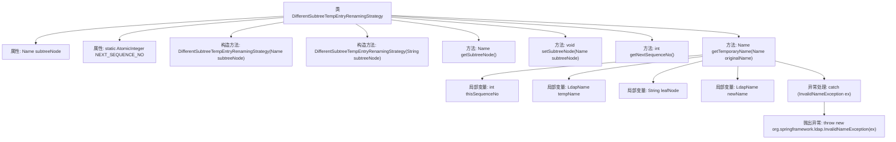

# 基础信息

|      |      |
|------|------|
| 名称 | DifferentSubtreeTempEntryRenamingStrategy |
| 编码语言 | .java |
| 代码路径 | spring-ldap/core/src/main/java/org/springframework/ldap/transaction/compensating/support/DifferentSubtreeTempEntryRenamingStrategy.java |
| 包名 | org.springframework.ldap.transaction.compensating.support |
| 依赖项 | ['java.util.concurrent.atomic.AtomicInteger', 'javax.naming.InvalidNameException', 'javax.naming.Name', 'javax.naming.ldap.LdapName', 'org.springframework.ldap.support.LdapUtils', 'org.springframework.ldap.transaction.compensating.TempEntryRenamingStrategy'] |
| 概述说明 | 实现临时条目重命名策略，生成子树节点和序列号的唯一名称。 |

# 说明

该内容描述了一种实现临时条目重命名的策略，旨在通过结合子树节点信息和序列号来生成唯一的名称。这种方法确保了每个条目在特定上下文中具有独特性，避免了命名冲突，并提高了系统的可管理性和可追溯性。通过利用子树节点和序列号的组合，策略能够有效地区分和标识临时条目，确保其在复杂结构中的唯一性和可识别性。

# 类列表 Class Summary

| 名称   | 类型  | 说明 |
|-------|------|-------------|
| DifferentSubtreeTempEntryRenamingStrategy | class | 实现临时条目重命名策略，生成基于子树节点和序列号的唯一名称。 |

## 类 DifferentSubtreeTempEntryRenamingStrategy

|      |      |
|------|------|
| 访问范围 | public |
| 类型 | class |
| 名称 | DifferentSubtreeTempEntryRenamingStrategy |
| 说明 | 实现临时条目重命名策略，生成基于子树节点和序列号的唯一名称。 |

### UML类图

### 描述
`DifferentSubtreeTempEntryRenamingStrategy` 类实现了一个临时条目重命名策略，主要用于LDAP目录中的子树操作。该类通过`subtreeNode`属性标识子树节点，并使用`NEXT_SEQUENCE_NO`生成唯一的序列号。`getTemporaryName`方法根据原始名称和序列号生成临时名称，若名称无效则抛出`InvalidNameException`。该类依赖于`Name`、`LdapName`、`InvalidNameException`等接口和异常类。

### 内部方法调用关系图

该流程图描述了`DifferentSubtreeTempEntryRenamingStrategy`类的结构和主要方法调用关系。类中包含两个构造方法、多个属性和方法，以及一个异常处理流程。`getTemporaryName`方法通过生成临时名称来处理LDAP条目重命名，并在遇到无效名称时抛出异常。流程图清晰地展示了类内部各部分的逻辑关系，帮助理解代码的执行流程。

### 字段列表 Field List

| 名称  | 类型  | 说明 |
|-------|-------|------|
| subtreeNode | Name | 定义私有变量subtreeNode。 |
| NEXT_SEQUENCE_NO = new AtomicInteger(1) | AtomicInteger | 私有静态原子整型变量，初始值为1。 |

### 方法列表 Method List

| 名称  | 类型  | 说明 |
|-------|-------|------|
| getNextSequenceNo | int | 获取并返回下一个序列号。 |
| getSubtreeNode | Name | 获取子树节点的方法。 |
| getTemporaryName | Name | 生成临时名称并返回新LDAP名称，处理无效名称异常。 |
| setSubtreeNode | void | 设置子树节点的方法，接受Name类型参数。 |

