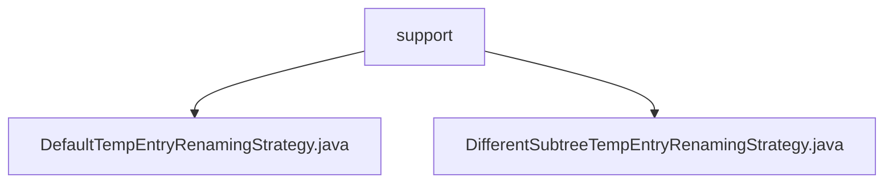

# 基础信息

|      |      |
|------|------|
| 名称 | support |
| 编码语言 | .java |
| 代码路径 | spring-ldap/core/src/main/java/org/springframework/ldap/transaction/compensating/support |
| 包名 | spring-ldap.core.src.main.java.org.springframework.ldap.transaction.compensating.support |
| 概述说明 | 默认临时条目重命名策略支持自定义后缀，未指定时用"_temp"，确保一致性和可识别性。 |

# 说明

## 概述
该代码模块主要处理LDAP（轻量级目录访问协议）事务中的临时条目重命名策略。模块提供了两种不同的重命名策略，确保临时条目在重命名时具有唯一性和可识别性，便于系统管理和区分。这些策略通过结合子树节点信息和序列号来生成唯一的名称，从而避免命名冲突，并提高系统的可管理性和可追溯性。

## 主要业务场景
1. **默认临时条目重命名策略**：支持用户自定义后缀，若用户未指定，则系统自动采用默认后缀"_temp"。该策略确保临时条目在重命名时具有一致性和可识别性，便于管理和区分。
2. **不同子树临时条目重命名策略**：通过结合子树节点信息和序列号来生成唯一的名称。这种方法确保了每个条目在特定上下文中具有独特性，避免了命名冲突，并提高了系统的可管理性和可追溯性。该策略特别适用于复杂LDAP结构中的临时条目管理。

### 包内部结构视图

该流程图展示了`spring-ldap`项目中`support`文件夹下的两个文件`DefaultTempEntryRenamingStrategy.java`和`DifferentSubtreeTempEntryRenamingStrategy.java`的层级关系。`support`作为父节点，直接包含这两个文件，反映了它们在项目结构中的位置和依赖关系。

# 文件列表 File List

| 名称   | 类型  | 说明 |
|-------|------|-------------|
| [DefaultTempEntryRenamingStrategy.java](DefaultTempEntryRenamingStrategy.md) | file | 默认临时条目重命名策略支持自定义后缀，默认后缀为"_temp"。 |
| [DifferentSubtreeTempEntryRenamingStrategy.java](DifferentSubtreeTempEntryRenamingStrategy.md) | file | 实现临时条目重命名策略，生成子树节点和序列号的唯一名称。 |

