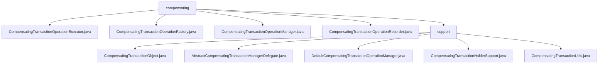

# 基础信息

|      |      |
|------|------|
| 名称 | compensating |
| 编码语言 | .java |
| 代码路径 | spring-ldap/core/src/main/java/org/springframework/transaction/compensating |
| 包名 | spring-ldap.core.src.main.java.org.springframework.transaction.compensating |
| 概述说明 | 补偿事务管理模块确保事务完整性、一致性及异常恢复能力。 |

# 说明

## 概述

该代码模块主要围绕补偿事务管理展开，提供了一套完整的机制来确保事务的完整性、一致性以及在异常情况下的恢复能力。模块中的类通过抽象、继承和工具类的设计，实现了事务操作的统一管理，包括事务的获取、执行、回滚、提交以及资源释放等核心功能。这种设计不仅提高了代码的复用性和可维护性，还为复杂的业务逻辑提供了可靠的事务管理支持。

## 主要业务场景

1. **事务补偿操作**：在系统发生异常或错误时，模块能够通过补偿事务机制将系统恢复到一致状态。例如，`CompensatingTransactionObject`类负责管理`CompensatingTransactionHolderSupport`实例的获取和设置，确保在需要时能够有效地执行补偿操作。

2. **事务资源管理**：模块中的抽象类（如`AbstractCompensatingTransactionManagerDelegate`）定义了补偿事务的核心流程，确保资源在使用后能够正确释放，事务操作能够按照预期执行。具体实现由子类完成，以适应不同的业务场景和需求。

3. **事务操作管理**：`DefaultCompensatingTransactionOperationManager`类负责管理事务操作，提供执行、回滚和提交功能，确保事务处理的完整性和一致性。这种机制适用于需要严格事务控制的业务场景。

4. **事务状态处理**：`CompensatingTransactionUtils`类作为一个工具类，提供了静态方法来处理事务补偿操作。它能够根据事务状态的不同，执行相应的补偿操作或直接调用目标方法，确保在不同事务环境下操作的正确执行。

5. **事务资源的获取与维护**：`CompensatingTransactionHolderSupport`抽象类具备支持补偿事务的功能，能够有效地管理事务操作并获取所需的事务资源。这种机制为复杂的业务逻辑提供了可靠的事务管理支持。

通过这些业务场景，该模块能够有效应对系统中事务管理的各种需求，确保事务处理的可靠性和一致性。

### 包内部结构视图

该流程图展示了`compensating`目录下的文件结构。`compensating`作为根节点，包含了多个操作执行器、工厂、管理器和记录器文件。此外，`compensating`下还有一个`support`子目录，其中包含了多个支持类文件，如事务对象、事务管理器委托、默认操作管理器等。这些文件共同构成了一个完整的事务补偿机制。

# 文件列表 File List

| 名称   | 类型  | 说明 |
|-------|------|-------------|
| [CompensatingTransactionOperationManager.java](CompensatingTransactionOperationManager.md) | file | 输入内容为空，无法生成概要描述。 |
| [CompensatingTransactionOperationFactory.java](CompensatingTransactionOperationFactory.md) | file | 无内容可总结。 |
| [CompensatingTransactionOperationRecorder.java](CompensatingTransactionOperationRecorder.md) | file | 输入内容为空，请提供具体信息以便生成概要描述。 |
| [CompensatingTransactionOperationExecutor.java](CompensatingTransactionOperationExecutor.md) | file | 内容为空，无法生成概要描述。 |
| [support](support/_module.md) | package | 多个类管理补偿事务，确保事务操作、回滚、提交及资源释放，支持系统异常恢复。 |

