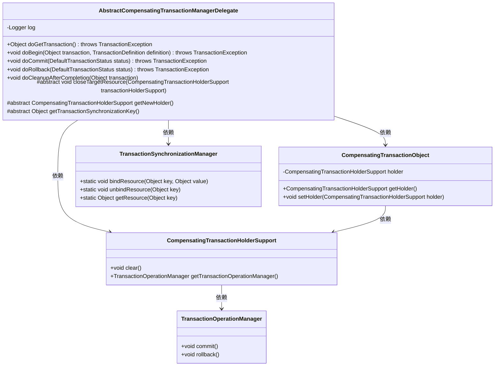
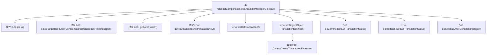

# 基础信息

|      |      |
|------|------|
| 名称 | AbstractCompensatingTransactionManagerDelegate |
| 编码语言 | .java |
| 代码路径 | spring-ldap/core/src/main/java/org/springframework/transaction/compensating/support/AbstractCompensatingTransactionManagerDelegate.java |
| 包名 | org.springframework.transaction.compensating.support |
| 依赖项 | ['org.slf4j.Logger', 'org.slf4j.LoggerFactory', 'org.springframework.transaction.CannotCreateTransactionException', 'org.springframework.transaction.TransactionDefinition', 'org.springframework.transaction.TransactionException', 'org.springframework.transaction.support.DefaultTransactionStatus', 'org.springframework.transaction.support.TransactionSynchronizationManager'] |
| 概述说明 | 抽象类管理补偿事务，处理资源获取、关闭及事务操作。 |

# 说明

抽象类管理补偿事务，主要负责获取和关闭资源，以及执行事务操作。该类通过抽象方法定义了补偿事务的核心流程，确保资源在使用后能够正确释放，事务操作能够按照预期执行。具体实现由子类完成，以适应不同的业务场景和需求。该设计提高了代码的复用性和可维护性，确保事务管理的统一性和可靠性。

# 类列表 Class Summary

| 名称   | 类型  | 说明 |
|-------|------|-------------|
| AbstractCompensatingTransactionManagerDelegate | class | 抽象类管理补偿事务，包含获取、关闭资源及事务操作。 |

## 类 AbstractCompensatingTransactionManagerDelegate

|      |      |
|------|------|
| 访问范围 | public abstract |
| 类型 | class |
| 名称 | AbstractCompensatingTransactionManagerDelegate |
| 说明 | 抽象类管理补偿事务，包含获取、关闭资源及事务操作。 |

### UML类图

### 描述
`AbstractCompensatingTransactionManagerDelegate` 是一个抽象类，用于管理补偿事务。它提供了事务的获取、开始、提交、回滚和清理等操作，并依赖于 `CompensatingTransactionHolderSupport` 和 `CompensatingTransactionObject` 来管理事务状态。`TransactionSynchronizationManager` 用于资源的绑定和解绑，`TransactionOperationManager` 则负责事务的提交和回滚操作。该类通过抽象方法 `closeTargetResource`、`getNewHolder` 和 `getTransactionSynchronizationKey` 允许子类实现特定的资源管理逻辑。

### 内部方法调用关系图

这段代码描述了一个抽象类 `AbstractCompensatingTransactionManagerDelegate`，它主要用于管理补偿事务的生命周期。类中包含多个抽象方法和具体方法，分别用于关闭目标资源、获取新的事务持有者、获取事务同步键、执行事务的获取、开始、提交、回滚以及清理操作。代码中还包含异常处理机制，确保在事务创建失败时能够抛出 `CannotCreateTransactionException` 异常。整体流程通过事务持有者对象 `CompensatingTransactionHolderSupport` 和事务对象 `CompensatingTransactionObject` 进行管理，确保事务的完整性和一致性。

### 字段列表 Field List

| 名称  | 类型  | 说明 |
|-------|-------|------|
| log = LoggerFactory.getLogger(AbstractCompensatingTransactionManagerDelegate.class) | Logger | 私有静态日志记录器用于抽象补偿事务管理器委托类。 |

### 方法列表 Method List

| 名称  | 类型  | 说明 |
|-------|-------|------|
| getNewHolder | CompensatingTransactionHolderSupport | 获取新的补偿事务持有者支持实例。 |
| doGetTransaction | Object | 获取事务资源并创建补偿事务对象。 |
| closeTargetResource | void | 抽象方法用于关闭目标资源，需传入事务持有者支持对象。 |
| getTransactionSynchronizationKey | Object | 获取事务同步键的抽象方法。 |
| doCommit | void | 方法doCommit执行事务提交，调用事务管理器的commit方法。 |
| doRollback | void | 事务回滚方法，调用事务对象的回滚操作。 |
| doCleanupAfterCompletion | void | 清理事务同步，解绑资源，关闭目标资源并清空持有者。 |
| doBegin | void | 方法doBegin处理事务开始，检查并绑定资源，异常时抛出事务创建失败异常。 |

