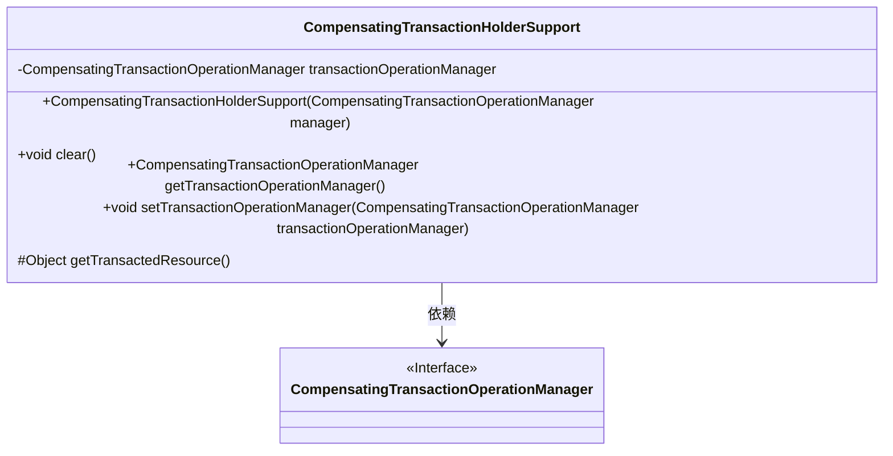
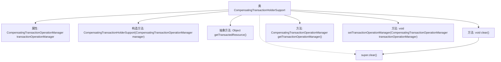

# 基础信息

|      |      |
|------|------|
| 名称 | CompensatingTransactionHolderSupport |
| 编码语言 | .java |
| 代码路径 | spring-ldap/core/src/main/java/org/springframework/transaction/compensating/support/CompensatingTransactionHolderSupport.java |
| 包名 | org.springframework.transaction.compensating.support |
| 依赖项 | ['org.springframework.transaction.compensating.CompensatingTransactionOperationManager', 'org.springframework.transaction.support.ResourceHolderSupport'] |
| 概述说明 | 抽象类管理事务操作，支持补偿事务并获取资源。 |

# 说明

抽象类具备支持补偿事务的功能，能够有效地管理事务操作并获取所需的事务资源。通过这种方式，抽象类确保了事务的完整性和一致性，为复杂的业务逻辑提供了可靠的事务管理机制。

# 类列表 Class Summary

| 名称   | 类型  | 说明 |
|-------|------|-------------|
| CompensatingTransactionHolderSupport | class | 抽象类支持补偿事务，管理事务操作并获取事务资源。 |

## 类 CompensatingTransactionHolderSupport

|      |      |
|------|------|
| 访问范围 | public abstract |
| 类型 | class |
| 名称 | CompensatingTransactionHolderSupport |
| 说明 | 抽象类支持补偿事务，管理事务操作并获取事务资源。 |

### UML类图

这段代码定义了一个抽象类 `CompensatingTransactionHolderSupport`，它继承自 `ResourceHolderSupport`。该类持有一个 `CompensatingTransactionOperationManager` 接口的实例，并提供了对该实例的获取和设置方法。此外，该类还定义了一个抽象方法 `getTransactedResource()`，用于获取事务资源。`clear()` 方法用于清除当前的事务操作管理器。该类主要用于管理事务操作，确保事务的正确执行和回滚。

### 内部方法调用关系图

这段代码定义了一个抽象类 `CompensatingTransactionHolderSupport`，它继承自 `ResourceHolderSupport`。该类包含一个 `CompensatingTransactionOperationManager` 类型的属性，并通过构造方法进行初始化。类中定义了一个抽象方法 `getTransactedResource()`，用于获取事务资源。此外，还提供了 `clear()` 方法用于清除资源，以及 `getTransactionOperationManager()` 和 `setTransactionOperationManager()` 方法用于获取和设置事务操作管理器。这个类主要用于管理事务操作，确保事务的补偿操作能够正确执行。

### 字段列表 Field List

| 名称  | 类型  | 说明 |
|-------|-------|------|
| transactionOperationManager | CompensatingTransactionOperationManager | 私有补偿事务操作管理器实例变量。 |

### 方法列表 Method List

| 名称  | 类型  | 说明 |
|-------|-------|------|
| setTransactionOperationManager | void | 设置事务操作管理器实例。 |
| getTransactedResource | Object | 获取受保护的事务资源对象。 |
| clear | void | 清除方法调用父类清除并置空事务管理器。 |
| getTransactionOperationManager | CompensatingTransactionOperationManager | 获取事务操作管理器实例。 |

