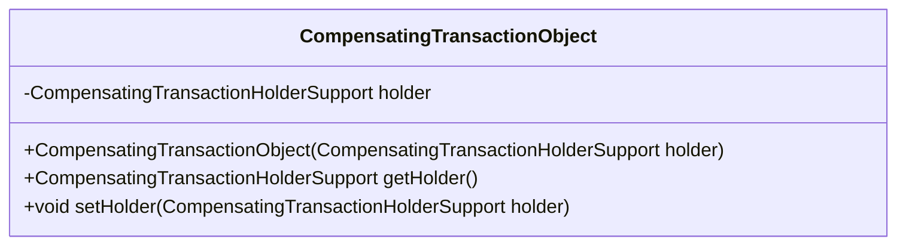
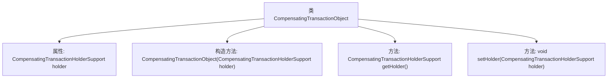

# 基础信息

|      |      |
|------|------|
| 名称 | CompensatingTransactionObject |
| 编码语言 | .java |
| 代码路径 | spring-ldap/core/src/main/java/org/springframework/transaction/compensating/support/CompensatingTransactionObject.java |
| 包名 | org.springframework.transaction.compensating.support |
| 依赖项 | [] |
| 概述说明 | CompensatingTransactionObject类负责管理CompensatingTransactionHolderSupport实例的获取和设置。 |

# 说明

CompensatingTransactionObject类负责管理CompensatingTransactionHolderSupport实例的获取和设置操作。该类的主要功能是确保CompensatingTransactionHolderSupport实例的正确初始化和维护，以便在需要时能够有效地获取或更新该实例的状态。通过这种管理机制，CompensatingTransactionObject类支持事务补偿操作的高效执行，确保系统在异常情况下能够恢复到一致状态。

# 类列表 Class Summary

| 名称   | 类型  | 说明 |
|-------|------|-------------|
| CompensatingTransactionObject | class | CompensatingTransactionObject类管理CompensatingTransactionHolderSupport实例的获取和设置。 |

## 类 CompensatingTransactionObject

|      |      |
|------|------|
| 访问范围 | public |
| 类型 | class |
| 名称 | CompensatingTransactionObject |
| 说明 | CompensatingTransactionObject类管理CompensatingTransactionHolderSupport实例的获取和设置。 |

### UML类图

类图描述：
`CompensatingTransactionObject` 类用于管理与事务相关的 `CompensatingTransactionHolderSupport` 对象。该类包含一个私有成员 `holder`，用于存储当前事务的 `CompensatingTransactionHolderSupport` 实例。通过构造函数、`getHolder` 和 `setHolder` 方法，可以分别初始化、获取和设置 `holder` 对象。该类的主要作用是封装和管理事务持有者，确保事务的正确执行和补偿。

### 内部方法调用关系图

这段代码定义了一个名为 `CompensatingTransactionObject` 的类，该类包含一个 `CompensatingTransactionHolderSupport` 类型的属性 `holder`。类中提供了一个构造方法，用于初始化 `holder` 属性，并提供了 `getHolder` 和 `setHolder` 方法，分别用于获取和设置 `holder` 属性的值。这段代码的主要作用是管理和操作与当前事务相关的 `CompensatingTransactionHolderSupport` 对象。

### 字段列表 Field List

| 名称  | 类型  | 说明 |
|-------|-------|------|
| holder | CompensatingTransactionHolderSupport | 私有变量holder支持补偿事务处理。 |

### 方法列表 Method List

| 名称  | 类型  | 说明 |
|-------|-------|------|
| getHolder | CompensatingTransactionHolderSupport | 获取补偿事务持有者支持对象。 |
| setHolder | void | 该方法用于设置补偿事务持有者支持对象。 |

