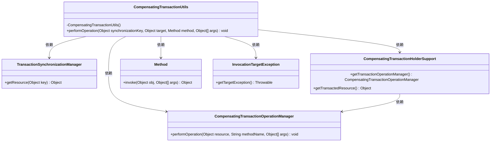
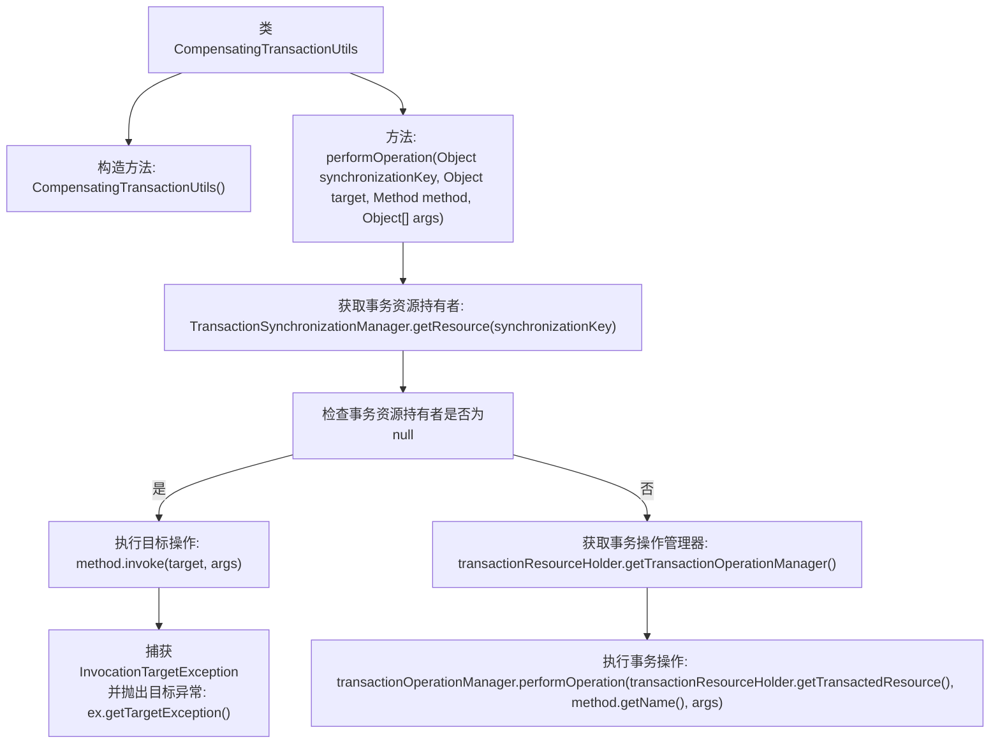

# 基础信息

|      |      |
|------|------|
| 名称 | CompensatingTransactionUtils |
| 编码语言 | .java |
| 代码路径 | spring-ldap/core/src/main/java/org/springframework/transaction/compensating/support/CompensatingTransactionUtils.java |
| 包名 | org.springframework.transaction.compensating.support |
| 依赖项 | ['java.lang.reflect.InvocationTargetException', 'java.lang.reflect.Method', 'org.springframework.transaction.compensating.CompensatingTransactionOperationManager', 'org.springframework.transaction.support.TransactionSynchronizationManager'] |
| 概述说明 | CompensatingTransactionUtils类提供事务补偿和直接调用目标方法的功能。 |

# 说明

CompensatingTransactionUtils类是一个工具类，主要提供静态方法用于处理事务补偿操作。当存在事务时，该类的方法会执行相应的补偿操作；而在没有事务的情况下，则直接调用目标方法。这种设计确保了在不同事务环境下，操作能够正确执行，避免了因事务状态不一致导致的问题。

# 类列表 Class Summary

| 名称   | 类型  | 说明 |
|-------|------|-------------|
| CompensatingTransactionUtils | class | CompensatingTransactionUtils类提供静态方法，用于在有事务时执行补偿操作，无事务时直接调用目标方法。 |

## 类 CompensatingTransactionUtils

|      |      |
|------|------|
| 访问范围 | public final |
| 类型 | class |
| 名称 | CompensatingTransactionUtils |
| 说明 | CompensatingTransactionUtils类提供静态方法，用于在有事务时执行补偿操作，无事务时直接调用目标方法。 |

### UML类图

这段代码描述了一个工具类 `CompensatingTransactionUtils`，它用于在事务环境中执行操作，并支持事务的提交和回滚。通过 `TransactionSynchronizationManager` 获取事务资源持有者 `CompensatingTransactionHolderSupport`，然后使用 `CompensatingTransactionOperationManager` 执行操作。如果没有活动的事务，则直接在目标对象上调用方法。代码中还处理了方法调用时可能抛出的 `InvocationTargetException` 异常。

### 内部方法调用关系图

这段代码描述了一个工具类 `CompensatingTransactionUtils`，主要用于在事务上下文中执行操作。首先，它通过 `TransactionSynchronizationManager` 获取事务资源持有者。如果存在事务资源持有者，则通过事务操作管理器执行事务操作；否则，直接调用目标方法。如果目标方法调用过程中抛出 `InvocationTargetException`，则捕获并抛出其目标异常。该流程确保了在事务和非事务环境下的操作一致性。

### 字段列表 Field List

| 名称  | 类型  | 说明 |
|-------|-------|------|

### 方法列表 Method List

| 名称  | 类型  | 说明 |
|-------|-------|------|
| performOperation | void | 根据同步键执行目标操作，支持事务补偿管理。 |

