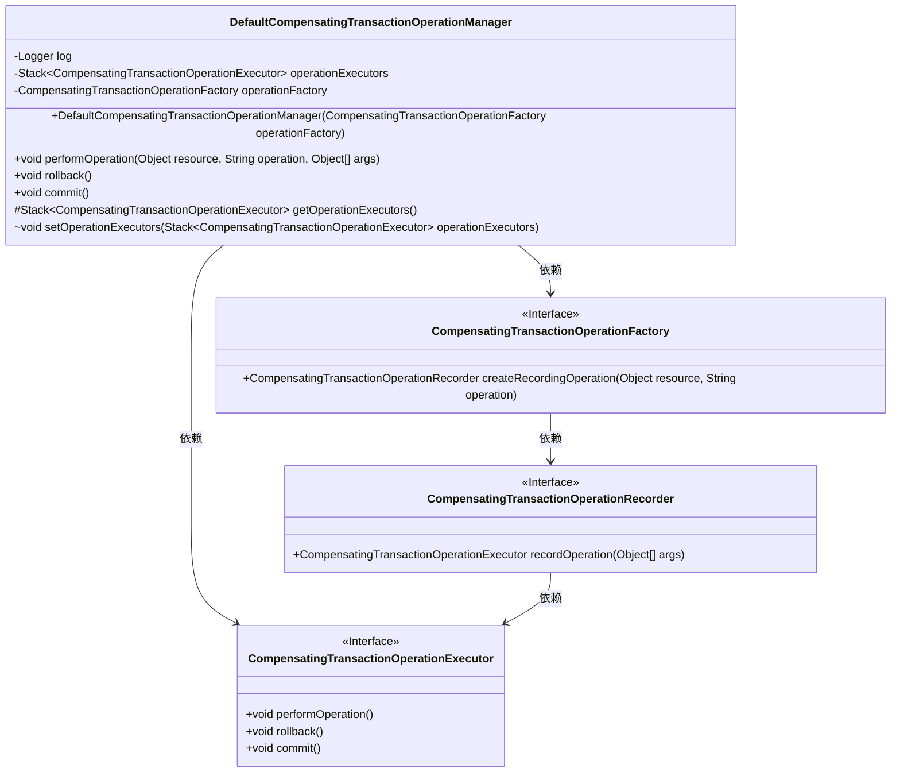
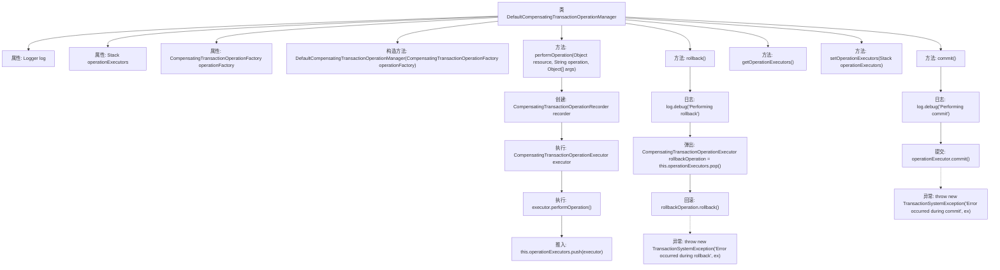

# 基础信息

|      |      |
|------|------|
| 名称 | DefaultCompensatingTransactionOperationManager |
| 编码语言 | .java |
| 代码路径 | spring-ldap/core/src/main/java/org/springframework/transaction/compensating/support/DefaultCompensatingTransactionOperationManager.java |
| 包名 | org.springframework.transaction.compensating.support |
| 依赖项 | ['java.util.Stack', 'org.slf4j.Logger', 'org.slf4j.LoggerFactory', 'org.springframework.transaction.TransactionSystemException', 'org.springframework.transaction.compensating.CompensatingTransactionOperationExecutor', 'org.springframework.transaction.compensating.CompensatingTransactionOperationFactory', 'org.springframework.transaction.compensating.CompensatingTransactionOperationManager', 'org.springframework.transaction.compensating.CompensatingTransactionOperationRecorder'] |
| 概述说明 | DefaultCompensatingTransactionOperationManager负责事务的执行、回滚和提交。 |

# 说明

DefaultCompensatingTransactionOperationManager负责管理事务操作，提供执行、回滚和提交功能，确保事务处理的完整性和一致性。

# 类列表 Class Summary

| 名称   | 类型  | 说明 |
|-------|------|-------------|
| DefaultCompensatingTransactionOperationManager | class | DefaultCompensatingTransactionOperationManager管理事务操作，支持执行、回滚和提交。 |

## 类 DefaultCompensatingTransactionOperationManager

|      |      |
|------|------|
| 访问范围 | public |
| 类型 | class |
| 名称 | DefaultCompensatingTransactionOperationManager |
| 说明 | DefaultCompensatingTransactionOperationManager管理事务操作，支持执行、回滚和提交。 |

### UML类图

### 描述
`DefaultCompensatingTransactionOperationManager` 是一个实现 `CompensatingTransactionOperationManager` 接口的类，用于管理补偿事务操作。它依赖于 `CompensatingTransactionOperationFactory` 来创建操作记录器，并通过 `CompensatingTransactionOperationExecutor` 执行具体的操作、回滚和提交。类图展示了它们之间的依赖关系，清晰地描述了各个组件如何协同工作以管理事务操作。

### 内部方法调用关系图

这段代码描述了一个用于管理补偿事务操作的类 `DefaultCompensatingTransactionOperationManager`。该类通过 `performOperation` 方法执行操作并记录执行器，`rollback` 方法用于回滚所有操作，`commit` 方法用于提交所有操作。代码还提供了用于测试的 `getOperationExecutors` 和 `setOperationExecutors` 方法。流程图中展示了各个方法之间的调用关系以及异常处理流程。

### 字段列表 Field List

| 名称  | 类型  | 说明 |
|-------|-------|------|
| operationExecutors = new Stack<>() | Stack<CompensatingTransactionOperationExecutor> | 私有栈存储补偿事务操作执行器实例。 |
| log = LoggerFactory.getLogger(DefaultCompensatingTransactionOperationManager.class) | Logger | 日志记录器初始化，用于DefaultCompensatingTransactionOperationManager类。 |
| operationFactory | CompensatingTransactionOperationFactory | 私有补偿事务操作工厂实例变量。 |

### 方法列表 Method List

| 名称  | 类型  | 说明 |
|-------|-------|------|
| performOperation | void | 方法执行操作并记录补偿事务，确保操作成功后推送执行器。 |
| setOperationExecutors | void | 设置操作执行器堆栈为指定值。 |
| commit | void | 方法执行提交操作，遍历操作执行器并逐一提交，捕获异常抛出事务系统错误。 |
| rollback | void | 执行回滚操作，逐一出栈并调用回滚方法，异常时抛出事务系统错误。 |
| getOperationExecutors | Stack<CompensatingTransactionOperationExecutor> | 获取操作执行器的受保护方法，返回当前操作执行器堆栈。 |

