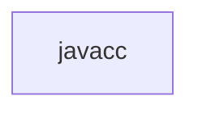

# 基础信息

|      |      |
|------|------|
| 名称 | javacc |
| 编码语言 | .java |
| 代码路径 | spring-ldap/core/src/main/javacc |
| 包名 | spring-ldap.core.src.main.javacc |
| 概述说明 | None |

# 说明

None

### 包内部结构视图

流程图描述：该流程图展示了路径 `spring-ldap/core/src/main/javacc` 的层级关系。路径的最后一级元素为 `javacc`，表示该路径指向一个名为 `javacc` 的文件夹或文件。由于路径仅包含一个层级，因此流程图只有一个节点。

# 文件列表 File List

| 名称   | 类型  | 说明 |
|-------|------|-------------|

