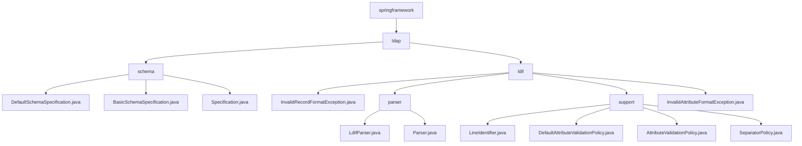

# 基础信息

|      |      |
|------|------|
| 名称 | springframework |
| 编码语言 | .java |
| 代码路径 | spring-ldap/ldif/ldif-core/src/main/java/org/springframework |
| 包名 | spring-ldap.ldif.ldif-core.src.main.java.org.springframework |
| 概述说明 | LDAP属性验证与合规性检查，LDIF文件解析与处理。 |

# 说明

## 概述

该代码模块主要围绕LDAP（轻量级目录访问协议）和LDIF（LDAP Data Interchange Format）文件的处理展开，涵盖了属性验证、策略合规性检查、文件解析和数据一致性处理等功能。模块的核心类包括 `DefaultSchemaSpecification`、`BasicSchemaSpecification` 和 `LdifParser`，它们分别负责验证 `LdapAttributes` 对象的合规性以及解析和验证LDIF文件的内容。通过这些功能，模块确保LDAP数据和LDIF文件的格式、结构和内容符合预定义的策略和标准，从而保证数据的一致性和合规性。

## 主要业务场景

1. **LDAP属性验证**：`DefaultSchemaSpecification` 和 `BasicSchemaSpecification` 类用于验证 `LdapAttributes` 对象的属性是否符合预定义的策略。这些策略可能涉及属性的格式、类型、值范围等，确保数据在LDAP目录中的一致性和有效性。

2. **数据合规性检查**：通过调用 `Specification` 接口的方法，模块能够确保 `LdapAttributes` 对象在结构、内容和格式上与预期策略一致。这一过程在数据导入、更新或同步时尤为重要，以避免不合规数据进入系统。

3. **LDIF文件解析**：`LdifParser` 类负责从资源中读取LDIF文件，并解析其内容，确保数据准确获取。`SeparatorPolicy` 类则负责评估LDIF文件的行格式，能够识别并处理版本、控制信息、变更类型、注释、续行、属性和新记录等多种标识，确保LDIF文件的内容能够被准确解析，并且符合LDAP标准。

4. **属性验证**：`DefaultAttributeValidationPolicy` 类专门用于验证LDAP属性，支持多种格式，包括标准、Base64、URL和UTF8。此外，该类还允许对属性值进行字母排序，确保数据的一致性和规范性。该功能在处理LDAP数据时非常重要，尤其是在数据导入或导出时，能够确保数据的合法性和一致性。

5. **记录规范化**：解析后的记录格式通过 `LdifParser` 类进行统一化处理，确保符合LDIF规范。

6. **大小写敏感控制**：`LdifParser` 类支持对解析过程中大小写敏感度的调整，以满足不同场景下的解析需求。

7. **通用解析接口**：`Parser` 接口可能定义了通用的解析方法或行为，供 `LdifParser` 类或其他解析类实现，确保模块的可扩展性和灵活性。

8. **异常处理**：模块中包含多个异常处理类，如 `InvalidRecordFormatException` 和 `InvalidAttributeFormatException`，用于在解析过程中捕获和处理特定的异常情况，确保系统在遇到无效记录格式或无效属性格式时能够进行适当的错误处理。

这些功能共同构成了一个完整的LDAP和LDIF文件处理模块，适用于需要处理LDAP数据的场景，如LDAP目录的导入导出、数据同步以及数据验证等。

### 包内部结构视图

该流程图展示了Spring LDAP项目中`ldif-core`模块的目录结构。从`springframework`开始，逐步展开到`ldap`目录，进一步分为`schema`和`ldif`子目录。`schema`目录包含多个Schema规范类，而`ldif`目录则包含解析器、支持类和异常处理类。每个子目录中的文件都清晰地展示了它们与上级目录的层级关系。

# 文件列表 File List

| 名称   | 类型  | 说明 |
|-------|------|-------------|
| [ldap](ldap/_module.md) | package | LDAP属性验证与合规性检查，LDIF文件解析与处理。 |

