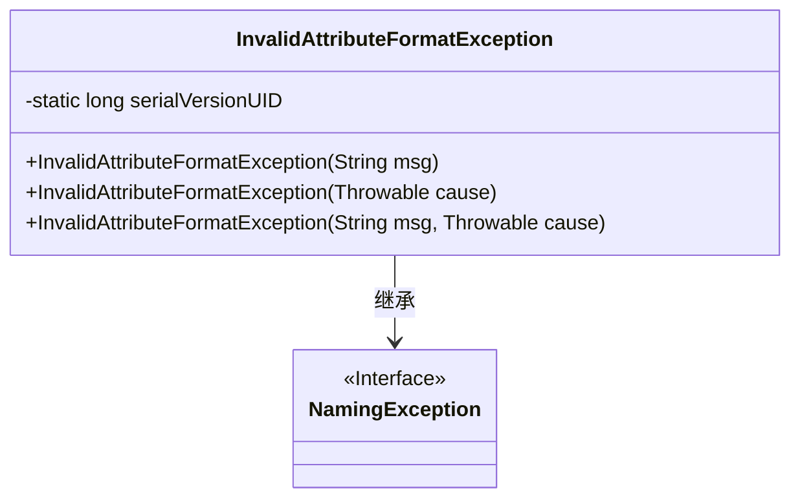
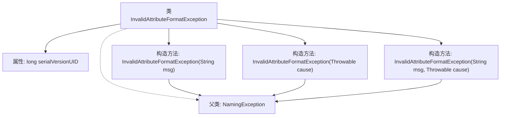

# 基础信息

|      |      |
|------|------|
| 名称 | InvalidAttributeFormatException |
| 编码语言 | .java |
| 代码路径 | spring-ldap/ldif/ldif-core/src/main/java/org/springframework/ldap/ldif/InvalidAttributeFormatException.java |
| 包名 | org.springframework.ldap.ldif |
| 依赖项 | ['org.springframework.ldap.NamingException'] |
| 概述说明 | InvalidAttributeFormatException继承NamingException，提供三种构造方法处理异常。 |

# 说明

InvalidAttributeFormatException继承自NamingException，提供了三种构造方法来处理异常信息。这些构造方法分别用于处理不同的异常场景，确保在遇到无效属性格式时能够准确地捕获和传递异常信息。

# 类列表 Class Summary

| 名称   | 类型  | 说明 |
|-------|------|-------------|
| InvalidAttributeFormatException | class | InvalidAttributeFormatException继承NamingException，提供三种构造方法处理异常信息。 |

## 类 InvalidAttributeFormatException

|      |      |
|------|------|
| 访问范围 | public |
| 类型 | class |
| 名称 | InvalidAttributeFormatException |
| 说明 | InvalidAttributeFormatException继承NamingException，提供三种构造方法处理异常信息。 |

### UML类图

### 描述：
`InvalidAttributeFormatException` 是一个自定义异常类，继承自 `NamingException` 接口。它提供了三种构造函数，分别用于处理异常信息、异常原因以及两者结合的情况。该类的 `serialVersionUID` 是一个静态常量，用于确保序列化时的版本一致性。通过继承 `NamingException`，`InvalidAttributeFormatException` 能够处理与命名相关的异常情况。

### 内部方法调用关系图

该流程图展示了`InvalidAttributeFormatException`类的结构及其与父类`NamingException`的关系。类中包含三个构造方法，分别接受`String`、`Throwable`以及两者的组合作为参数，并通过`super`调用父类的相应构造方法。`serialVersionUID`是类的静态属性，用于序列化时的版本控制。

### 字段列表 Field List

| 名称  | 类型  | 说明 |
|-------|-------|------|
| serialVersionUID = -4529380160785322985L | long | 定义序列化版本UID为-4529380160785322985L。 |

### 方法列表 Method List

| 名称  | 类型  | 说明 |
|-------|-------|------|

