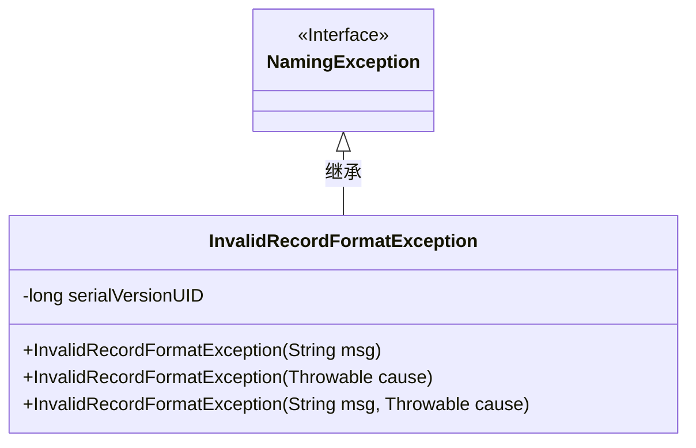
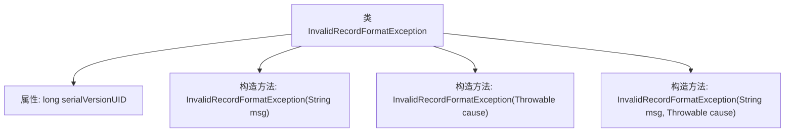

# 基础信息

|      |      |
|------|------|
| 名称 | InvalidRecordFormatException |
| 编码语言 | .java |
| 代码路径 | spring-ldap/ldif/ldif-core/src/main/java/org/springframework/ldap/ldif/InvalidRecordFormatException.java |
| 包名 | org.springframework.ldap.ldif |
| 依赖项 | ['org.springframework.ldap.NamingException'] |
| 概述说明 | InvalidRecordFormatException继承NamingException，提供三种构造方法处理异常。 |

# 说明

InvalidRecordFormatException是NamingException的子类，专门用于处理无效记录格式的异常。它提供了三种构造方法，分别用于不同的异常信息处理场景。这些构造方法允许开发者根据具体情况传递不同的异常信息，以便更精确地捕获和处理错误。通过继承NamingException，InvalidRecordFormatException能够在命名服务相关的上下文中有效管理异常，确保系统在遇到无效记录格式时能够进行适当的错误处理。

# 类列表 Class Summary

| 名称   | 类型  | 说明 |
|-------|------|-------------|
| InvalidRecordFormatException | class | InvalidRecordFormatException继承NamingException，提供三种构造方法处理异常信息。 |

## 类 InvalidRecordFormatException

|      |      |
|------|------|
| 访问范围 | public |
| 类型 | class |
| 名称 | InvalidRecordFormatException |
| 说明 | InvalidRecordFormatException继承NamingException，提供三种构造方法处理异常信息。 |

### UML类图

这段代码定义了一个名为 `InvalidRecordFormatException` 的异常类，它继承自 `NamingException`。`InvalidRecordFormatException` 类提供了三个构造函数，分别用于处理不同的异常情况：一个接受错误消息字符串，一个接受异常原因，另一个同时接受错误消息和异常原因。这个类主要用于处理记录格式无效的情况，并通过构造函数将错误信息传递给父类 `NamingException`。

### 内部方法调用关系图

该流程图展示了`InvalidRecordFormatException`类的结构及其构造方法。该类继承自`NamingException`，包含一个静态属性`serialVersionUID`和三个构造方法。每个构造方法分别接受不同的参数组合（字符串、Throwable对象或两者），并调用父类的相应构造方法进行初始化。

### 字段列表 Field List

| 名称  | 类型  | 说明 |
|-------|-------|------|
| serialVersionUID = -5047874723621065139L | long | 定义私有静态长整型常量serialVersionUID。 |

### 方法列表 Method List

| 名称  | 类型  | 说明 |
|-------|-------|------|

