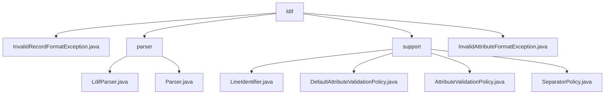

# 基础信息

|      |      |
|------|------|
| 名称 | ldif |
| 编码语言 | .java |
| 代码路径 | spring-ldap/ldif/ldif-core/src/main/java/org/springframework/ldap/ldif |
| 包名 | spring-ldap.ldif.ldif-core.src.main.java.org.springframework.ldap.ldif |
| 概述说明 | InvalidRecordFormatException处理无效记录格式，继承NamingException。LdifParser解析LDIF文件，验证属性，规范化记录。InvalidAttributeFormatException处理无效属性格式。 |

# 说明

## 概述
该代码模块主要围绕LDIF（LDAP Data Interchange Format）文件的解析、验证和处理展开。模块中的核心类提供了对LDIF文件内容的行格式识别、属性验证以及数据一致性处理等功能。通过这些功能，模块能够确保LDIF文件的内容符合LDAP标准，并且在处理过程中保持数据的规范性和准确性。模块还包含多个异常处理类，如`InvalidRecordFormatException`和`InvalidAttributeFormatException`，用于在解析过程中捕获和处理特定的异常情况。

## 主要业务场景
1. **LDIF文件解析**：`LdifParser`类负责从资源中读取LDIF文件，并解析其内容，确保数据准确获取。`SeparatorPolicy`类则负责评估LDIF文件的行格式，能够识别并处理版本、控制信息、变更类型、注释、续行、属性和新记录等多种标识，确保LDIF文件的内容能够被准确解析，并且符合LDAP标准。

2. **属性验证**：`DefaultAttributeValidationPolicy`类专门用于验证LDAP属性，支持多种格式，包括标准、Base64、URL和UTF8。此外，该类还允许对属性值进行字母排序，确保数据的一致性和规范性。该功能在处理LDAP数据时非常重要，尤其是在数据导入或导出时，能够确保数据的合法性和一致性。

3. **记录规范化**：解析后的记录格式通过`LdifParser`类进行统一化处理，确保符合LDIF规范。

4. **大小写敏感控制**：`LdifParser`类支持对解析过程中大小写敏感度的调整，以满足不同场景下的解析需求。

5. **通用解析接口**：`Parser`接口可能定义了通用的解析方法或行为，供`LdifParser`类或其他解析类实现，确保模块的可扩展性和灵活性。

6. **异常处理**：模块中包含多个异常处理类，如`InvalidRecordFormatException`和`InvalidAttributeFormatException`，用于在解析过程中捕获和处理特定的异常情况，确保系统在遇到无效记录格式或无效属性格式时能够进行适当的错误处理。

这些功能共同构成了一个完整的LDIF文件处理模块，适用于需要处理LDAP数据的场景，如LDAP目录的导入导出、数据同步以及数据验证等。

### 包内部结构视图

该流程图展示了`ldif`目录下的层级结构。`ldif`包含四个子节点：`InvalidRecordFormatException.java`、`parser`、`support`和`InvalidAttributeFormatException.java`。`parser`目录下包含`LdifParser.java`和`Parser.java`，而`support`目录下包含`LineIdentifier.java`、`DefaultAttributeValidationPolicy.java`、`AttributeValidationPolicy.java`和`SeparatorPolicy.java`。这些节点清晰地反映了路径的层级关系。

# 文件列表 File List

| 名称   | 类型  | 说明 |
|-------|------|-------------|
| [InvalidAttributeFormatException.java](InvalidAttributeFormatException.md) | file | InvalidAttributeFormatException继承NamingException，提供三种构造方法处理异常。 |
| [InvalidRecordFormatException.java](InvalidRecordFormatException.md) | file | InvalidRecordFormatException继承NamingException，提供三种构造方法处理异常。 |
| [support](support/_module.md) | package | DefaultAttributeValidationPolicy验证LDAP属性，支持多种格式和字母排序。SeparatorPolicy评估LDIF文件行格式，确保内容准确。 |
| [parser](parser/_module.md) | package | LdifParser类解析LDIF文件，支持数据读取、属性验证、记录规范及大小写敏感控制。 |

