# 基础信息

|      |      |
|------|------|
| 名称 | LdifParser |
| 编码语言 | .java |
| 代码路径 | spring-ldap/ldif/ldif-core/src/main/java/org/springframework/ldap/ldif/parser/LdifParser.java |
| 包名 | org.springframework.ldap.ldif.parser |
| 依赖项 | ['java.io.BufferedReader', 'java.io.File', 'java.io.IOException', 'java.io.InputStreamReader', 'java.util.NoSuchElementException', 'javax.naming.NamingException', 'javax.naming.directory.Attribute', 'org.slf4j.Logger', 'org.slf4j.LoggerFactory', 'org.springframework.beans.factory.InitializingBean', 'org.springframework.core.io.FileSystemResource', 'org.springframework.core.io.Resource', 'org.springframework.ldap.core.LdapAttributes', 'org.springframework.ldap.ldif.InvalidRecordFormatException', 'org.springframework.ldap.ldif.support.AttributeValidationPolicy', 'org.springframework.ldap.ldif.support.DefaultAttributeValidationPolicy', 'org.springframework.ldap.ldif.support.LineIdentifier', 'org.springframework.ldap.ldif.support.SeparatorPolicy', 'org.springframework.ldap.schema.DefaultSchemaSpecification', 'org.springframework.ldap.schema.Specification', 'org.springframework.ldap.support.LdapUtils', 'org.springframework.util.Assert', 'org.springframework.util.StringUtils'] |
| 概述说明 | LdifParser类解析LDIF文件，支持资源读取、属性验证、记录规范及大小写敏感控制。 |

# 说明

LdifParser类专门用于解析LDIF文件，具备多种功能。它支持从资源中读取数据，确保文件内容的准确获取。此外，该类提供属性验证功能，能够检查LDIF文件中的属性是否符合预期标准。记录规范功能则确保解析后的记录格式统一且符合规范。LdifParser类还支持大小写敏感控制，允许用户根据需要调整解析过程中对大小写的敏感度，从而满足不同的解析需求。

# 类列表 Class Summary

| 名称   | 类型  | 说明 |
|-------|------|-------------|
| LdifParser | class | LdifParser类用于解析LDIF文件，支持资源读取、属性验证、记录规范及大小写敏感控制。 |

## 类 LdifParser

|      |      |
|------|------|
| 访问范围 | public |
| 类型 | class |
| 名称 | LdifParser |
| 说明 | LdifParser类用于解析LDIF文件，支持资源读取、属性验证、记录规范及大小写敏感控制。 |

### UML类图

```mermaid
classDiagram
    class LdifParser {
        -Resource resource
        -BufferedReader reader
        -SeparatorPolicy separatorPolicy
        -AttributeValidationPolicy attributePolicy
        -Specification~LdapAttributes~ specification
        -boolean caseInsensitive
        +LdifParser()
        +LdifParser(boolean caseInsensitive)
        +LdifParser(Resource resource, boolean caseInsensitive)
        +LdifParser(Resource resource)
        +LdifParser(File file)
        +void setSeparatorPolicy(SeparatorPolicy separatorPolicy)
        +void setAttributeValidationPolicy(AttributeValidationPolicy avPolicy)
        +void setRecordSpecification(Specification~LdapAttributes~ specification)
        +void setResource(Resource resource)
        +void setCaseInsensitive(boolean caseInsensitive)
        +void open() throws IOException
        +boolean isReady() throws IOException
        +void close() throws IOException
        +void reset() throws IOException
        +boolean hasMoreRecords() throws IOException
        +LdapAttributes getRecord() throws IOException
        -void addAttributeToRecord(String buffer, LdapAttributes record)
        +void afterPropertiesSet() throws Exception
    }

    class Resource {
        // Resource类的方法和属性
    }

    class BufferedReader {
        // BufferedReader类的方法和属性
    }

    class SeparatorPolicy {
        +LineIdentifier assess(String line)
    }

    class AttributeValidationPolicy {
        +Attribute parse(String buffer)
    }

    class DefaultAttributeValidationPolicy {
        // DefaultAttributeValidationPolicy类的方法和属性
    }

    class Specification~T~ {
        +boolean isSatisfiedBy(T record)
    }

    class DefaultSchemaSpecification {
        // DefaultSchemaSpecification类的方法和属性
    }

    class LdapAttributes {
        +void setName(LdapName name)
        +Attribute get(String id)
        +void put(Attribute attribute)
        +String getDN()
    }

    class Attribute {
        +String getID()
        +Object get()
        +void add(Object value)
    }

    class FileSystemResource {
        +FileSystemResource(File file)
    }

    class File {
        // File类的方法和属性
    }

    class LdapUtils {
        +LdapName newLdapName(String dn)
    }

    class LdapName {
        // LdapName类的方法和属性
    }

    class NamingException {
        // NamingException类的方法和属性
    }

    class NoSuchElementException {
        // NoSuchElementException类的方法和属性
    }

    class InvalidRecordFormatException {
        +InvalidRecordFormatException(String message)
    }

    LdifParser --> Resource : 依赖
    LdifParser --> BufferedReader : 依赖
    LdifParser --> SeparatorPolicy : 依赖
    LdifParser --> AttributeValidationPolicy : 依赖
    LdifParser --> Specification~LdapAttributes~ : 依赖
    LdifParser --> DefaultAttributeValidationPolicy : 依赖
    LdifParser --> DefaultSchemaSpecification : 依赖
    LdifParser --> LdapAttributes : 依赖
    LdifParser --> Attribute : 依赖
    LdifParser --> FileSystemResource : 依赖
    LdifParser --> File : 依赖
    LdifParser --> LdapUtils : 依赖
    LdifParser --> LdapName : 依赖
    LdifParser --> NamingException : 依赖
    LdifParser --> NoSuchElementException : 依赖
    LdifParser --> InvalidRecordFormatException : 依赖
    AttributeValidationPolicy <|-- DefaultAttributeValidationPolicy : 实现
    Specification~T~ <|-- DefaultSchemaSpecification : 实现
```

### 描述
`LdifParser`类用于解析LDIF文件，实现了`Parser`和`InitializingBean`接口。它依赖于多个策略类（如`SeparatorPolicy`、`AttributeValidationPolicy`）来处理文件解析和属性验证。`LdifParser`通过`BufferedReader`读取资源文件，并根据策略生成`LdapAttributes`对象。它还处理文件操作、属性添加和记录验证，确保生成的LDAP记录符合规范。

### 内部方法调用关系图

```mermaid
graph TD
    A["类LdifParser"]
    B["属性: Logger LOG"]
    C["属性: Resource resource"]
    D["属性: BufferedReader reader"]
    E["属性: SeparatorPolicy separatorPolicy"]
    F["属性: AttributeValidationPolicy attributePolicy"]
    G["属性: Specification<LdapAttributes> specification"]
    H["属性: boolean caseInsensitive"]
    I["构造方法: LdifParser()"]
    J["构造方法: LdifParser(boolean caseInsensitive)"]
    K["构造方法: LdifParser(Resource resource, boolean caseInsensitive)"]
    L["构造方法: LdifParser(Resource resource)"]
    M["构造方法: LdifParser(File file)"]
    N["方法: setSeparatorPolicy(SeparatorPolicy separatorPolicy)"]
    O["方法: setAttributeValidationPolicy(AttributeValidationPolicy avPolicy)"]
    P["方法: setRecordSpecification(Specification<LdapAttributes> specification)"]
    Q["方法: setResource(Resource resource)"]
    R["方法: setCaseInsensitive(boolean caseInsensitive)"]
    S["方法: open()"]
    T["方法: isReady()"]
    U["方法: close()"]
    V["方法: reset()"]
    W["方法: hasMoreRecords()"]
    X["方法: getRecord()"]
    Y["方法: addAttributeToRecord(String buffer, LdapAttributes record)"]
    Z["方法: afterPropertiesSet()"]

    A --> B
    A --> C
    A --> D
    A --> E
    A --> F
    A --> G
    A --> H
    A --> I
    A --> J
    A --> K
    A --> L
    A --> M
    A --> N
    A --> O
    A --> P
    A --> Q
    A --> R
    A --> S
    A --> T
    A --> U
    A --> V
    A --> W
    A --> X
    A --> Y
    A --> Z
```

这段代码定义了一个`LdifParser`类，用于解析LDIF格式的资源文件。类中包含多个属性和方法，用于设置解析策略、验证策略、记录规范等。`open()`方法用于打开资源文件，`getRecord()`方法用于读取并解析记录，`addAttributeToRecord()`方法用于将解析出的属性添加到记录中。`afterPropertiesSet()`方法用于在属性设置完成后进行验证。整体流程涉及资源的打开、读取、解析和关闭，以及对记录和属性的处理。

### 字段列表 Field List

| 名称  | 类型  | 说明 |
|-------|-------|------|
| LOG = LoggerFactory.getLogger(LdifParser.class) | Logger | LdifParser类中定义了一个静态的日志记录器LOG。 |
| resource | Resource | 定义私有资源变量。 |
| specification = new DefaultSchemaSpecification() | Specification<LdapAttributes> | 创建私有LDAP属性规范实例。 |
| reader | BufferedReader | 声明了一个私有的BufferedReader对象reader。 |
| caseInsensitive = true | boolean | 变量caseInsensitive为布尔类型，默认值为true。 |
| attributePolicy = new DefaultAttributeValidationPolicy() | AttributeValidationPolicy | 私有属性验证策略初始化为默认属性验证策略。 |
| separatorPolicy = new SeparatorPolicy() | SeparatorPolicy | 私有变量separatorPolicy初始化为SeparatorPolicy实例。 |

### 方法列表 Method List

| 名称  | 类型  | 说明 |
|-------|-------|------|
| close | void | 关闭已打开的资源读取器。 |
| setSeparatorPolicy | void | 设置分隔符策略的方法。 |
| hasMoreRecords | boolean | 方法检查读取器是否准备好读取更多记录。 |
| setAttributeValidationPolicy | void | 设置属性验证策略的方法，将传入策略赋值给类变量。 |
| open | void | 打开资源并创建缓冲读取器，确保资源不为空。 |
| setRecordSpecification | void | 设置LDAP属性规范的方法。 |
| isReady | boolean | 该方法检查读取器是否就绪，抛出IO异常。 |
| setResource | void | 该方法用于设置资源对象。 |
| afterPropertiesSet | void | 方法验证资源存在且可读，否则抛出异常。 |
| setCaseInsensitive | void | 设置是否忽略大小写。 |
| addAttributeToRecord | void | 将属性添加到LDAP记录，处理DN和其他属性，捕获异常。 |
| getRecord | LdapAttributes | 读取LDAP记录，处理不同行标识符，验证记录格式并返回。 |
| reset | void | 重置读取器，需确保读取器已初始化。 |

