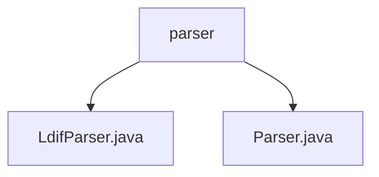

# 基础信息

|      |      |
|------|------|
| 名称 | parser |
| 编码语言 | .java |
| 代码路径 | spring-ldap/ldif/ldif-core/src/main/java/org/springframework/ldap/ldif/parser |
| 包名 | spring-ldap.ldif.ldif-core.src.main.java.org.springframework.ldap.ldif.parser |
| 概述说明 | LdifParser类解析LDIF文件，支持数据读取、属性验证、记录规范及大小写敏感控制。 |

# 说明

## 概述
该代码模块主要涉及LDIF（LDAP Data Interchange Format）文件的解析功能，核心类为`LdifParser`。`LdifParser`类专门用于解析LDIF文件，提供了多种功能以确保文件内容的准确获取和解析后的记录符合规范。此外，模块还包含`Parser`接口，可能定义了通用的解析行为或方法，供`LdifParser`类实现或扩展。

## 主要业务场景
1. **LDIF文件解析**：`LdifParser`类负责从资源中读取LDIF文件，并解析其内容，确保数据准确获取。
2. **属性验证**：在解析过程中，`LdifParser`类能够检查LDIF文件中的属性是否符合预期标准，确保数据的有效性。
3. **记录规范化**：解析后的记录格式通过`LdifParser`类进行统一化处理，确保符合LDIF规范。
4. **大小写敏感控制**：`LdifParser`类支持对解析过程中大小写敏感度的调整，以满足不同场景下的解析需求。
5. **通用解析接口**：`Parser`接口可能定义了通用的解析方法或行为，供`LdifParser`类或其他解析类实现，确保模块的可扩展性和灵活性。

### 包内部结构视图

该流程图展示了`parser`目录下的文件层级关系。`parser`目录包含两个Java文件：`LdifParser.java`和`Parser.java`。这些文件位于`spring-ldap`项目的`ldif-core`模块中，用于处理LDIF格式的解析任务。

# 文件列表 File List

| 名称   | 类型  | 说明 |
|-------|------|-------------|
| [Parser.java](Parser.md) | file | 信息为空，无法生成概要描述。 |
| [LdifParser.java](LdifParser.md) | file | LdifParser类解析LDIF文件，支持资源读取、属性验证、记录规范及大小写敏感控制。 |

