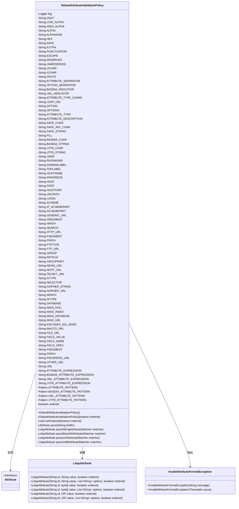
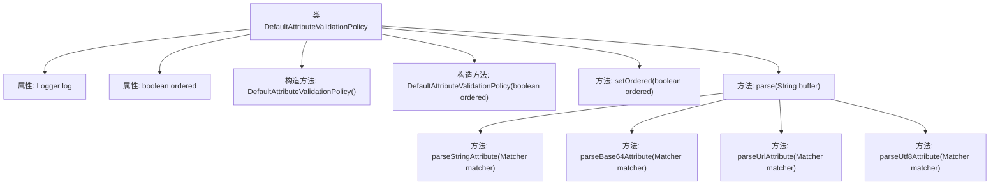

# 基础信息

|      |      |
|------|------|
| 名称 | DefaultAttributeValidationPolicy |
| 编码语言 | .java |
| 代码路径 | spring-ldap/ldif/ldif-core/src/main/java/org/springframework/ldap/ldif/support/DefaultAttributeValidationPolicy.java |
| 包名 | org.springframework.ldap.ldif.support |
| 依赖项 | ['java.net.URI', 'java.net.URISyntaxException', 'java.util.Arrays', 'java.util.List', 'java.util.regex.Matcher', 'java.util.regex.Pattern', 'javax.naming.directory.Attribute', 'org.slf4j.Logger', 'org.slf4j.LoggerFactory', 'org.springframework.ldap.core.LdapAttribute', 'org.springframework.ldap.ldif.InvalidAttributeFormatException', 'org.springframework.ldap.support.LdapEncoder', 'org.springframework.util.StringUtils'] |
| 概述说明 | DefaultAttributeValidationPolicy类验证LDAP属性，支持多种格式并允许属性值排序。 |

# 说明

DefaultAttributeValidationPolicy类专门用于验证LDAP属性，支持多种格式，包括标准、Base64、URL和UTF8。此外，该类还允许对属性值进行字母排序，确保数据的一致性和规范性。

# 类列表 Class Summary

| 名称   | 类型  | 说明 |
|-------|------|-------------|
| DefaultAttributeValidationPolicy | class | DefaultAttributeValidationPolicy类用于验证LDAP属性，支持标准、Base64、URL和UTF8格式，并允许属性值按字母排序。 |

## 类 DefaultAttributeValidationPolicy

|      |      |
|------|------|
| 访问范围 | @SuppressWarnings("unused");public |
| 类型 | class |
| 名称 | DefaultAttributeValidationPolicy |
| 说明 | DefaultAttributeValidationPolicy类用于验证LDAP属性，支持标准、Base64、URL和UTF8格式，并允许属性值按字母排序。 |

### UML类图

### 描述
`DefaultAttributeValidationPolicy` 类实现了 `AttributeValidationPolicy` 接口，用于验证和解析 LDAP 属性。它包含多个正则表达式模式，用于匹配不同类型的属性（如普通字符串、Base64、URL 和 UTF8）。通过 `parse` 方法，该类根据输入字符串的模式匹配结果，生成相应的 `LdapAttribute` 对象。如果输入字符串不符合任何模式，则抛出 `InvalidAttributeFormatException` 异常。

### 内部方法调用关系图

该流程图展示了`DefaultAttributeValidationPolicy`类的结构及其内部方法调用关系。类包含两个属性：`Logger log`和`boolean ordered`，以及两个构造方法和多个方法。`parse`方法是核心方法，根据不同的匹配模式调用不同的解析方法，如`parseStringAttribute`、`parseBase64Attribute`、`parseUrlAttribute`和`parseUtf8Attribute`，分别处理不同类型的属性。每个解析方法根据匹配结果生成相应的`LdapAttribute`对象。

### 字段列表 Field List

| 名称  | 类型  | 说明 |
|-------|-------|------|
| DIGIT = "\\p{Digit}" | String | 定义私有静态常量DIGIT，值为匹配数字的正则表达式。 |
| HIGH_ALPHA = "\\p{Upper}" | String | 定义常量HIGH_ALPHA表示大写字母的正则表达式。 |
| IPADDRESS = "(?:" + DIGIT + "{1,3}\\.){3}" + DIGIT + "{1,3}" | String | 定义IPv4地址的正则表达式。 |
| URLPATH = XCHAR + "*" | String | 私有静态常量URLPATH定义为XCHAR加星号。 |
| LOW_ALPHA = "\\p{Lower}" | String | 定义静态常量LOW_ALPHA，表示小写字母的正则表达式。 |
| log = LoggerFactory.getLogger(DefaultAttributeValidationPolicy.class) | Logger | DefaultAttributeValidationPolicy类中初始化了静态日志记录器。 |
| PORT = DIGITS | String | 私有静态常量PORT定义为DIGITS。 |
| LDAP_OID = "[[0-9]|[1-9][0-9]+][\\.(?:[0-9]|[1-9][0-9]+)]+" | String | 定义LDAP OID的正则表达式模式。 |
| ATTRIBUTE_PATTERN = Pattern.compile(ATTRIBUTE_EXPRESSION) | Pattern | 定义私有静态常量正则表达式模式。 |
| UTF8_STRING = "(" + UTF8_CHAR + "+)" | String | 定义UTF8字符串常量，包含UTF8字符。 |
| ALPHA = "\\p{Alpha}" | String | 定义静态常量ALPHA表示字母字符的正则表达式。 |
| BASE64_INDICATOR = ":" | String | 定义私有静态常量BASE64_INDICATOR，值为":"。 |
| SEARCH = HSEGMENT | String | 定义私有静态常量SEARCH，值为HSEGMENT。 |
| RESERVED = "[\\x3B\\x2F\\x3F\\x3A\\x40\\x26\\x3D]" | String | 定义保留字符的正则表达式字符串。 |
| ATTRIBUTE_SEPARATOR = ":" | String | 定义私有静态常量，属性分隔符为冒号。 |
| OPTION = "[" + ATTRIBUTE_TYPE_CHARS + "]+" | String | 定义常量OPTION为包含ATTRIBUTE_TYPE_CHARS的字符串。 |
| DOMAINLABEL = ALPHANUM + "|" + ALPHANUM + "[" + ALPHANUM + "-]*" + ALPHANUM | String | 定义域标签格式为字母数字加连字符组合。 |
| ALPHANUM = "\\p{Alnum}" | String | 定义了一个静态常量ALPHANUM，用于匹配字母和数字字符。 |
| ordered = false | boolean | 私有布尔变量ordered初始值为false。 |
| OPTIONS = "[" + OPTION_SEPARATOR + OPTION + "]*" | String | 定义一个私有静态常量字符串，表示由选项分隔符和选项组成的模式。 |
| URL = "((?:" + HTTP_URL + ")|(?:" + FTP_URL + ")|(?:" + NEWS_URL + ")|(?:" + NNTP_URL			+ ")|(?:" + TELNET_URL + ")|(?:" + GOPHER_URL + ")|(?:" + WAIS_URL + ")|(?:" + MAILTO_URL + ")|(?:"			+ FILE_URL + ")|(?:" + PROSPERO_URL + ")|(?:" + OTHER_URL + "))" | String | 定义了一个包含多种协议URL的正则表达式字符串。 |
| HEX = "\\p{XDigit}" | String | 定义了一个静态常量HEX，表示十六进制字符的正则表达式。 |
| IP_SCHEMEPART = "//" + LOGIN + "(?:/" + URLPATH + ")?" | String | 定义私有静态字符串常量IP_SCHEMEPART，包含登录和URL路径。 |
| UTF8_ATTRIBUTE_EXPRESSION = "^" + ATTRIBUTE_DESCRIPTION + ATTRIBUTE_SEPARATOR + FILL			+ UTF8_STRING | String | 定义UTF8属性表达式的静态常量字符串。 |
| USER = "[" + UCHAR + "\\x3B\\x3F\\x26\\x3D]*" | String | 定义私有静态字符串常量USER，包含特定字符集。 |
| PASSWORD = "[" + UCHAR + "\\x3B\\x3F\\x26\\x3D]*" | String | 定义密码正则表达式，包含特定字符集。 |
| WTYPE = UCHAR + "*" | String | 定义静态常量WTYPE为UCHAR类型指针。 |
| UCHAR = "(?:" + UNRESERVED + "|" + ESCAPE + ")" | String | 定义字符串常量UCHAR，包含UNRESERVED和ESCAPE。 |
| HOSTPORT = HOST + "(?::" + PORT + ")?" | String | 定义静态字符串HOSTPORT，包含HOST和可选PORT。 |
| ATTRIBUTE_TYPE_CHARS = ALPHA + DIGIT + "-" | String | 定义常量ATTRIBUTE_TYPE_CHARS，包含字母、数字和短横线。 |
| HSEGMENT = "[" + UCHAR + "\\x3A\\x3B\\x26\\x3D\\x40]*" | String | 定义静态字符串常量HSEGMENT，包含特定字符集匹配规则。 |
| BASE64_CHAR = "[\\x2B\\x2F\\x30-\\x39\\x3D\\x41-\\x5A\\x61-\\x7A]" | String | 定义BASE64字符集的正则表达式。 |
| UTF8_ATTRIBUTE_PATTERN = Pattern.compile(UTF8_ATTRIBUTE_EXPRESSION) | Pattern | 定义UTF8属性匹配的正则表达式模式。 |
| OPTION_SEPARATOR = ";" | String | 定义了一个私有静态常量字符串OPTION_SEPARATOR，值为分号。 |
| BASE64_ATTRIBUTE_PATTERN = Pattern.compile(BASE64_ATTRIBUTE_EXPRESSION) | Pattern | 定义用于匹配Base64属性的正则表达式模式。 |
| PSEGMENT = "[" + UCHAR + "\\x3F\\x3A\\x40\\x26\\x3D]*" | String | 定义字符串常量PSEGMENT，包含特定字符和通配符。 |
| LOGIN = "(?:" + USER + "(?::" + PASSWORD + ")?@)?" + HOSTPORT | String | 登录字符串包含用户、密码及主机端口信息。 |
| ESCAPE = "%" + HEX + "{2}" | String | 定义常量ESCAPE，值为百分号加双位十六进制数。 |
| NNTP_URL = "nntp://" + HOSTPORT + "/" + GROUP + "/" + DIGITS | String | 定义了一个包含NNTP协议URL的静态字符串常量。 |
| SAFE_CHAR = "[\\p{ASCII}&&[^\\x00\\x0A\\x0D]]" | String | 定义常量SAFE_CHAR，匹配非换行符的ASCII字符。 |
| NEWS_URL = "news:" + GROUPPART | String | 定义常量NEWS_URL，值为"news:"与GROUPPART拼接。 |
| PUNCTUATION = "[\\x3C\\x3E\\x23\\x25\\x22]" | String | 定义字符串常量PUNCTUATION，包含特定标点符号。 |
| FILE_URL = "file://(?:" + HOST + "|localhost)?/" + FPATH | String | 私有静态常量FILE_URL定义文件路径匹配模式。 |
| DIGITS = DIGIT + "+" | String | 定义私有静态常量DIGITS，值为DIGIT加一个或多个字符。 |
| OTHER_URL = GENERIC_URL | String | 私有静态常量OTHER_URL引用GENERIC_URL。 |
| UNRESERVED = "[" + ALPHA + DIGIT + SAFE + EXTRA + "]" | String | 定义常量UNRESERVED，包含字母、数字、安全字符和额外字符。 |
| HOSTNAME = "(?:" + DOMAINLABEL + "\\.)*" + TOPLABEL | String | 定义HOSTNAME为包含DOMAINLABEL和TOPLABEL的字符串模式。 |
| SAFE = "[\\x24\\x2D\\x5F\\x2E\\x2B]" | String | 定义安全字符的正则表达式常量。 |
| SCHEME = "[" + LOW_ALPHA + DIGIT + "\\x2B\\x2D\\x2E]+" | String | 定义私有静态字符串常量SCHEME，包含小写字母、数字及特定符号。 |
| WPATH = UCHAR + "*" | String | 定义常量WPATH，值为UCHAR加星号。 |
| ARTICLE = "[" + UCHAR + "\\x3A\\x3B\\x2F\\x3F\\x26\\x3D]@" + HOST | String | 定义私有静态字符串ARTICLE，包含特定字符和主机名。 |
| HOST = "(?:" + HOSTNAME + "|" + IPADDRESS + ")" | String | 定义HOST为HOSTNAME或IPADDRESS的正则表达式。 |
| SCHEMEPART = "(?:" + XCHAR + "*|" + IP_SCHEMEPART + ")" | String | 定义静态字符串SCHEMEPART，包含XCHAR或IP_SCHEMEPART。 |
| HPATH = HSEGMENT + "[/" + HSEGMENT + "]*" | String | 定义静态常量HPATH，格式为HSEGMENT重复拼接。 |
| GOPHER_STRING = XCHAR + "*" | String | 定义常量GOPHER_STRING，值为XCHAR加星号。 |
| FIELD_VALUE = "[" + UCHAR + "\\x3F\\x3A\\x40\\x26]*" | String | 定义静态常量FIELD_VALUE，包含UCHAR及特定字符集。 |
| DATABASE = UCHAR + "*" | String | 定义私有静态常量DATABASE，值为UCHAR加"*"。 |
| ENCODED_822_ADDR = XCHAR + "+" | String | 定义静态常量ENCODED_822_ADDR，值为XCHAR加加号。 |
| FPATH = FSEGMENT + "[/" + FSEGMENT + "]*" | String | 定义静态常量FPATH，由FSEGMENT及其重复模式组成。 |
| XCHAR = "(?:" + UNRESERVED + "|" + RESERVED + "|" + ESCAPE + ")" | String | 定义XCHAR为正则表达式，包含UNRESERVED、RESERVED和ESCAPE。 |
| GENERIC_URL = SCHEME + ":" + SCHEMEPART | String | 定义了一个私有静态常量GENERIC_URL，由SCHEME和SCHEMEPART拼接而成。 |
| SELECTOR = XCHAR + "*" | String | 定义了一个私有静态常量字符串SELECTOR，值为XCHAR加星号。 |
| WAIS_INDEX = "wais://" + HOSTPORT + "/" + DATABASE + "\\?" + SEARCH | String | 定义常量WAIS_INDEX，拼接HOSTPORT、DATABASE和SEARCH生成URL。 |
| SAFE_INIT_CHAR = "[\\p{ASCII}&&[^ \\x00\\x0A\\x0D\\x3A\\x3C]]" | String | SAFE_INIT_CHAR定义安全初始字符集，排除空格、换行、冒号和小于号。 |
| URL_ATTRIBUTE_PATTERN = Pattern.compile(URL_ATTRIBUTE_EXPRESSION) | Pattern | 定义静态URL属性正则表达式匹配模式。 |
| FTP_URL = "ftp://" + LOGIN + "(?:/" + FPATH + "(?:;type=" + FTPTYPE + ")?)?" | String | FTP URL 字符串拼接格式包含登录、路径和类型。 |
| FILL = "[ ]*" | String | 定义常量FILL为包含任意数量空格的字符串。 |
| GROUPPART = "(?:\\x2A|" + GROUP + "|" + ARTICLE + ")" | String | 定义了一个静态字符串常量GROUPPART，包含星号和GROUP、ARTICLE的组合。 |
| URL_ATTRIBUTE_EXPRESSION = "^" + ATTRIBUTE_DESCRIPTION + ATTRIBUTE_SEPARATOR			+ URL_INDICATOR + FILL + URL + "$" | String | URL属性表达式定义，包含描述、分隔符、指示符和URL。 |
| MAILTO_URL = "mailto:" + ENCODED_822_ADDR | String | 定义了一个静态常量MAILTO_URL，值为"mailto:"加上ENCODED_822_ADDR。 |
| EXTRA = "[\\x21\\x2A\\x27\\x7B\\x7D\\x2C]" | String | 定义常量EXTRA，包含特定字符集。 |
| WAIS_URL = WAIS_DATABASE + "|" + WAIS_INDEX + "|" + WAIS_DOC | String | 定义常量WAIS_URL，由WAIS_DATABASE、WAIS_INDEX和WAIS_DOC拼接而成。 |
| GROUP = ALPHA + "[" + ALPHA + DIGIT + "\\x2D\\x2E\\x2B\\x5F]*" | String | 定义常量GROUP，组合ALPHA、DIGIT及特定字符生成正则表达式。 |
| ATTRIBUTE_TYPE = LDAP_OID + "|" + ALPHANUM + "[" + ATTRIBUTE_TYPE_CHARS + "]*" | String | LDAP属性类型格式定义为LDAP_OID与ALPHANUM及ATTRIBUTE_TYPE_CHARS的组合。 |
| GOPHER_URL = "gopher://" + HOSTPORT + "(?:/(?:" + GTYPE + "(?:" + SELECTOR + "(?:%09"			+ SEARCH + "(?:%09" + GOPHER_STRING + ")?)?)?)?)?" | String | Gopher URL 结构包含主机端口、类型、选择器、搜索和字符串参数。 |
| ATTRIBUTE_DESCRIPTION = "(" + ATTRIBUTE_TYPE + ")(" + OPTIONS + ")" | String | 定义私有静态常量ATTRIBUTE_DESCRIPTION，包含ATTRIBUTE_TYPE和OPTIONS。 |
| WAIS_DATABASE = "wais://" + HOSTPORT + "/" + DATABASE | String | 定义私有静态常量WAIS_DATABASE，值为wais协议拼接HOSTPORT和DATABASE。 |
| PROSPERO_URL = "prospero://" + HOSTPORT + "/" + PPATH + "(?:" + FIELD_SPEC + ")*" | String | 定义私有静态常量PROSPERO_URL，拼接HOSTPORT、PPATH和FIELD_SPEC。 |
| FSEGMENT = "[" + UCHAR + "\\x3F\\x3A\\x26\\x3D\\x40]*" | String | 定义静态常量FSEGMENT，包含特定字符集的字符串模式。 |
| FTPTYPE = "[AIDaid]" | String | 定义私有静态常量FTPTYPE，值为"[AIDaid]"。 |
| TELNET_URL = "telnet://" + LOGIN + "[/]?" | String | 定义私有静态常量TELNET_URL，格式为telnet://加LOGIN。 |
| GTYPE = XCHAR | String | 私有静态常量GTYPE被定义为XCHAR类型。 |
| UTF8_CHAR = "[\\p{L}|[0-9]|\\s]" | String | 定义UTF8字符的正则表达式，包含字母、数字和空格。 |
| TOPLABEL = ALPHA + "|" + ALPHA + "[" + ALPHANUM + "-]*" + ALPHANUM | String | 定义常量TOPLABEL为ALPHA连接ALPHA和可选ALPHANUM的字符串。 |
| FIELD_SPEC = ";" + FIELD_NAME + "=" + FIELD_VALUE | String | 定义静态字符串常量FIELD_SPEC，格式为分号加字段名等号加字段值。 |
| PPATH = PSEGMENT + "(?:/" + PSEGMENT + ")*" | String | PPATH定义为PSEGMENT及其重复组合的路径格式。 |
| FIELD_NAME = "[" + UCHAR + "\\x3F\\x3A\\x40\\x26]*" | String | 定义字符串常量FIELD_NAME，包含特定字符集。 |
| BASE64_STRING = "(" + BASE64_CHAR + "*)" | String | 定义BASE64字符串的正则表达式模式。 |
| HTTP_URL = "http://" + HOSTPORT + "(?:/" + HPATH + "(?:\\x3F" + SEARCH + ")?)?" | String | 定义静态常量HTTP_URL，拼接HOSTPORT、HPATH和SEARCH生成完整URL。 |
| ATTRIBUTE_EXPRESSION = "^" + ATTRIBUTE_DESCRIPTION + ATTRIBUTE_SEPARATOR + FILL			+ SAFE_STRING + "{0,1}$" | String | 定义静态常量正则表达式，用于匹配属性描述、分隔符和填充字符串的组合。 |
| BASE64_ATTRIBUTE_EXPRESSION = "^" + ATTRIBUTE_DESCRIPTION + ATTRIBUTE_SEPARATOR			+ BASE64_INDICATOR + FILL + BASE64_STRING + "$" | String | 定义BASE64属性表达式的正则表达式，包含属性描述、分隔符、BASE64标识符和填充字符。 |
| URL_INDICATOR = "<" | String | 定义静态常量URL_INDICATOR，值为"<"。 |
| SAFE_STRING = "(" + SAFE_INIT_CHAR + SAFE_CHAR + "*)" | String | 定义常量SAFE_STRING，由SAFE_INIT_CHAR和SAFE_CHAR组成。 |
| WAIS_DOC = "wais://" + HOSTPORT + "/" + DATABASE + "/" + WTYPE + "/" + WPATH | String | WAIS文档路径由主机端口、数据库、类型和路径组成。 |

### 方法列表 Method List

| 名称  | 类型  | 说明 |
|-------|-------|------|
| setOrdered | void | 设置对象的有序状态。 |
| parseUrlAttribute | LdapAttribute | 解析URL属性，生成LdapAttribute对象，处理选项和URI异常。 |
| parseBase64Attribute | LdapAttribute | 解析Base64属性，生成LdapAttribute对象，处理异常。 |
| parseUtf8Attribute | LdapAttribute | 解析UTF8属性并生成LdapAttribute对象。 |
| parse | Attribute | 解析字符串属性，支持常规、Base64、URL和UTF8格式，无匹配则抛出异常。 |
| parseStringAttribute | LdapAttribute | 解析字符串属性并返回LdapAttribute对象，包含ID、值和选项。 |

