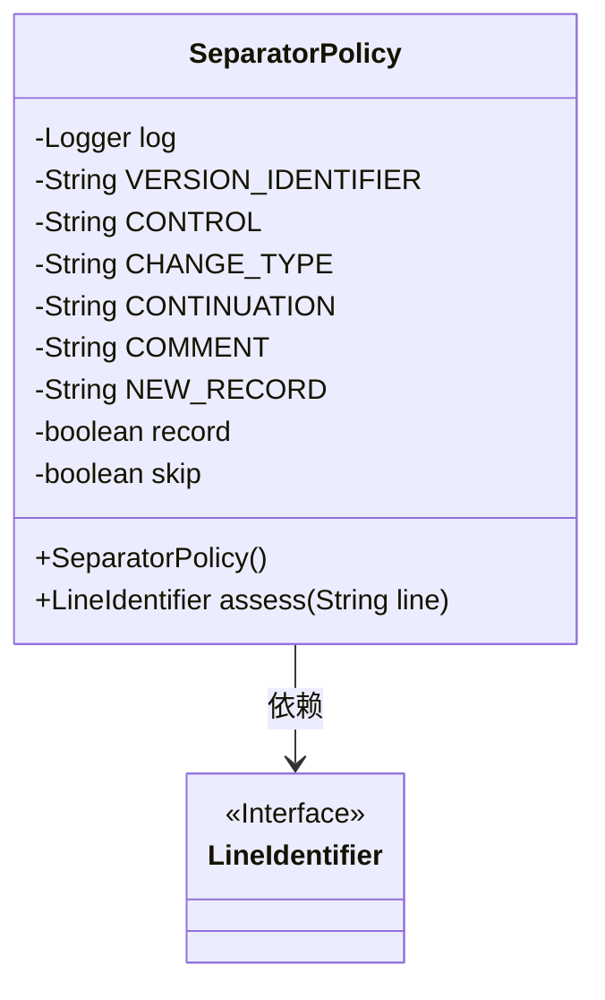

# 基础信息

|      |      |
|------|------|
| 名称 | SeparatorPolicy |
| 编码语言 | .java |
| 代码路径 | spring-ldap/ldif/ldif-core/src/main/java/org/springframework/ldap/ldif/support/SeparatorPolicy.java |
| 包名 | org.springframework.ldap.ldif.support |
| 依赖项 | ['org.slf4j.Logger', 'org.slf4j.LoggerFactory', 'org.springframework.util.StringUtils'] |
| 概述说明 | SeparatorPolicy类评估LDIF文件行格式，识别多种标识。 |

# 说明

SeparatorPolicy类主要用于评估LDIF文件的行格式，能够识别多种标识，包括版本、控制信息、变更类型、注释、续行、属性以及新记录等。该类的功能全面，能够精确解析和处理LDIF文件中的各类行格式，确保文件内容的准确性和完整性。

# 类列表 Class Summary

| 名称   | 类型  | 说明 |
|-------|------|-------------|
| SeparatorPolicy | class | SeparatorPolicy类用于评估LDIF文件行格式，识别版本、控制、变更类型、注释、续行、属性和新记录等标识。 |

## 类 SeparatorPolicy

|      |      |
|------|------|
| 访问范围 | public |
| 类型 | class |
| 名称 | SeparatorPolicy |
| 说明 | SeparatorPolicy类用于评估LDIF文件行格式，识别版本、控制、变更类型、注释、续行、属性和新记录等标识。 |

### UML类图

类图描述：
`SeparatorPolicy` 类用于评估LDIF格式的每一行，判断其类型并返回相应的 `LineIdentifier`。该类包含多个静态常量用于匹配不同的行模式，以及两个布尔类型的成员变量 `record` 和 `skip` 用于控制记录和跳过的逻辑。`assess` 方法根据输入行的内容返回相应的 `LineIdentifier` 类型，如 `EndOfRecord`、`Control`、`ChangeType` 等。`LineIdentifier` 是一个接口，用于标识不同类型的行。

### 内部方法调用关系图

```mermaid
graph TD
    A["类SeparatorPolicy"]
    B["属性: Logger log"]
    C["属性: String VERSION_IDENTIFIER"]
    D["属性: String CONTROL"]
    E["属性: String CHANGE_TYPE"]
    F["属性: String CONTINUATION"]
    G["属性: String COMMENT"]
    H["属性: String NEW_RECORD"]
    I["属性: boolean record"]
    J["属性: boolean skip"]
    K["构造方法: SeparatorPolicy()"]
    L["方法: LineIdentifier assess(String line)"]
    M["条件: this.record为true"]
    N["条件: !StringUtils.hasLength(line)"]
    O["操作: this.record = false, this.skip = false"]
    P["返回: LineIdentifier.EndOfRecord"]
    Q["条件: this.skip为true"]
    R["返回: LineIdentifier.Void"]
    S["条件: line.startsWith(CONTROL)"]
    T["操作: this.skip = true"]
    U["返回: LineIdentifier.Control"]
    V["条件: line.startsWith(CHANGE_TYPE)"]
    W["操作: this.skip = true"]
    X["返回: LineIdentifier.ChangeType"]
    Y["条件: line.startsWith(COMMENT)"]
    Z["返回: LineIdentifier.Comment"]
    AA["条件: line.startsWith(CONTINUATION)"]
    AB["返回: LineIdentifier.Continuation"]
    AC["返回: LineIdentifier.Attribute"]
    AD["条件: this.record为false"]
    AE["条件: StringUtils.hasLength(line) && line.matches(VERSION_IDENTIFIER) && !this.skip"]
    AF["返回: LineIdentifier.VersionIdentifier"]
    AG["条件: StringUtils.hasLength(line) && line.matches(NEW_RECORD)"]
    AH["操作: this.record = true, this.skip = false"]
    AI["返回: LineIdentifier.NewRecord"]
    AJ["返回: LineIdentifier.Void"]

    A --> B
    A --> C
    A --> D
    A --> E
    A --> F
    A --> G
    A --> H
    A --> I
    A --> J
    A --> K
    A --> L
    L --> M
    M --> N
    N --> O
    O --> P
    M --> Q
    Q --> R
    M --> S
    S --> T
    T --> U
    M --> V
    V --> W
    W --> X
    M --> Y
    Y --> Z
    M --> AA
    AA --> AB
    M --> AC
    L --> AD
    AD --> AE
    AE --> AF
    AD --> AG
    AG --> AH
    AH --> AI
    AD --> AJ
```

这段代码描述了一个名为`SeparatorPolicy`的类，该类用于评估LDIF（轻量级目录访问协议数据交换格式）文件中的行。`assess`方法根据行的内容判断其类型，如版本标识符、控制行、变更类型、注释、续行或属性等。该方法通过多个条件判断和状态变量`record`和`skip`来控制流程，最终返回相应的行标识符。流程图展示了方法的执行路径和各个条件分支的处理逻辑。

### 字段列表 Field List

| 名称  | 类型  | 说明 |
|-------|-------|------|
| log = LoggerFactory.getLogger(SeparatorPolicy.class) | Logger | 私有静态日志记录器初始化，用于SeparatorPolicy类。 |
| record = false | boolean | 私有布尔变量record初始值为false。 |
| CONTINUATION = " " | String | 定义静态常量CONTINUATION，值为空格。 |
| CONTROL = "control:" | String | 定义了一个私有静态常量字符串CONTROL，值为"control:"。 |
| CHANGE_TYPE = "changetype:" | String | 定义私有静态常量CHANGE_TYPE，值为"changetype:"。 |
| skip = false | boolean | 私有布尔变量skip初始值为false。 |
| COMMENT = "#" | String | 定义了一个私有的静态常量字符串COMMENT，值为“#”。 |
| VERSION_IDENTIFIER = "^version: [0-9]+(\\.[0-9]*){0,1}$" | String | 私有静态字符串常量用于匹配版本号格式。 |
| NEW_RECORD = "^dn:.*$" | String | 定义静态常量NEW_RECORD，用于匹配以"dn:"开头的字符串。 |

### 方法列表 Method List

| 名称  | 类型  | 说明 |
|-------|-------|------|
| assess | LineIdentifier | 方法评估输入行并返回标识符，处理记录、跳过、控制、变更类型、注释、延续、属性和版本标识符等情况。 |

