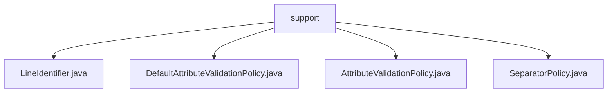

# 基础信息

|      |      |
|------|------|
| 名称 | support |
| 编码语言 | .java |
| 代码路径 | spring-ldap/ldif/ldif-core/src/main/java/org/springframework/ldap/ldif/support |
| 包名 | spring-ldap.ldif.ldif-core.src.main.java.org.springframework.ldap.ldif.support |
| 概述说明 | DefaultAttributeValidationPolicy验证LDAP属性，支持多种格式和字母排序。SeparatorPolicy评估LDIF文件行格式，确保内容准确。 |

# 说明

## 概述
该代码模块主要围绕LDIF（LDAP Data Interchange Format）文件的解析、验证和处理展开。模块中的核心类提供了对LDIF文件内容的行格式识别、属性验证以及数据一致性处理等功能。通过这些功能，模块能够确保LDIF文件的内容符合LDAP标准，并且在处理过程中保持数据的规范性和准确性。

## 主要业务场景
1. **LDIF文件解析**：`SeparatorPolicy`类负责评估LDIF文件的行格式，能够识别并处理版本、控制信息、变更类型、注释、续行、属性和新记录等多种标识。该功能确保LDIF文件的内容能够被准确解析，并且符合LDAP标准。

2. **属性验证**：`DefaultAttributeValidationPolicy`类专门用于验证LDAP属性，支持多种格式，包括标准、Base64、URL和UTF8。此外，该类还允许对属性值进行字母排序，确保数据的一致性和规范性。该功能在处理LDAP数据时非常重要，尤其是在数据导入或导出时，能够确保数据的合法性和一致性。

3. **行标识处理**：`LineIdentifier`类（尽管描述未提供具体内容，但根据上下文推测）可能用于处理LDIF文件中的行标识，确保每一行的格式和内容符合LDAP标准。

这些功能共同构成了一个完整的LDIF文件处理模块，适用于需要处理LDAP数据的场景，如LDAP目录的导入导出、数据同步以及数据验证等。

### 包内部结构视图

该流程图展示了 `support` 文件夹下的四个文件：`LineIdentifier.java`、`DefaultAttributeValidationPolicy.java`、`AttributeValidationPolicy.java` 和 `SeparatorPolicy.java`。这些文件均位于 `support` 目录下，且它们之间没有进一步的层级关系，直接归属于 `support` 节点。

# 文件列表 File List

| 名称   | 类型  | 说明 |
|-------|------|-------------|
| [SeparatorPolicy.java](SeparatorPolicy.md) | file | SeparatorPolicy类评估LDIF文件行格式，识别多种标识。 |
| [AttributeValidationPolicy.java](AttributeValidationPolicy.md) | file | 信息为空，无法生成概要描述。 |
| [DefaultAttributeValidationPolicy.java](DefaultAttributeValidationPolicy.md) | file | DefaultAttributeValidationPolicy类验证LDAP属性，支持多种格式并允许属性值排序。 |
| [LineIdentifier.java](LineIdentifier.md) | file | 信息为空，无法生成概要描述。 |

