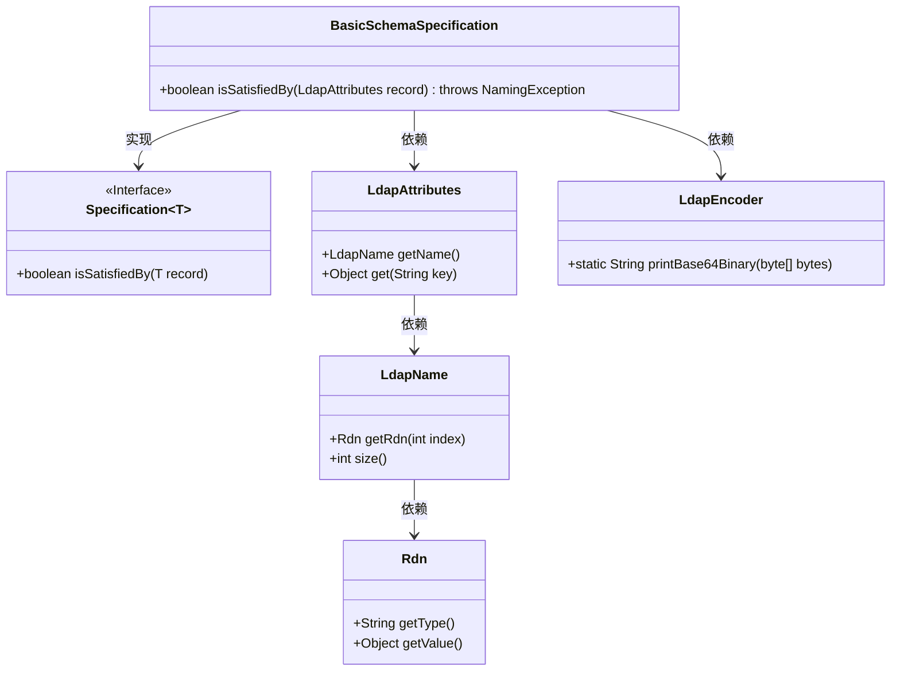
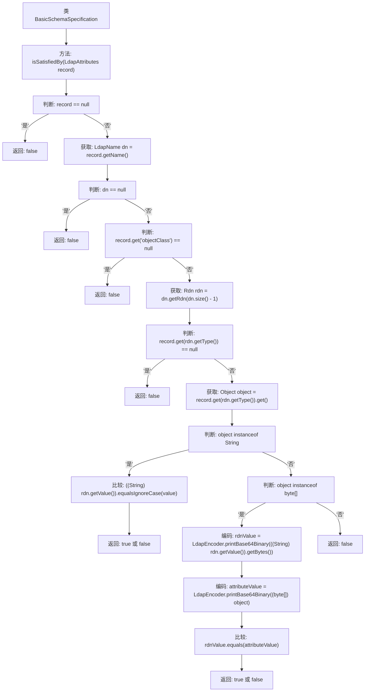

# 基础信息

|      |      |
|------|------|
| 名称 | BasicSchemaSpecification |
| 编码语言 | .java |
| 代码路径 | spring-ldap/ldif/ldif-core/src/main/java/org/springframework/ldap/schema/BasicSchemaSpecification.java |
| 包名 | org.springframework.ldap.schema |
| 依赖项 | ['javax.naming.NamingException', 'javax.naming.ldap.LdapName', 'javax.naming.ldap.Rdn', 'org.springframework.ldap.core.LdapAttributes', 'org.springframework.ldap.support.LdapEncoder'] |
| 概述说明 | BasicSchemaSpecification类验证LdapAttributes对象是否符合策略。 |

# 说明

BasicSchemaSpecification类用于验证LdapAttributes对象是否符合特定的策略要求。该类的核心功能是检查LdapAttributes对象的属性，确保其满足预先定义的条件或规则。通过这一验证过程，可以确保LdapAttributes对象在结构、内容或格式上与预期策略一致，从而保证数据的有效性和合规性。

# 类列表 Class Summary

| 名称   | 类型  | 说明 |
|-------|------|-------------|
| BasicSchemaSpecification | class | BasicSchemaSpecification类验证LdapAttributes对象是否满足特定策略。 |

## 类 BasicSchemaSpecification

|      |      |
|------|------|
| 访问范围 | public |
| 类型 | class |
| 名称 | BasicSchemaSpecification |
| 说明 | BasicSchemaSpecification类验证LdapAttributes对象是否满足特定策略。 |

### UML类图

**描述：**  
`BasicSchemaSpecification`类实现了`Specification<LdapAttributes>`接口，用于验证`LdapAttributes`对象是否满足特定策略。该类通过检查`LdapAttributes`的`name`、`objectClass`以及`Rdn`的值是否与预期匹配来进行验证。验证过程中涉及`LdapName`、`Rdn`和`LdapEncoder`类的使用，确保数据的一致性和正确性。

### 内部方法调用关系图

这段代码是一个实现`Specification<LdapAttributes>`接口的类`BasicSchemaSpecification`，主要用于验证`LdapAttributes`对象是否满足特定的LDAP模式规范。方法`isSatisfiedBy`通过一系列条件判断，确保`record`对象包含必要的属性（如`DN`、`objectClass`等），并根据属性的类型进行相应的比较。如果所有条件都满足，则返回`true`，否则返回`false`。

### 字段列表 Field List

| 名称  | 类型  | 说明 |
|-------|-------|------|

### 方法列表 Method List

| 名称  | 类型  | 说明 |
|-------|-------|------|
| isSatisfiedBy | boolean | 检查LDAP记录是否满足条件，包括非空、DN、objectClass和命名属性。 |

