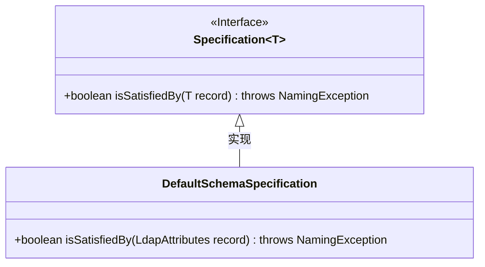
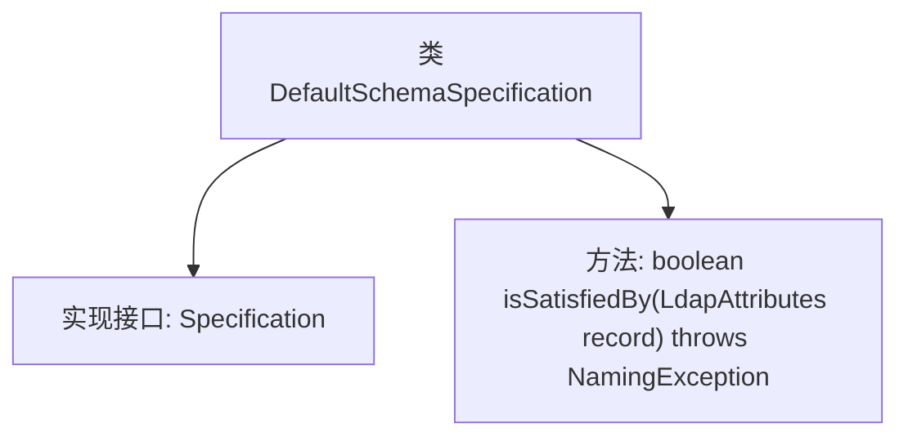

# 基础信息

|      |      |
|------|------|
| 名称 | DefaultSchemaSpecification |
| 编码语言 | .java |
| 代码路径 | spring-ldap/ldif/ldif-core/src/main/java/org/springframework/ldap/schema/DefaultSchemaSpecification.java |
| 包名 | org.springframework.ldap.schema |
| 依赖项 | ['javax.naming.NamingException', 'org.springframework.ldap.core.LdapAttributes'] |
| 概述说明 | DefaultSchemaSpecification类实现Specification接口，验证LdapAttributes对象策略符合性。 |

# 说明

DefaultSchemaSpecification类实现了Specification接口，其主要功能是验证LdapAttributes对象是否符合预定义的策略。该类通过调用接口方法，确保LdapAttributes对象的属性和值满足特定要求，从而保证数据的一致性和合规性。

# 类列表 Class Summary

| 名称   | 类型  | 说明 |
|-------|------|-------------|
| DefaultSchemaSpecification | class | DefaultSchemaSpecification类实现Specification接口，验证LdapAttributes对象是否满足策略。 |

## 类 DefaultSchemaSpecification

|      |      |
|------|------|
| 访问范围 | public |
| 类型 | class |
| 名称 | DefaultSchemaSpecification |
| 说明 | DefaultSchemaSpecification类实现Specification接口，验证LdapAttributes对象是否满足策略。 |

### UML类图

### 描述
该代码定义了一个 `DefaultSchemaSpecification` 类，该类实现了 `Specification<LdapAttributes>` 接口。`Specification` 接口包含一个 `isSatisfiedBy` 方法，用于判断给定的 `LdapAttributes` 对象是否满足特定条件。`DefaultSchemaSpecification` 类实现了该方法，并始终返回 `true`，表示默认情况下所有 `LdapAttributes` 对象都满足条件。

### 内部方法调用关系图

这段代码定义了一个名为 `DefaultSchemaSpecification` 的类，该类实现了 `Specification<LdapAttributes>` 接口。类中包含一个 `isSatisfiedBy` 方法，该方法接受一个 `LdapAttributes` 类型的参数，并返回一个布尔值。此方法用于确定给定的 `LdapAttributes` 对象是否满足某种策略，当前实现始终返回 `true`。代码结构简单，主要用于策略模式的实现。

### 字段列表 Field List

| 名称  | 类型  | 说明 |
|-------|-------|------|

### 方法列表 Method List

| 名称  | 类型  | 说明 |
|-------|-------|------|
| isSatisfiedBy | boolean | 该方法检查LdapAttributes记录是否满足条件，默认返回true。 |

