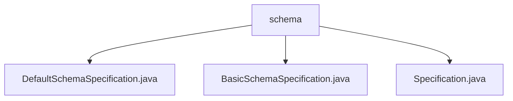

# 基础信息

|      |      |
|------|------|
| 名称 | schema |
| 编码语言 | .java |
| 代码路径 | spring-ldap/ldif/ldif-core/src/main/java/org/springframework/ldap/schema |
| 包名 | spring-ldap.ldif.ldif-core.src.main.java.org.springframework.ldap.schema |
| 概述说明 | DefaultSchemaSpecification和BasicSchemaSpecification类用于验证LdapAttributes对象，确保其符合预定义策略，保证数据一致性和合规性。 |

# 说明

## 概述

该代码模块主要围绕LDAP（轻量级目录访问协议）属性的验证和策略合规性检查展开。核心类包括 `DefaultSchemaSpecification` 和 `BasicSchemaSpecification`，它们均实现了 `Specification` 接口，用于验证 `LdapAttributes` 对象是否符合预定义的策略要求。通过这一验证过程，确保 `LdapAttributes` 对象的属性、结构和内容满足特定规则，从而保证数据的一致性和合规性。

## 主要业务场景

1. **LDAP属性验证**：`DefaultSchemaSpecification` 和 `BasicSchemaSpecification` 类用于验证 `LdapAttributes` 对象的属性是否符合预定义的策略。这些策略可能涉及属性的格式、类型、值范围等，确保数据在LDAP目录中的一致性和有效性。

2. **数据合规性检查**：通过调用 `Specification` 接口的方法，模块能够确保 `LdapAttributes` 对象在结构、内容和格式上与预期策略一致。这一过程在数据导入、更新或同步时尤为重要，以避免不合规数据进入系统。

3. **策略扩展与实现**：`Specification` 接口为策略验证提供了扩展点，开发人员可以通过实现该接口来定义自定义的验证规则，从而满足不同业务场景下的合规性需求。

### 包内部结构视图

该流程图展示了 `spring-ldap/ldif/ldif-core/src/main/java/org/springframework/ldap/schema` 目录下的文件层级关系。`schema` 目录包含三个文件：`DefaultSchemaSpecification.java`、`BasicSchemaSpecification.java` 和 `Specification.java`。这些文件均位于同一层级，直接依赖于 `schema` 目录。

# 文件列表 File List

| 名称   | 类型  | 说明 |
|-------|------|-------------|
| [Specification.java](Specification.md) | file | 无内容可总结。 |
| [BasicSchemaSpecification.java](BasicSchemaSpecification.md) | file | BasicSchemaSpecification类验证LdapAttributes对象是否符合策略。 |
| [DefaultSchemaSpecification.java](DefaultSchemaSpecification.md) | file | DefaultSchemaSpecification类实现Specification接口，验证LdapAttributes对象策略符合性。 |

