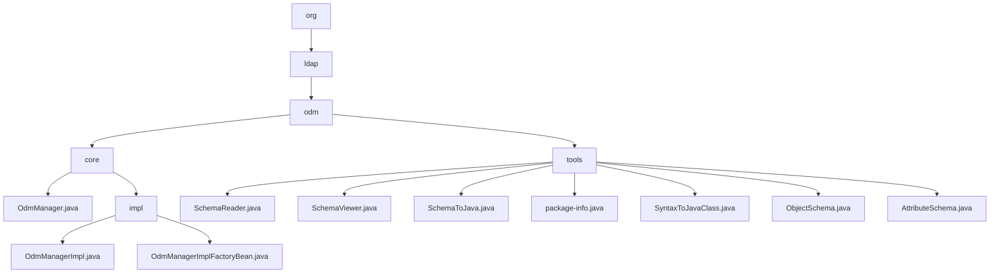

# 基础信息

|      |      |
|------|------|
| 名称 | springframework |
| 编码语言 | .java |
| 代码路径 | spring-ldap/odm/src/main/java/org/springframework |
| 包名 | spring-ldap.odm.src.main.java.org.springframework |
| 概述说明 | LDAP模块提供数据管理和模式转换功能，支持增删改查及Java代码生成。 |

# 说明

## 概述
该代码模块主要围绕LDAP（轻量目录访问协议）操作的管理和实现展开，涵盖了LDAP数据的增删改查、搜索、模式处理以及模式到Java代码的转换等功能。模块的核心类`OdmManagerImpl`提供了对LDAP数据的高效管理，依赖于`LdapTemplate`和`ObjectDirectoryMapper`组件。此外，模块还包含一系列工具类，用于读取、解析、查看和将LDAP模式转换为Java代码，确保数据操作的准确性和一致性。

## 主要业务场景
1. **LDAP数据管理**：通过`OdmManagerImpl`类，开发者可以执行对LDAP数据的增删改查及搜索操作，适用于需要与LDAP服务器进行交互的业务场景。
2. **LDAP模式处理**：
   - **LDAP模式读取与解析**：通过`SchemaReader`类，用户可以读取和解析LDAP模式，生成结构化的对象和属性模式，为后续处理提供基础数据。
   - **LDAP模式查看与查询**：`SchemaViewer`类支持用户通过默认或自定义的LDAP连接URL，快速访问和浏览LDAP模式中的对象类、属性和语法信息。
   - **LDAP模式到Java代码的转换**：`SchemaToJava`类提供了命令行配置功能，能够将LDAP模式转换为Java代码文件，简化了从LDAP模式到Java类的映射过程。
   - **语法结构到Java类的映射**：`SyntaxToJavaClass`类将特定的语法结构映射为Java类的相关信息，包括类名和包名，便于在Java环境中使用。
3. **对象与属性的管理**：`ObjectSchema`类管理对象的必须属性和可选属性，确保属性的一致性和完整性，并提供对象的比较和字符串化操作。`AttributeSchema`类则用于定义和管理属性的结构，确保属性定义的规范性和一致性。
4. **实例创建与初始化**：`OdmManagerImplFactoryBean`类（已弃用）用于创建和初始化`OdmManagerImpl`实例，确保实例能够正确配置并运行。尽管该类已被弃用，但在旧代码中仍可能见到其使用。
5. **依赖管理**：`OdmManagerImpl`依赖于`LdapTemplate`和`ObjectDirectoryMapper`，这两个组件分别负责LDAP操作和对象映射，确保数据操作的高效性和准确性。

这些功能组合为处理LDAP数据和模式提供了完整的解决方案，适用于需要在Java应用程序中集成LDAP功能的开发场景。

### 包内部结构视图

该流程图展示了Spring LDAP ODM模块的目录结构及其文件层级关系。从`org`开始，依次展开到`ldap`、`odm`，并进一步细分为`core`和`tools`两个子目录。`core`目录包含`OdmManager.java`及其实现类，而`tools`目录则包含了多个与模式读取和转换相关的工具类文件。整个结构清晰地反映了模块的组织方式。

# 文件列表 File List

| 名称   | 类型  | 说明 |
|-------|------|-------------|
| [ldap](ldap/_module.md) | package | LDAP模块提供数据管理和模式转换功能，支持增删改查及Java代码生成。 |

