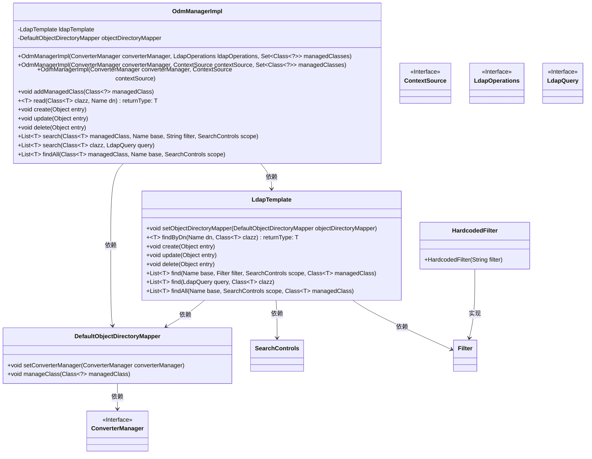

# 基础信息

|      |      |
|------|------|
| 名称 | OdmManagerImpl |
| 编码语言 | .java |
| 代码路径 | spring-ldap/odm/src/main/java/org/springframework/ldap/odm/core/impl/OdmManagerImpl.java |
| 包名 | org.springframework.ldap.odm.core.impl |
| 依赖项 | ['java.util.List', 'java.util.Set', 'javax.naming.Name', 'javax.naming.directory.SearchControls', 'org.springframework.ldap.core.ContextSource', 'org.springframework.ldap.core.LdapOperations', 'org.springframework.ldap.core.LdapTemplate', 'org.springframework.ldap.filter.Filter', 'org.springframework.ldap.filter.HardcodedFilter', 'org.springframework.ldap.odm.core.OdmManager', 'org.springframework.ldap.odm.typeconversion.ConverterManager', 'org.springframework.ldap.query.LdapQuery', 'org.springframework.util.StringUtils'] |
| 概述说明 | OdmManagerImpl类管理LDAP操作，支持增删改查及搜索，依赖LdapTemplate和ObjectDirectoryMapper。 |

# 说明

OdmManagerImpl类是一个用于管理LDAP操作的实现类，提供了增删改查及搜索功能。该类依赖于LdapTemplate和ObjectDirectoryMapper两个组件，通过这些依赖实现对LDAP数据的高效管理和操作。

# 类列表 Class Summary

| 名称   | 类型  | 说明 |
|-------|------|-------------|
| OdmManagerImpl | class | OdmManagerImpl类用于管理LDAP操作，支持增删改查及搜索功能，依赖LdapTemplate和ObjectDirectoryMapper。 |

## 类 OdmManagerImpl

|      |      |
|------|------|
| 访问范围 | @Deprecated;public final |
| 类型 | class |
| 名称 | OdmManagerImpl |
| 说明 | OdmManagerImpl类用于管理LDAP操作，支持增删改查及搜索功能，依赖LdapTemplate和ObjectDirectoryMapper。 |

### UML类图

**描述：**  
`OdmManagerImpl` 类实现了 `OdmManager` 接口，负责管理与 LDAP 目录的交互。它依赖于 `LdapTemplate` 和 `DefaultObjectDirectoryMapper` 来处理 LDAP 操作和对象映射。`LdapTemplate` 提供了对 LDAP 目录的 CRUD 操作，而 `DefaultObjectDirectoryMapper` 负责将 LDAP 条目映射到 Java 对象。`OdmManagerImpl` 通过构造函数初始化这些依赖，并提供了添加管理类、读取、创建、更新、删除和搜索 LDAP 条目的方法。

### 内部方法调用关系图

```mermaid
graph TD
    A["类OdmManagerImpl"]
    B["属性: LdapTemplate ldapTemplate"]
    C["属性: DefaultObjectDirectoryMapper objectDirectoryMapper"]
    D["构造方法: OdmManagerImpl(ConverterManager converterManager, LdapOperations ldapOperations, Set<Class<?>> managedClasses)"]
    E["构造方法: OdmManagerImpl(ConverterManager converterManager, ContextSource contextSource, Set<Class<?>> managedClasses)"]
    F["构造方法: OdmManagerImpl(ConverterManager converterManager, ContextSource contextSource)"]
    G["方法: void addManagedClass(Class<?> managedClass)"]
    H["方法: <T> T read(Class<T> clazz, Name dn)"]
    I["方法: void create(Object entry)"]
    J["方法: void update(Object entry)"]
    K["方法: void delete(Object entry)"]
    L["方法: <T> List<T> search(Class<T> managedClass, Name base, String filter, SearchControls scope)"]
    M["方法: <T> List<T> search(Class<T> clazz, LdapQuery query)"]
    N["方法: <T> List<T> findAll(Class<T> managedClass, Name base, SearchControls scope)"]

    A --> B
    A --> C
    A --> D
    A --> E
    A --> F
    A --> G
    A --> H
    A --> I
    A --> J
    A --> K
    A --> L
    A --> M
    A --> N
```

这段代码定义了一个名为 `OdmManagerImpl` 的类，该类实现了 `OdmManager` 接口。`OdmManagerImpl` 类主要用于管理与 LDAP 目录的交互操作，包括读取、创建、更新、删除和搜索 LDAP 条目。该类通过 `LdapTemplate` 和 `DefaultObjectDirectoryMapper` 来实现这些操作，并提供了多个构造方法以适应不同的初始化场景。流程图展示了类的主要属性、构造方法及其公共方法之间的关系，清晰地描述了类的内部结构和方法调用路径。

### 字段列表 Field List

| 名称  | 类型  | 说明 |
|-------|-------|------|
| objectDirectoryMapper | DefaultObjectDirectoryMapper | 私有默认对象目录映射器变量声明。 |
| ldapTemplate | LdapTemplate | 私有LdapTemplate类型变量ldapTemplate。 |

### 方法列表 Method List

| 名称  | 类型  | 说明 |
|-------|-------|------|
| findAll | List<T> | 公共方法`findAll`查询指定类在LDAP中的全部实例。 |
| read | T | 公共泛型方法读取LDAP数据，根据类名和DN查找对象。 |
| search | List<T> | 该方法通过LDAP模板查找指定类、基址、过滤器和搜索控件的对象列表。 |
| addManagedClass | void | 方法addManagedClass将指定类交由objectDirectoryMapper管理。 |
| delete | void | 删除指定对象的LDAP条目。 |
| search | List<T> | 重写search方法，通过ldapTemplate查找指定类实例。 |
| create | void | 创建方法调用ldapTemplate的create方法处理对象entry。 |
| update | void | 该方法使用ldapTemplate更新指定对象。 |

