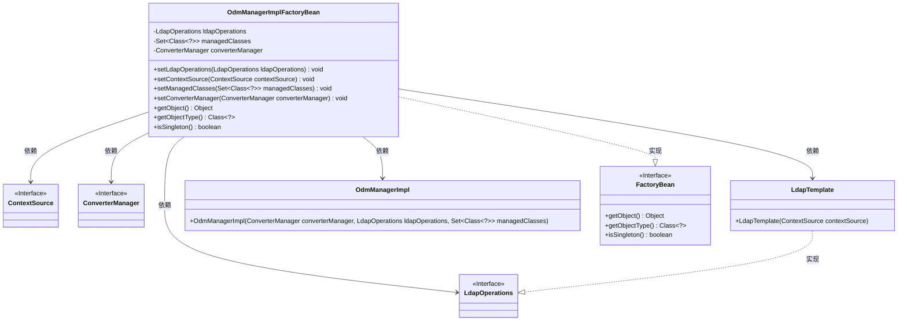
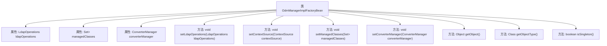

# 基础信息

|      |      |
|------|------|
| 名称 | OdmManagerImplFactoryBean |
| 编码语言 | .java |
| 代码路径 | spring-ldap/odm/src/main/java/org/springframework/ldap/odm/core/impl/OdmManagerImplFactoryBean.java |
| 包名 | org.springframework.ldap.odm.core.impl |
| 依赖项 | ['java.util.Set', 'org.springframework.beans.factory.FactoryBean', 'org.springframework.beans.factory.FactoryBeanNotInitializedException', 'org.springframework.ldap.core.ContextSource', 'org.springframework.ldap.core.LdapOperations', 'org.springframework.ldap.core.LdapTemplate', 'org.springframework.ldap.odm.typeconversion.ConverterManager'] |
| 概述说明 | 弃用类OdmManagerImplFactoryBean用于创建OdmManagerImpl实例，需配置ldapOperations等属性。 |

# 说明

已弃用的OdmManagerImplFactoryBean类主要用于创建OdmManagerImpl实例。在使用过程中，必须设置三个关键属性：ldapOperations、managedClasses和converterManager。这些属性分别用于定义LDAP操作、管理类以及转换管理器，确保OdmManagerImpl实例能够正常初始化和运行。由于该类已被弃用，建议使用替代方案以避免潜在问题。

# 类列表 Class Summary

| 名称   | 类型  | 说明 |
|-------|------|-------------|
| OdmManagerImplFactoryBean | class | 已弃用的OdmManagerImplFactoryBean类用于创建OdmManagerImpl实例，需设置ldapOperations、managedClasses和converterManager属性。 |

## 类 OdmManagerImplFactoryBean

|      |      |
|------|------|
| 访问范围 | @Deprecated;public final |
| 类型 | class |
| 名称 | OdmManagerImplFactoryBean |
| 说明 | 已弃用的OdmManagerImplFactoryBean类用于创建OdmManagerImpl实例，需设置ldapOperations、managedClasses和converterManager属性。 |

### UML类图

**描述：**  
`OdmManagerImplFactoryBean` 是一个工厂类，用于创建 `OdmManagerImpl` 实例。它依赖于 `LdapOperations`、`ContextSource` 和 `ConverterManager` 接口，并通过 `LdapTemplate` 实现 `LdapOperations`。该类实现了 `FactoryBean` 接口，提供了 `getObject`、`getObjectType` 和 `isSingleton` 方法。通过设置 `ldapOperations`、`managedClasses` 和 `converterManager`，工厂类可以生成 `OdmManagerImpl` 实例。

### 内部方法调用关系图

这段代码定义了一个名为 `OdmManagerImplFactoryBean` 的类，该类实现了 `FactoryBean` 接口。它包含多个属性和方法，用于设置和管理与 LDAP 目录交互的 `LdapOperations` 实例、被管理的类集合以及属性转换的 `ConverterManager`。`getObject` 方法用于创建并返回 `OdmManagerImpl` 实例，同时检查必要属性是否已设置。`getObjectType` 和 `isSingleton` 方法分别返回对象类型和指示该对象是否为单例的布尔值。

### 字段列表 Field List

| 名称  | 类型  | 说明 |
|-------|-------|------|
| converterManager = null | ConverterManager | 私有变量converterManager初始化为null。 |
| ldapOperations = null | LdapOperations | 私有变量ldapOperations初始化为null。 |
| managedClasses = null | Set<Class<?>> | 私有变量managedClasses用于存储一组类对象。 |

### 方法列表 Method List

| 名称  | 类型  | 说明 |
|-------|-------|------|
| setLdapOperations | void | 设置LDAP操作对象。 |
| getObjectType | Class<?> | 方法返回OdmManagerImpl类的类型对象。 |
| isSingleton | boolean | 该方法返回布尔值true，表示单例模式。 |
| setConverterManager | void | 该方法用于设置转换管理器实例。 |
| getObject | Object | 检查ldapOperations、managedClasses和converterManager是否为空，若为空抛出异常，否则返回OdmManagerImpl实例。 |
| setContextSource | void | 设置上下文源并初始化LdapTemplate对象。 |
| setManagedClasses | void | 设置托管类集合方法，接收Class对象集合并赋值给成员变量。 |

