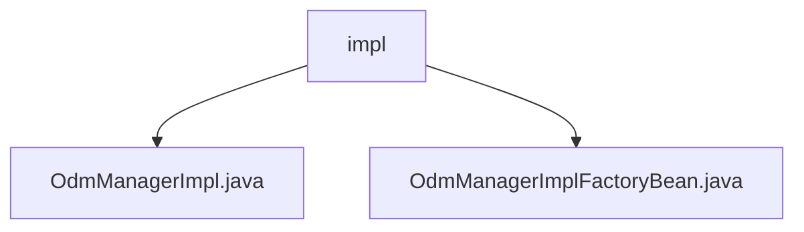

# 基础信息

|      |      |
|------|------|
| 名称 | impl |
| 编码语言 | .java |
| 代码路径 | spring-ldap/odm/src/main/java/org/springframework/ldap/odm/core/impl |
| 包名 | spring-ldap.odm.src.main.java.org.springframework.ldap.odm.core.impl |
| 概述说明 | OdmManagerImpl类管理LDAP操作，依赖LdapTemplate和ObjectDirectoryMapper。OdmManagerImplFactoryBean类已弃用，建议使用替代方案。 |

# 说明

## 概述
该代码模块主要涉及LDAP（轻量目录访问协议）操作的管理和实现。核心类`OdmManagerImpl`提供了对LDAP数据的增删改查及搜索功能，依赖于`LdapTemplate`和`ObjectDirectoryMapper`组件，以实现高效的数据管理和操作。此外，模块中还包含一个已弃用的`OdmManagerImplFactoryBean`类，该类用于创建`OdmManagerImpl`实例，但因其已被弃用，建议使用替代方案以避免潜在问题。

## 主要业务场景
1. **LDAP数据管理**：通过`OdmManagerImpl`类，开发者可以执行对LDAP数据的增删改查及搜索操作，适用于需要与LDAP服务器进行交互的业务场景。
2. **实例创建与初始化**：`OdmManagerImplFactoryBean`类（已弃用）用于创建和初始化`OdmManagerImpl`实例，确保实例能够正确配置并运行。尽管该类已被弃用，但在旧代码中仍可能见到其使用。
3. **依赖管理**：`OdmManagerImpl`依赖于`LdapTemplate`和`ObjectDirectoryMapper`，这两个组件分别负责LDAP操作和对象映射，确保数据操作的高效性和准确性。

### 包内部结构视图

该流程图展示了`spring-ldap/odm`项目中`impl`文件夹下的文件层级关系。`impl`文件夹包含两个文件：`OdmManagerImpl.java`和`OdmManagerImplFactoryBean.java`。这两个文件是`impl`文件夹的直接子节点，显示了它们在项目中的具体位置和结构关系。

# 文件列表 File List

| 名称   | 类型  | 说明 |
|-------|------|-------------|
| [OdmManagerImplFactoryBean.java](OdmManagerImplFactoryBean.md) | file | 弃用类OdmManagerImplFactoryBean用于创建OdmManagerImpl实例，需配置ldapOperations等属性。 |
| [OdmManagerImpl.java](OdmManagerImpl.md) | file | OdmManagerImpl类管理LDAP操作，支持增删改查及搜索，依赖LdapTemplate和ObjectDirectoryMapper。 |

