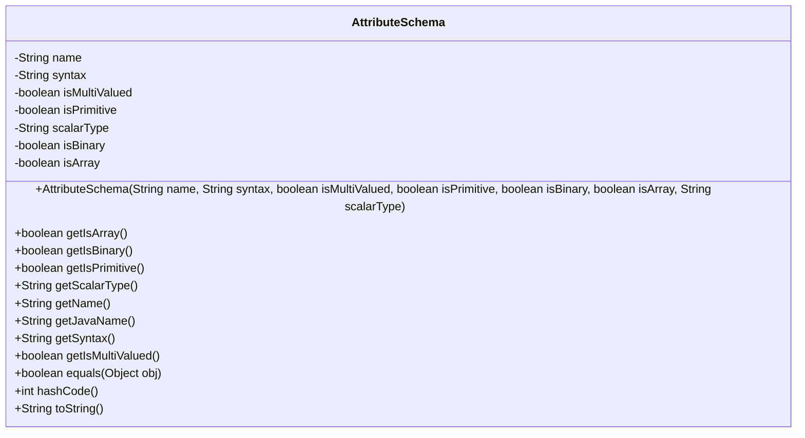

# 基础信息

|      |      |
|------|------|
| 名称 | AttributeSchema |
| 编码语言 | .java |
| 代码路径 | spring-ldap/odm/src/main/java/org/springframework/ldap/odm/tools/AttributeSchema.java |
| 包名 | org.springframework.ldap.odm.tools |
| 依赖项 | ['org.springframework.util.StringUtils'] |
| 概述说明 | AttributeSchema类定义属性结构，包含名称、语法、类型等字段和方法。 |

# 说明

AttributeSchema类用于定义属性结构，包含名称、语法、类型等关键字段，并提供了相应的方法来操作这些字段。该类通过结构化的方式管理属性信息，确保属性定义的规范性和一致性。

# 类列表 Class Summary

| 名称   | 类型  | 说明 |
|-------|------|-------------|
| AttributeSchema | class | AttributeSchema类定义属性结构，包含名称、语法、类型等字段及相应方法。 |

## 类 AttributeSchema

|      |      |
|------|------|
| 访问范围 | public final |
| 类型 | class |
| 名称 | AttributeSchema |
| 说明 | AttributeSchema类定义属性结构，包含名称、语法、类型等字段及相应方法。 |

### UML类图

这段代码定义了一个名为 `AttributeSchema` 的不可变类，用于表示属性模式。该类包含多个私有字段，如 `name`、`syntax`、`isMultiValued` 等，并通过构造函数进行初始化。类中提供了多个公有方法来获取这些字段的值，并重写了 `equals`、`hashCode` 和 `toString` 方法，以确保对象的比较、哈希计算和字符串表示的准确性。该类主要用于描述属性的结构和特性，适用于需要严格定义属性模式的场景。

### 内部方法调用关系图

```mermaid
graph TD
    A["类AttributeSchema"]
    B["属性: String name"]
    C["属性: String syntax"]
    D["属性: boolean isMultiValued"]
    E["属性: boolean isPrimitive"]
    F["属性: String scalarType"]
    G["属性: boolean isBinary"]
    H["属性: boolean isArray"]
    I["构造方法: AttributeSchema(String name, String syntax, boolean isMultiValued, boolean isPrimitive, boolean isBinary, boolean isArray, String scalarType)"]
    J["方法: boolean getIsArray()"]
    K["方法: boolean getIsBinary()"]
    L["方法: boolean getIsPrimitive()"]
    M["方法: String getScalarType()"]
    N["方法: String getName()"]
    O["方法: String getJavaName()"]
    P["方法: String getSyntax()"]
    Q["方法: boolean getIsMultiValued()"]
    R["重写方法: boolean equals(Object obj)"]
    S["重写方法: int hashCode()"]
    T["重写方法: String toString()"]

    A --> B
    A --> C
    A --> D
    A --> E
    A --> F
    A --> G
    A --> H
    A --> I
    A --> J
    A --> K
    A --> L
    A --> M
    A --> N
    A --> O
    A --> P
    A --> Q
    A --> R
    A --> S
    A --> T
```

这段代码定义了一个名为 `AttributeSchema` 的类，该类包含多个属性和方法，用于描述和操作属性的模式。类中的属性包括 `name`、`syntax`、`isMultiValued`、`isPrimitive`、`scalarType`、`isBinary` 和 `isArray`，这些属性通过构造方法进行初始化。类中还提供了多个 getter 方法用于获取这些属性的值，并重写了 `equals`、`hashCode` 和 `toString` 方法，以便进行对象的比较、哈希计算和字符串表示。流程图展示了类的结构及其内部方法之间的调用关系。

### 字段列表 Field List

| 名称  | 类型  | 说明 |
|-------|-------|------|
| syntax | String | 私有字符串变量语法声明。 |
| name | String | 私有字符串变量名为name。 |
| isPrimitive | boolean | 私有布尔变量，标识是否为基本类型。 |
| isMultiValued | boolean | 私有布尔变量，表示是否为多值类型。 |
| isBinary | boolean | 私有布尔变量isBinary。 |
| isArray | boolean | 该变量为私有不可变布尔类型，表示是否为数组。 |
| scalarType | String | 私有不可变的字符串类型变量scalarType。 |

### 方法列表 Method List

| 名称  | 类型  | 说明 |
|-------|-------|------|
| getIsBinary | boolean | 方法返回布尔值，表示是否为二进制。 |
| getScalarType | String | 该方法返回当前对象的标量类型。 |
| equals | boolean | 重写equals方法，比较对象属性是否一致。 |
| getIsArray | boolean | 该方法返回当前对象是否为数组的布尔值。 |
| getJavaName | String | 该方法将名称中的横杠替换为空字符串后返回。 |
| getName | String | 方法返回当前对象的名称属性。 |
| getSyntax | String | 获取语法字符串的方法。 |
| toString | String | 重写toString方法，格式化输出对象属性值。 |
| getIsMultiValued | boolean | 方法getIsMultiValued返回布尔值isMultiValued。 |
| getIsPrimitive | boolean | 该方法返回布尔值，表示当前对象是否为原始类型。 |
| hashCode | int | 重写hashCode方法，计算对象哈希值，包含多个布尔和字符串属性。 |

