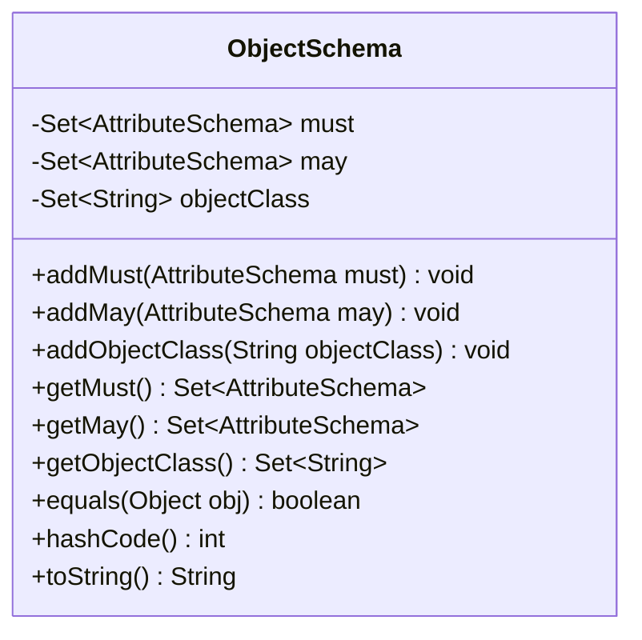

# 基础信息

|      |      |
|------|------|
| 名称 | ObjectSchema |
| 编码语言 | .java |
| 代码路径 | spring-ldap/odm/src/main/java/org/springframework/ldap/odm/tools/ObjectSchema.java |
| 包名 | org.springframework.ldap.odm.tools |
| 依赖项 | ['java.util.Collections', 'java.util.HashSet', 'java.util.Set'] |
| 概述说明 | ObjectSchema类管理属性和对象类，确保属性唯一，并提供常用方法。 |

# 说明

ObjectSchema类负责管理对象的必须属性和可选属性，确保这些属性在对象中不会重复出现。该类还提供了equals、hashCode和toString方法，用于比较对象的相等性、生成对象的哈希码以及将对象转换为字符串表示。通过这些功能，ObjectSchema类确保了对象的属性管理的一致性和完整性，并支持对象的比较和字符串化操作。

# 类列表 Class Summary

| 名称   | 类型  | 说明 |
|-------|------|-------------|
| ObjectSchema | class | ObjectSchema类管理必须、可选属性和对象类，确保属性不重复，并提供equals、hashCode和toString方法。 |

## 类 ObjectSchema

|      |      |
|------|------|
| 访问范围 | public final |
| 类型 | class |
| 名称 | ObjectSchema |
| 说明 | ObjectSchema类管理必须、可选属性和对象类，确保属性不重复，并提供equals、hashCode和toString方法。 |

### UML类图

这段代码定义了一个名为 `ObjectSchema` 的类，用于管理对象的模式。该类包含三个私有成员变量：`must`、`may` 和 `objectClass`，分别表示必须的属性、可选的属性和对象类。类中提供了添加和获取这些属性的方法，并重写了 `equals`、`hashCode` 和 `toString` 方法以确保对象的正确比较和字符串表示。该类的主要作用是维护和操作对象的模式信息，确保属性的正确性和一致性。

### 内部方法调用关系图

```mermaid
graph TD
    A["类ObjectSchema"]
    B["属性: Set<AttributeSchema> must"]
    C["属性: Set<AttributeSchema> may"]
    D["属性: Set<String> objectClass"]
    E["方法: void addMust(AttributeSchema must)"]
    F["方法: void addMay(AttributeSchema may)"]
    G["方法: void addObjectClass(String objectClass)"]
    H["方法: Set<AttributeSchema> getMust()"]
    I["方法: Set<AttributeSchema> getMay()"]
    J["方法: Set<String> getObjectClass()"]
    K["重写方法: boolean equals(Object obj)"]
    L["重写方法: int hashCode()"]
    M["重写方法: String toString()"]

    A --> B
    A --> C
    A --> D
    A --> E
    A --> F
    A --> G
    A --> H
    A --> I
    A --> J
    A --> K
    A --> L
    A --> M
```

这段代码定义了一个名为 `ObjectSchema` 的类，该类包含三个主要属性：`must`、`may` 和 `objectClass`，分别表示必须的属性、可选的属性和对象类。类中提供了添加和获取这些属性的方法，并重写了 `equals`、`hashCode` 和 `toString` 方法。`addMust` 方法确保 `must` 属性不会出现在 `may` 中，而 `addMay` 方法则确保 `may` 属性不会出现在 `must` 中。这些方法通过集合操作来维护属性的唯一性。

### 字段列表 Field List

| 名称  | 类型  | 说明 |
|-------|-------|------|
| must = new HashSet<>() | Set<AttributeSchema> | 私有集合存储必需的属性模式。 |
| may = new HashSet<>() | Set<AttributeSchema> | 定义私有不可变集合变量may，存储AttributeSchema类型元素。 |
| objectClass = new HashSet<>() | Set<String> | 声明并初始化一个私有的不可变字符串集合对象。 |

### 方法列表 Method List

| 名称  | 类型  | 说明 |
|-------|-------|------|
| getMay | Set<AttributeSchema> | 返回不可修改的may属性集合。 |
| equals | boolean | 重写equals方法，比较对象类型和属性是否一致。 |
| addMust | void | 将属性从可能列表移至必须列表。 |
| addMay | void | 方法addMay仅在may不在must中时将其添加到may集合。 |
| getObjectClass | Set<String> | 方法返回不可修改的对象类集合。 |
| addObjectClass | void | 方法`addObjectClass`将`objectClass`添加到当前对象的`objectClass`列表中。 |
| toString | String | 重写toString方法，返回对象类、必须属性和可选属性的格式化字符串。 |
| hashCode | int | 重写hashCode方法，使用31作为基数，计算may、must和objectClass的哈希值并组合。 |
| getMust | Set<AttributeSchema> | 方法getMust返回不可修改的AttributeSchema集合。 |

