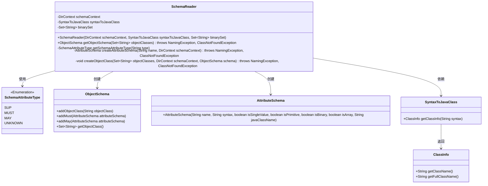
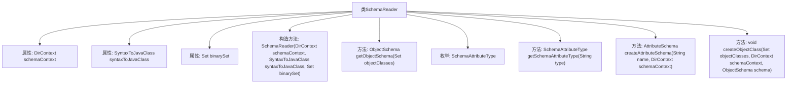
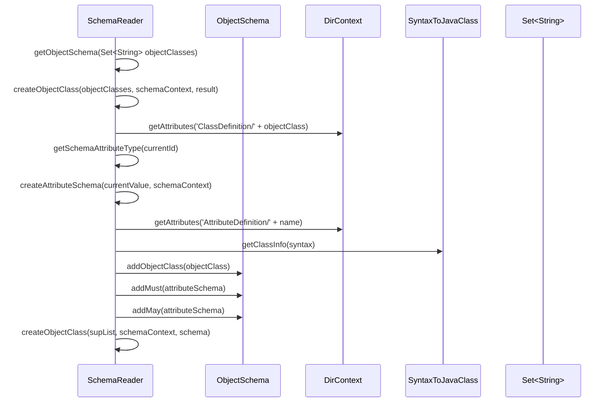

# 基础信息

|      |      |
|------|------|
| 名称 | SchemaReader |
| 编码语言 | .java |
| 代码路径 | spring-ldap/odm/src/main/java/org/springframework/ldap/odm/tools/SchemaReader.java |
| 包名 | org.springframework.ldap.odm.tools |
| 依赖项 | ['java.util.HashSet', 'java.util.Locale', 'java.util.Set', 'javax.naming.NamingEnumeration', 'javax.naming.NamingException', 'javax.naming.directory.Attribute', 'javax.naming.directory.Attributes', 'javax.naming.directory.DirContext', 'org.springframework.ldap.odm.tools.SyntaxToJavaClass.ClassInfo'] |
| 概述说明 | SchemaReader类解析LDAP模式，生成对象和属性模式。 |

# 说明

SchemaReader类是一个专门用于读取和解析LDAP模式的工具，其主要功能是生成对象和属性模式。通过该类的操作，用户可以有效地处理和转换LDAP模式数据，从而为后续的应用程序或系统提供结构化的模式信息。该类在LDAP模式处理过程中起到了关键作用，确保了数据的准确性和一致性。

# 类列表 Class Summary

| 名称   | 类型  | 说明 |
|-------|------|-------------|
| SchemaReader | class | SchemaReader类用于读取和解析LDAP模式，生成对象和属性模式。 |

## 类 SchemaReader

|      |      |
|------|------|
| 访问范围 | final |
| 类型 | class |
| 名称 | SchemaReader |
| 说明 | SchemaReader类用于读取和解析LDAP模式，生成对象和属性模式。 |

### UML类图

### 描述
`SchemaReader`类负责从目录上下文中读取对象模式，并将其转换为Java类。它依赖于`SyntaxToJavaClass`来将语法映射到Java类，并使用`SchemaAttributeType`枚举来区分不同的属性类型。`ObjectSchema`和`AttributeSchema`类分别用于存储对象模式和属性模式的信息。`SyntaxToJavaClass`类通过`ClassInfo`类提供Java类的详细信息。整体流程包括递归地创建对象类、处理属性类型，并最终生成对象模式。

### 内部方法调用关系图

**描述：**

`SchemaReader` 类用于从目录上下文中读取对象模式，并将其转换为Java类。它通过递归地处理对象的超类、必须属性和可选属性来构建对象模式。`getObjectSchema` 方法启动模式读取过程，`createObjectClass` 方法负责递归地处理对象类及其属性，`createAttributeSchema` 方法用于创建属性模式，`getSchemaAttributeType` 方法用于确定属性的类型。整个流程通过深度优先搜索来确保所有相关属性都被正确处理。

### 字段列表 Field List

| 名称  | 类型  | 说明 |
|-------|-------|------|
| schemaContext | DirContext | 私有不可变的DirContext对象schemaContext。 |
| syntaxToJavaClass | SyntaxToJavaClass | 私有成员变量syntaxToJavaClass，类型为SyntaxToJavaClass。 |
| binarySet | Set<String> | 私有不可变字符串集合变量 binarySet。 |

### 方法列表 Method List

| 名称  | 类型  | 说明 |
|-------|-------|------|
| getObjectSchema | ObjectSchema | 根据对象类集合生成对象模式并返回。 |
| getSchemaAttributeType | SchemaAttributeType | 根据输入类型返回对应的SchemaAttributeType枚举值。 |
| createAttributeSchema | AttributeSchema | 方法创建属性模式，获取语法定义，判断二进制类型，映射Java类，返回属性模式对象。 |
| createObjectClass | void | 方法`createObjectClass`处理对象类，递归添加超类及其属性。 |

