# 基础信息

|      |      |
|------|------|
| 名称 | SchemaToJava |
| 编码语言 | .java |
| 代码路径 | spring-ldap/odm/src/main/java/org/springframework/ldap/odm/tools/SchemaToJava.java |
| 包名 | org.springframework.ldap.odm.tools |
| 依赖项 | ['java.io.BufferedReader', 'java.io.File', 'java.io.FileOutputStream', 'java.io.FileReader', 'java.io.IOException', 'java.io.OutputStreamWriter', 'java.io.Writer', 'java.net.URL', 'java.util.HashMap', 'java.util.HashSet', 'java.util.Hashtable', 'java.util.Locale', 'java.util.Map', 'java.util.Set', 'java.util.regex.Matcher', 'java.util.regex.Pattern', 'javax.naming.Context', 'javax.naming.NamingException', 'javax.naming.directory.DirContext', 'javax.naming.directory.InitialDirContext', 'freemarker.template.Configuration', 'freemarker.template.DefaultObjectWrapper', 'freemarker.template.Template', 'freemarker.template.TemplateException', 'org.apache.commons.cli.CommandLine', 'org.apache.commons.cli.CommandLineParser', 'org.apache.commons.cli.HelpFormatter', 'org.apache.commons.cli.Options', 'org.apache.commons.cli.ParseException', 'org.apache.commons.cli.PosixParser', 'org.slf4j.Logger', 'org.slf4j.LoggerFactory'] |
| 概述说明 | SchemaToJava类将LDAP模式转Java代码，支持命令行配置生成文件。 |

# 说明

SchemaToJava类是一个用于将LDAP模式转换为Java代码的工具。它支持通过命令行参数进行配置，能够根据指定的LDAP模式生成相应的Java代码文件。该工具的主要功能是将LDAP模式的结构和属性映射到Java类中，便于开发者在Java应用程序中使用这些模式。通过命令行参数，用户可以灵活地配置生成代码的路径、文件名等选项，确保生成的代码符合项目需求。该工具简化了从LDAP模式到Java代码的转换过程，提高了开发效率。

# 类列表 Class Summary

| 名称   | 类型  | 说明 |
|-------|------|-------------|
| SchemaToJava | class | SchemaToJava类用于将LDAP模式转换为Java代码，支持命令行参数配置，生成代码文件。 |


## 类 SchemaToJava

|      |      |
|------|------|
| 访问范围 | public final |
| 类型 | class |
| 名称 | SchemaToJava |
| 说明 | SchemaToJava类用于将LDAP模式转换为Java代码，支持命令行参数配置，生成代码文件。 |


### UML类图

```mermaid
classDiagram
    class SchemaToJava {
        -Logger LOG
        -String TEMPLATE_FILE
        -String BINARY_FILE
        -Class<?> DEFAULT_LOADER_CLASS
        -String DEFAULT_URL
        -Options DEFAULT_OPTIONS
        +static void main(String[] argv)
        -static Set~String~ readBinarySet(File binarySetFile) throws IOException
        -static Map~String, String~ readSyntaxMap(File syntaxMapFile) throws IOException
        -static ObjectSchema readSchema(String url, String user, String pass, SyntaxToJavaClass syntaxToJavaClass, Set~String~ binarySet, Set~String~ objectClasses) throws NamingException, ClassNotFoundException
        -static void createCode(String packageName, String className, ObjectSchema schema, Set~SyntaxToJavaClass.ClassInfo~ imports, File outputFile) throws IOException, TemplateException
        -static File makeOutputFile(String outputDir, String packageName, String className) throws IOException
        -static Set~String~ parseObjectClassesFlag(String objectClassesFlag)
        -static void error(String message)
    }

    class Flag {
        <<Enumeration>>
        -String shortName
        -String longName
        +Flag(String shortName, String longName)
        +String getShort()
        +String getLong()
        +String toString()
    }

    class Options {
        +void addOption(String opt, String longOpt, boolean hasArg, String description)
    }

    class CommandLineParser {
        <<Interface>>
        +CommandLine parse(Options options, String[] arguments) throws ParseException
    }

    class PosixParser {
        +CommandLine parse(Options options, String[] arguments) throws ParseException
    }

    class CommandLine {
        +boolean hasOption(String opt)
        +String getOptionValue(String opt)
    }

    class HelpFormatter {
        +void printHelp(int width, String cmdLineSyntax, String header, Options options, String footer, boolean autoUsage)
    }

    class ObjectSchema {
        +String toString()
        +Set~AttributeSchema~ getMay()
    }

    class SyntaxToJavaClass {
        +SyntaxToJavaClass(Map~String, String~ syntaxMap)
        +ClassInfo getClassInfo(String syntax)
        class ClassInfo {
            +String getPackageName()
        }
    }

    class SchemaReader {
        +SchemaReader(DirContext schemaContext, SyntaxToJavaClass syntaxToJavaClass, Set~String~ binarySet)
        +ObjectSchema getObjectSchema(Set~String~ objectClasses)
    }

    class DirContext {
        <<Interface>>
        +DirContext getSchema(String name)
    }

    class InitialDirContext {
        +InitialDirContext(Hashtable~String, String~ environment)
    }

    class Configuration {
        +void setClassForTemplateLoading(Class<?> clazz, String path)
        +void setObjectWrapper(ObjectWrapper wrapper)
        +Template getTemplate(String name) throws IOException
    }

    class Template {
        +void process(Object dataModel, Writer out) throws TemplateException, IOException
    }

    SchemaToJava --> Flag : 使用
    SchemaToJava --> Options : 使用
    SchemaToJava --> CommandLineParser : 使用
    SchemaToJava --> CommandLine : 使用
    SchemaToJava --> HelpFormatter : 使用
    SchemaToJava --> ObjectSchema : 使用
    SchemaToJava --> SyntaxToJavaClass : 使用
    SchemaToJava --> SchemaReader : 使用
    SchemaToJava --> DirContext : 使用
    SchemaToJava --> InitialDirContext : 使用
    SchemaToJava --> Configuration : 使用
    SchemaToJava --> Template : 使用
    CommandLineParser <|.. PosixParser : 实现
    DirContext <|.. InitialDirContext : 实现
```

**描述：**
`SchemaToJava` 类是一个用于从LDAP模式生成Java代码的工具。它通过解析命令行参数、读取LDAP模式、处理语法映射文件，并使用FreeMarker模板生成Java类。该类依赖于多个辅助类，如`Flag`枚举用于定义命令行选项，`Options`和`CommandLine`用于解析命令行参数，`ObjectSchema`和`SyntaxToJavaClass`用于处理LDAP模式和语法映射，`SchemaReader`用于读取LDAP模式，`DirContext`和`InitialDirContext`用于与LDAP服务器交互，`Configuration`和`Template`用于生成Java代码。整个流程通过`main`方法驱动，最终生成Java类文件。


### 内部方法调用关系图

```mermaid
graph TD
    A["类SchemaToJava"]
    B["属性: Logger LOG"]
    C["属性: String TEMPLATE_FILE"]
    D["属性: String BINARY_FILE"]
    E["属性: Class<?> DEFAULT_LOADER_CLASS"]
    F["属性: String DEFAULT_URL"]
    G["枚举: Flag"]
    H["属性: Options DEFAULT_OPTIONS"]
    I["构造方法: SchemaToJava()"]
    J["方法: Set<String> readBinarySet(File binarySetFile)"]
    K["方法: Map<String, String> readSyntaxMap(File syntaxMapFile)"]
    L["方法: ObjectSchema readSchema(String url, String user, String pass, SyntaxToJavaClass syntaxToJavaClass, Set<String> binarySet, Set<String> objectClasses)"]
    M["方法: void createCode(String packageName, String className, ObjectSchema schema, Set<SyntaxToJavaClass.ClassInfo> imports, File outputFile)"]
    N["方法: File makeOutputFile(String outputDir, String packageName, String className)"]
    O["方法: Set<String> parseObjectClassesFlag(String objectClassesFlag)"]
    P["方法: void error(String message)"]
    Q["方法: void main(String[] argv)"]

    A --> B
    A --> C
    A --> D
    A --> E
    A --> F
    A --> G
    A --> H
    A --> I
    A --> J
    A --> K
    A --> L
    A --> M
    A --> N
    A --> O
    A --> P
    A --> Q
```



**描述：**
`SchemaToJava` 类用于将LDAP模式转换为Java代码。它包含多个私有静态属性，如日志记录器、模板文件路径、二进制文件路径等。类中定义了枚举 `Flag` 用于处理命令行参数，并通过 `Options` 对象管理这些参数。类中的方法包括读取二进制文件、读取语法映射文件、绑定到LDAP目录并读取模式、生成Java代码、创建输出文件等。`main` 方法负责解析命令行参数并调用相应的方法来完成整个转换过程。

### 字段列表 Field List

| 名称  | 类型  | 说明 |
|-------|-------|------|
| BINARY_FILE = "binary-attributes.txt" | String | 定义常量字符串BINARY_FILE，值为"binary-attributes.txt"。 |
| LOG = LoggerFactory.getLogger(SchemaToJava.class) | Logger | SchemaToJava类中定义了一个静态的Logger常量LOG。 |
| DEFAULT_LOADER_CLASS = SchemaToJava.class | Class<?> | 定义默认加载类为SchemaToJava。 |
| TEMPLATE_FILE = "oc-to-java.ftl" | String | 定义私有静态常量TEMPLATE_FILE为"oc-to-java.ftl"。 |
| DEFAULT_URL = "ldap://127.0.0.1:389" | String | 默认LDAP地址为127.0.0.1:389。 |
| DEFAULT_OPTIONS = new Options() | Options | 定义了一个私有静态常量DEFAULT_OPTIONS，初始化为Options对象。 |

### 方法列表 Method List

| 名称  | 类型  | 说明 |
|-------|-------|------|
| createCode | void | 使用FreeMarker生成Java代码并写入文件。 |
| error | void | 私有方法error打印错误信息并退出程序。 |
| parseObjectClassesFlag | Set<String> | 解析对象类标志字符串为小写去重集合。 |
| readBinarySet | Set<String> | 读取二进制文件内容并返回去重后的字符串集合。 |
| readSyntaxMap | Map<String, String> | 读取文件解析键值对，忽略注释行，处理异常并关闭流。 |
| main | void | 解析命令行参数，生成Java类，处理异常和文件读写。 |
| makeOutputFile | File | 根据包名和类名在指定目录创建Java文件，处理路径分隔符，捕获安全异常和IO异常。 |
| readSchema | ObjectSchema | 通过LDAP连接读取对象模式，配置环境后获取模式并返回。 |


