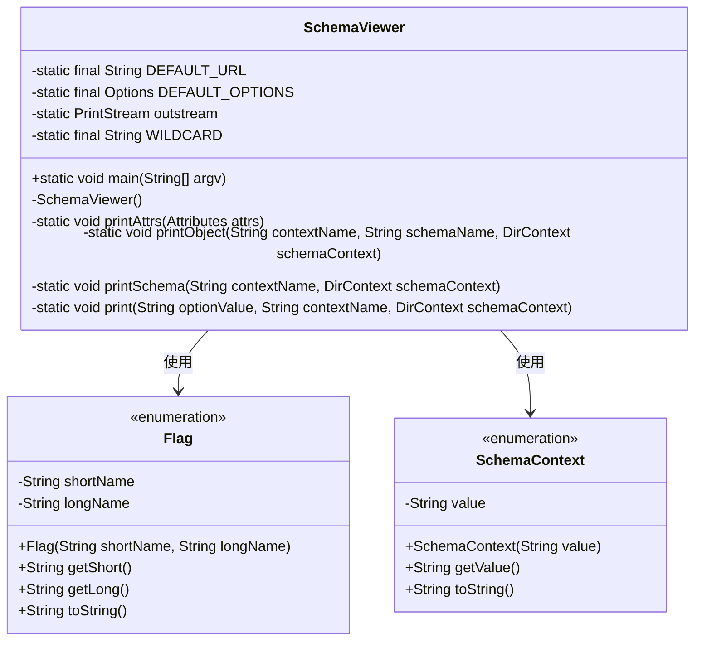
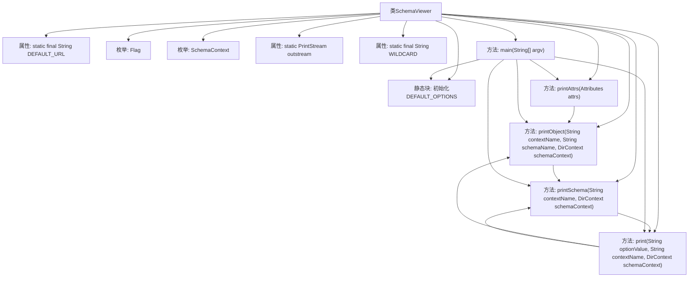

# 基础信息

|      |      |
|------|------|
| 名称 | SchemaViewer |
| 编码语言 | .java |
| 代码路径 | spring-ldap/odm/src/main/java/org/springframework/ldap/odm/tools/SchemaViewer.java |
| 包名 | org.springframework.ldap.odm.tools |
| 依赖项 | ['java.io.PrintStream', 'java.util.Hashtable', 'javax.naming.AuthenticationException', 'javax.naming.CommunicationException', 'javax.naming.Context', 'javax.naming.NameClassPair', 'javax.naming.NameNotFoundException', 'javax.naming.NamingEnumeration', 'javax.naming.NamingException', 'javax.naming.directory.Attribute', 'javax.naming.directory.Attributes', 'javax.naming.directory.DirContext', 'javax.naming.directory.InitialDirContext', 'org.apache.commons.cli.CommandLine', 'org.apache.commons.cli.CommandLineParser', 'org.apache.commons.cli.HelpFormatter', 'org.apache.commons.cli.Options', 'org.apache.commons.cli.ParseException', 'org.apache.commons.cli.PosixParser'] |
| 概述说明 | SchemaViewer类用于查询LDAP模式，默认URL为ldap://127.0.0.1:389。 |

# 说明

SchemaViewer类是一个用于查看LDAP模式的工具，支持查询对象类、属性和语法。默认情况下，它通过URL ldap://127.0.0.1:389进行连接，方便用户快速访问和浏览LDAP模式信息。

# 类列表 Class Summary

| 名称   | 类型  | 说明 |
|-------|------|-------------|
| SchemaViewer | class | SchemaViewer类用于查看LDAP模式，支持对象类、属性和语法的查询，默认URL为ldap://127.0.0.1:389。 |

## 类 SchemaViewer

|      |      |
|------|------|
| 访问范围 | public final |
| 类型 | class |
| 名称 | SchemaViewer |
| 说明 | SchemaViewer类用于查看LDAP模式，支持对象类、属性和语法的查询，默认URL为ldap://127.0.0.1:389。 |

### UML类图

类图描述：
`SchemaViewer` 类是一个用于查看LDAP模式信息的工具类，包含静态方法和枚举类型。`Flag` 枚举定义了命令行选项的短名称和长名称，`SchemaContext` 枚举定义了模式上下文类型。`SchemaViewer` 类通过`main`方法解析命令行参数，并根据参数调用不同的打印方法来输出LDAP模式信息。类图中展示了`SchemaViewer`与`Flag`和`SchemaContext`的依赖关系。

### 内部方法调用关系图

这段代码定义了一个`SchemaViewer`类，用于查看LDAP（轻量目录访问协议）的架构信息。类中包含两个枚举`Flag`和`SchemaContext`，分别用于表示命令行选项和架构上下文。`DEFAULT_OPTIONS`静态块初始化了命令行选项。`printAttrs`、`printObject`、`printSchema`和`print`方法用于打印LDAP架构的不同部分。`main`方法解析命令行参数，并根据参数调用相应的打印方法。代码通过`InitialDirContext`与LDAP服务器进行交互，处理可能的异常情况。

### 字段列表 Field List

| 名称  | 类型  | 说明 |
|-------|-------|------|
| DEFAULT_OPTIONS = new Options() | Options | 默认选项初始化为私有静态常量。 |
| DEFAULT_URL = "ldap://127.0.0.1:389" | String | 默认LDAP地址为127.0.0.1，端口389。 |
| WILDCARD = "?" | String | 定义静态常量WILDCARD，值为"?"。 |
| outstream = System.out | PrintStream | 定义私有静态PrintStream变量outstream，初始化为System.out。 |

### 方法列表 Method List

| 名称  | 类型  | 说明 |
|-------|-------|------|
| printAttrs | void | 打印属性ID及其所有值。 |
| print | void | 根据选项值打印模式或对象，处理命名异常。 |
| main | void | Java程序解析命令行参数，连接LDAP服务器，查询并打印模式信息。 |
| printSchema | void | 静态方法打印目录架构，遍历并输出指定上下文中的对象信息。 |
| printObject | void | 打印对象信息：查找并输出指定上下文和模式的属性。 |

