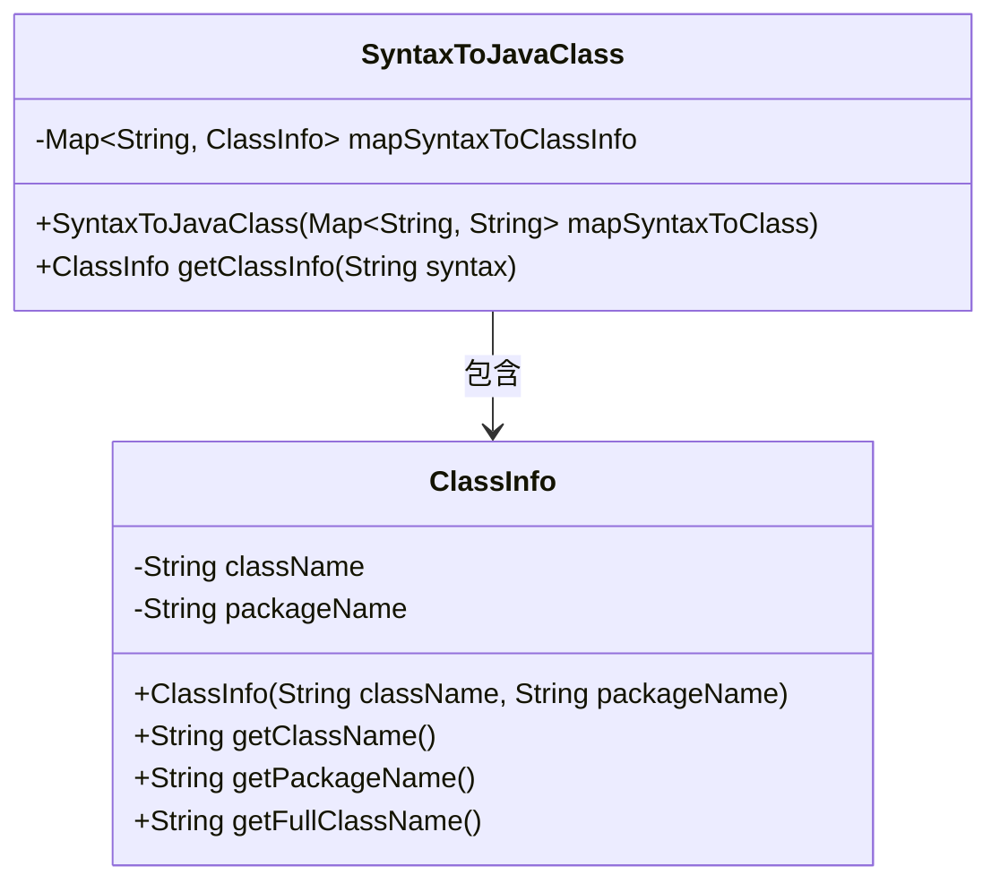
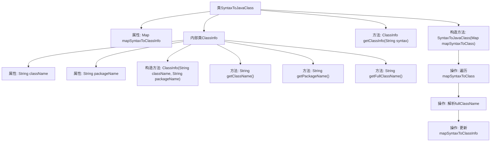

# 基础信息

|      |      |
|------|------|
| 名称 | SyntaxToJavaClass |
| 编码语言 | .java |
| 代码路径 | spring-ldap/odm/src/main/java/org/springframework/ldap/odm/tools/SyntaxToJavaClass.java |
| 包名 | org.springframework.ldap.odm.tools |
| 依赖项 | ['java.util.HashMap', 'java.util.Map', 'java.util.Map.Entry'] |
| 概述说明 | SyntaxToJavaClass类实现语法到Java类的映射，包含类名和包名。 |

# 说明

SyntaxToJavaClass类的主要功能是将特定的语法结构映射为Java类的相关信息。该类包含两个关键属性：类名和包名。类名表示映射后的Java类的名称，包名则表示该Java类所属的包路径。通过这种映射，SyntaxToJavaClass类能够将语法元素准确地转换为Java编程语言中的类定义，便于在Java环境中使用和操作。

# 类列表 Class Summary

| 名称   | 类型  | 说明 |
|-------|------|-------------|
| SyntaxToJavaClass | class | SyntaxToJavaClass类将语法映射为Java类信息，包含类名和包名。 |

## 类 SyntaxToJavaClass

|      |      |
|------|------|
| 访问范围 | final |
| 类型 | class |
| 名称 | SyntaxToJavaClass |
| 说明 | SyntaxToJavaClass类将语法映射为Java类信息，包含类名和包名。 |

### UML类图

这段代码定义了两个类：`SyntaxToJavaClass` 和 `ClassInfo`。`SyntaxToJavaClass` 类通过构造函数接收一个 `Map<String, String>` 类型的参数，并将其转换为 `Map<String, ClassInfo>` 类型的内部数据结构。`ClassInfo` 类用于存储类名和包名，并提供了获取完整类名的方法。`SyntaxToJavaClass` 类依赖于 `ClassInfo` 类来存储和管理类信息。整体设计用于将语法映射到 Java 类的信息。

### 内部方法调用关系图

这段代码定义了一个`SyntaxToJavaClass`类，用于将语法字符串映射到Java类的信息。该类包含一个内部类`ClassInfo`，用于存储类名和包名。`SyntaxToJavaClass`的构造函数通过遍历传入的`Map<String, String>`，解析出类名和包名，并将其存储在`mapSyntaxToClassInfo`中。`getClassInfo`方法则用于根据语法字符串获取对应的类信息。

### 字段列表 Field List

| 名称  | 类型  | 说明 |
|-------|-------|------|
| mapSyntaxToClassInfo = new HashMap<>() | Map<String, ClassInfo> | 声明一个私有最终Map变量，存储字符串到ClassInfo的映射。 |

### 方法列表 Method List

| 名称  | 类型  | 说明 |
|-------|-------|------|
| getClassInfo | ClassInfo | 获取语法对应的类信息。 |

