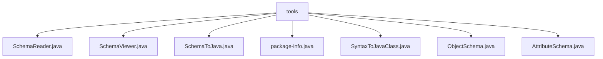

# 基础信息

|      |      |
|------|------|
| 名称 | tools |
| 编码语言 | .java |
| 代码路径 | spring-ldap/odm/src/main/java/org/springframework/ldap/odm/tools |
| 包名 | spring-ldap.odm.src.main.java.org.springframework.ldap.odm.tools |
| 概述说明 | SchemaReader读取LDAP模式，SchemaViewer查看LDAP模式，SchemaToJava将LDAP模式转Java代码，SyntaxToJavaClass映射语法为Java类，ObjectSchema管理对象属性，AttributeSchema定义属性结构。 |

# 说明

## 概述
该代码模块主要围绕LDAP（轻量级目录访问协议）模式的处理和转换展开，提供了一系列工具类用于读取、解析、查看和将LDAP模式转换为Java代码。模块的核心功能包括生成对象和属性模式、查询LDAP模式信息、将LDAP模式映射为Java类、管理对象和属性的结构等。通过这些工具，开发者可以高效地处理LDAP模式数据，并将其集成到Java应用程序中，确保数据的准确性和一致性。

## 主要业务场景
1. **LDAP模式读取与解析**：通过`SchemaReader`类，用户可以读取和解析LDAP模式，生成结构化的对象和属性模式，为后续处理提供基础数据。
2. **LDAP模式查看与查询**：`SchemaViewer`类支持用户通过默认或自定义的LDAP连接URL，快速访问和浏览LDAP模式中的对象类、属性和语法信息。
3. **LDAP模式到Java代码的转换**：`SchemaToJava`类提供了命令行配置功能，能够将LDAP模式转换为Java代码文件，简化了从LDAP模式到Java类的映射过程。
4. **语法结构到Java类的映射**：`SyntaxToJavaClass`类将特定的语法结构映射为Java类的相关信息，包括类名和包名，便于在Java环境中使用。
5. **对象与属性的管理**：`ObjectSchema`类管理对象的必须属性和可选属性，确保属性的一致性和完整性，并提供对象的比较和字符串化操作。`AttributeSchema`类则用于定义和管理属性的结构，确保属性定义的规范性和一致性。

这些工具类的组合为处理LDAP模式提供了完整的解决方案，适用于需要在Java应用程序中集成LDAP模式的开发场景。

### 包内部结构视图

该流程图展示了`spring-ldap/odm/src/main/java/org/springframework/ldap/odm/tools`目录下的文件结构。`tools`作为根节点，包含了多个子节点，每个子节点代表一个具体的Java文件，如`SchemaReader.java`、`SchemaViewer.java`等。这些文件都是`tools`目录下的直接子文件，没有更深层次的嵌套结构。

# 文件列表 File List

| 名称   | 类型  | 说明 |
|-------|------|-------------|
| [AttributeSchema.java](AttributeSchema.md) | file | AttributeSchema类定义属性结构，包含名称、语法、类型等字段和方法。 |
| [ObjectSchema.java](ObjectSchema.md) | file | ObjectSchema类管理属性和对象类，确保属性唯一，并提供常用方法。 |
| [package-info.java](package-info.md) | file | 信息为空，无法生成概要描述。 |
| [SyntaxToJavaClass.java](SyntaxToJavaClass.md) | file | SyntaxToJavaClass类实现语法到Java类的映射，包含类名和包名。 |
| [SchemaToJava.java](SchemaToJava.md) | file | SchemaToJava类将LDAP模式转Java代码，支持命令行配置生成文件。 |
| [SchemaViewer.java](SchemaViewer.md) | file | SchemaViewer类用于查询LDAP模式，默认URL为ldap://127.0.0.1:389。 |
| [SchemaReader.java](SchemaReader.md) | file | SchemaReader类解析LDAP模式，生成对象和属性模式。 |

