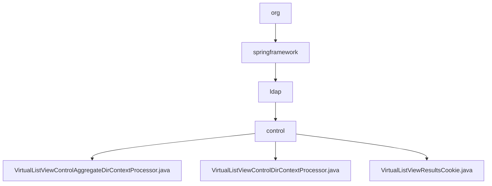

# 基础信息

|      |      |
|------|------|
| 名称 | org |
| 编码语言 | .java |
| 代码路径 | spring-ldap/sandbox/src/main/java/org |
| 包名 | spring-ldap.sandbox.src.main.java.org |
| 概述说明 | 虚拟列表视图控制工具集成排序和视图管理，优化数据展示，提升用户体验。 |

# 说明

## 概述

该代码模块主要围绕虚拟列表视图控制功能展开，旨在优化和管理列表视图的展示与操作。模块通过多个组件协同工作，提供了上下文感知、动态排序、视图控制、分页和偏移量设置等功能，适用于需要高效处理和管理大量数据的应用场景。模块的核心目标是提升用户体验，确保数据展示的准确性和一致性，同时优化系统性能。

## 主要业务场景

1. **复杂列表管理**：该模块适用于需要精细控制列表视图的场景，特别是那些涉及大量数据展示和操作的应用。通过上下文感知和动态排序功能，用户可以高效地浏览和操作列表内容。

2. **LDAP数据处理**：模块中的组件专门用于处理LDAP请求和响应，支持分页和偏移量设置。这使得系统能够高效管理大量LDAP数据，减少单次请求的数据量，提升系统性能。

3. **数据状态追踪**：通过`VirtualListViewResultsCookie`类，模块能够有效地管理和追踪列表视图中的数据和状态，确保视图的准确性和一致性。

4. **性能优化**：模块通过分页机制和偏移量设置，减少单次请求的数据量，提升系统性能，适用于需要高效处理大量数据的系统。

### 包内部结构视图

该流程图展示了Spring LDAP项目中路径的层级关系。从根目录`org`开始，逐步深入到`springframework`、`ldap`和`control`文件夹，最终展示了`control`文件夹下的三个Java文件。这些文件与虚拟列表视图控制相关，体现了项目的模块化结构。

# 文件列表 File List

| 名称   | 类型  | 说明 |
|-------|------|-------------|
| [springframework](springframework/_module.md) | package | 虚拟列表视图控制工具集成排序和视图管理，优化数据展示，提升用户体验。 |

