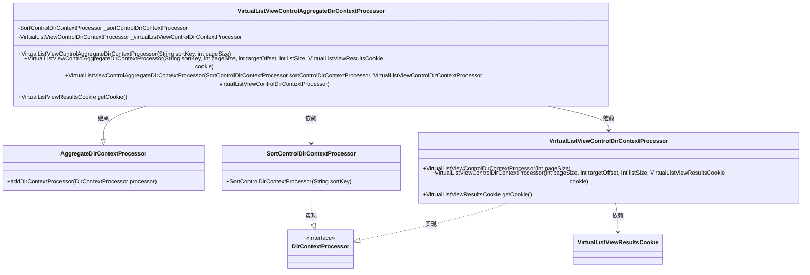
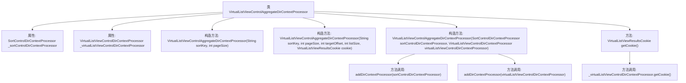

# 基础信息

|      |      |
|------|------|
| 名称 | VirtualListViewControlAggregateDirContextProcessor |
| 编码语言 | .java |
| 代码路径 | spring-ldap/sandbox/src/main/java/org/springframework/ldap/control/VirtualListViewControlAggregateDirContextProcessor.java |
| 包名 | org.springframework.ldap.control |
| 依赖项 | ['org.springframework.ldap.core.support.AggregateDirContextProcessor'] |
| 概述说明 | 虚拟列表视图集成排序与列表控制功能。 |

# 说明

虚拟列表视图控制聚合目录上下文处理器是一个集成排序和列表视图控制功能的工具。它通过聚合目录上下文，实现对列表视图的精细控制，包括排序和显示管理。该处理器旨在提升用户体验，优化数据展示，确保用户能够高效地浏览和操作列表内容。其核心功能包括上下文感知、动态排序和视图控制，适用于需要复杂列表管理的应用场景。

# 类列表 Class Summary

| 名称   | 类型  | 说明 |
|-------|------|-------------|
| VirtualListViewControlAggregateDirContextProcessor | class | 虚拟列表视图控制聚合目录上下文处理器，集成排序和列表视图控制功能。 |

## 类 VirtualListViewControlAggregateDirContextProcessor

|      |      |
|------|------|
| 访问范围 | public |
| 类型 | class |
| 名称 | VirtualListViewControlAggregateDirContextProcessor |
| 说明 | 虚拟列表视图控制聚合目录上下文处理器，集成排序和列表视图控制功能。 |

### UML类图

这段代码定义了一个名为 `VirtualListViewControlAggregateDirContextProcessor` 的类，它继承自 `AggregateDirContextProcessor`，并依赖于 `SortControlDirContextProcessor` 和 `VirtualListViewControlDirContextProcessor` 两个类。`VirtualListViewControlAggregateDirContextProcessor` 类通过构造函数初始化这两个依赖类，并将它们添加到处理器列表中。`VirtualListViewControlDirContextProcessor` 类负责处理虚拟列表视图控制逻辑，并返回一个 `VirtualListViewResultsCookie` 对象。整个类图展示了类之间的继承、依赖和实现关系，清晰地表达了代码的结构和功能。

### 内部方法调用关系图

这段代码定义了一个名为`VirtualListViewControlAggregateDirContextProcessor`的类，该类继承自`AggregateDirContextProcessor`。它包含两个私有属性：`_sortControlDirContextProcessor`和`_virtualListViewControlDirContextProcessor`，分别用于处理排序控制和虚拟列表视图控制。类中有三个构造方法，用于初始化这两个属性，并通过`addDirContextProcessor`方法将它们添加到上下文中。此外，还提供了一个`getCookie`方法，用于从`_virtualListViewControlDirContextProcessor`中获取`VirtualListViewResultsCookie`对象。

### 字段列表 Field List

| 名称  | 类型  | 说明 |
|-------|-------|------|
| _virtualListViewControlDirContextProcessor | VirtualListViewControlDirContextProcessor | 私有虚拟列表视图控件目录上下文处理器实例变量。 |
| _sortControlDirContextProcessor | SortControlDirContextProcessor | 私有排序控制目录上下文处理器实例声明。 |

### 方法列表 Method List

| 名称  | 类型  | 说明 |
|-------|-------|------|
| getCookie | VirtualListViewResultsCookie | 获取虚拟列表视图控制器的Cookie信息。 |

