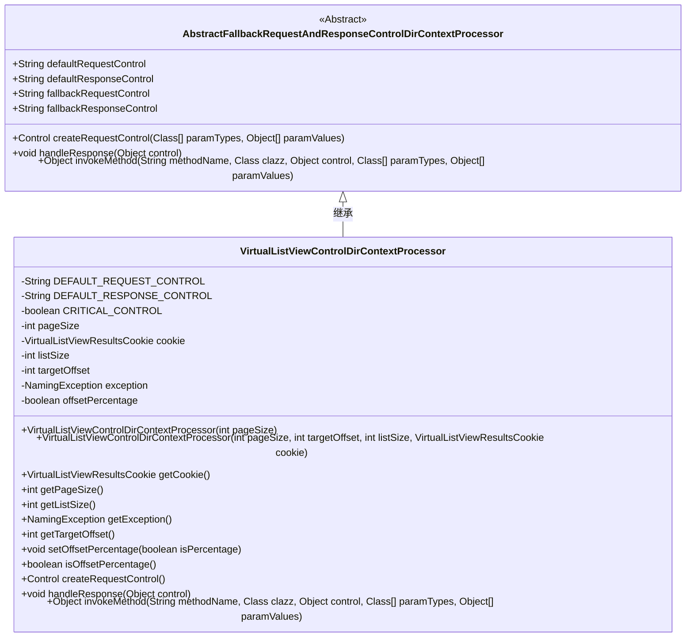

# 基础信息

|      |      |
|------|------|
| 名称 | VirtualListViewControlDirContextProcessor |
| 编码语言 | .java |
| 代码路径 | spring-ldap/sandbox/src/main/java/org/springframework/ldap/control/VirtualListViewControlDirContextProcessor.java |
| 包名 | org.springframework.ldap.control |
| 依赖项 | ['java.lang.reflect.Method', 'javax.naming.NamingException', 'javax.naming.ldap.Control', 'org.springframework.ldap.support.LdapUtils', 'org.springframework.util.ReflectionUtils'] |
| 概述说明 | 虚拟列表视图控件处理LDAP请求响应，支持分页和偏移量。 |

# 说明

虚拟列表视图控件处理器是一种专门用于处理LDAP请求和响应的工具，支持分页和偏移量设置。该处理器能够高效管理大量数据，通过分页机制减少单次请求的数据量，提升系统性能。偏移量设置功能允许用户从指定位置开始获取数据，适用于需要精确控制数据范围的应用场景。该处理器在处理LDAP协议时，能够确保数据的完整性和一致性，适用于需要高效处理大量LDAP数据的系统。

# 类列表 Class Summary

| 名称   | 类型  | 说明 |
|-------|------|-------------|
| VirtualListViewControlDirContextProcessor | class | 虚拟列表视图控件处理器，用于LDAP请求和响应控制，支持分页和偏移量设置。 |

## 类 VirtualListViewControlDirContextProcessor

|      |      |
|------|------|
| 访问范围 | public |
| 类型 | class |
| 名称 | VirtualListViewControlDirContextProcessor |
| 说明 | 虚拟列表视图控件处理器，用于LDAP请求和响应控制，支持分页和偏移量设置。 |

### UML类图

**描述**：`VirtualListViewControlDirContextProcessor` 类继承自 `AbstractFallbackRequestAndResponseControlDirContextProcessor`，用于处理虚拟列表视图控制请求和响应。它包含多个私有属性，如 `pageSize`、`cookie`、`listSize` 等，并提供了一系列公有方法来获取和设置这些属性。该类的主要功能是通过 `createRequestControl` 方法创建请求控制对象，并通过 `handleResponse` 方法处理响应。

### 内部方法调用关系图

```mermaid
graph TD
    A["类VirtualListViewControlDirContextProcessor"]
    B["属性: int pageSize"]
    C["属性: VirtualListViewResultsCookie cookie"]
    D["属性: int listSize"]
    E["属性: int targetOffset"]
    F["属性: NamingException exception"]
    G["属性: boolean offsetPercentage"]
    H["构造方法: VirtualListViewControlDirContextProcessor(int pageSize)"]
    I["构造方法: VirtualListViewControlDirContextProcessor(int pageSize, int targetOffset, int listSize, VirtualListViewResultsCookie cookie)"]
    J["方法: VirtualListViewResultsCookie getCookie()"]
    K["方法: int getPageSize()"]
    L["方法: int getListSize()"]
    M["方法: NamingException getException()"]
    N["方法: int getTargetOffset()"]
    O["方法: void setOffsetPercentage(boolean isPercentage)"]
    P["方法: boolean isOffsetPercentage()"]
    Q["方法: Control createRequestControl()"]
    R["方法: void handleResponse(Object control)"]
    S["静态方法: Object invokeMethod(String methodName, Class clazz, Object control, Class[] paramTypes, Object[] paramValues)"]

    A --> B
    A --> C
    A --> D
    A --> E
    A --> F
    A --> G
    A --> H
    A --> I
    A --> J
    A --> K
    A --> L
    A --> M
    A --> N
    A --> O
    A --> P
    A --> Q
    A --> R
    A --> S
```

这段代码定义了一个名为`VirtualListViewControlDirContextProcessor`的类，继承自`AbstractFallbackRequestAndResponseControlDirContextProcessor`。该类主要用于处理LDAP虚拟列表视图控件的请求和响应。它包含多个属性，如`pageSize`、`cookie`、`listSize`等，以及多个方法用于获取和设置这些属性。`createRequestControl`方法根据`offsetPercentage`的值创建不同的请求控件，`handleResponse`方法处理响应并更新内部状态，`invokeMethod`是一个静态方法，用于通过反射调用指定方法。

### 字段列表 Field List

| 名称  | 类型  | 说明 |
|-------|-------|------|
| DEFAULT_RESPONSE_CONTROL = "com.sun.jndi.ldap.ctl.VirtualListViewResponseControl" | String | 默认响应控制为虚拟列表视图响应控件。 |
| CRITICAL_CONTROL = true | boolean | 私有静态常量CRITICAL_CONTROL值为真。 |
| listSize | int | 私有整型变量用于存储列表大小。 |
| cookie | VirtualListViewResultsCookie | 私有变量`cookie`用于存储虚拟列表视图结果。 |
| exception | NamingException | 私有变量exception为NamingException类型。 |
| pageSize | int | 私有整型变量pageSize。 |
| targetOffset | int | 定义私有整型变量targetOffset。 |
| DEFAULT_REQUEST_CONTROL = "com.sun.jndi.ldap.ctl.VirtualListViewControl" | String | 默认请求控制为VirtualListViewControl。 |
| offsetPercentage | boolean | 私有布尔类型变量offsetPercentage。 |

### 方法列表 Method List

| 名称  | 类型  | 说明 |
|-------|-------|------|
| setOffsetPercentage | void | 设置偏移量是否为百分比。 |
| invokeMethod | Object | 通过反射调用指定类的方法并返回结果。 |
| isOffsetPercentage | boolean | 该方法返回偏移量是否为百分比形式。 |
| getTargetOffset | int | 获取目标偏移量的方法。 |
| getListSize | int | 获取列表大小的公共方法，返回当前列表大小。 |
| getPageSize | int | 该方法返回当前页面的尺寸。 |
| handleResponse | void | 处理响应，获取上下文ID、列表大小、目标偏移量和异常，生成cookie并处理异常。 |
| getException | NamingException | 获取当前异常实例的方法。 |
| createRequestControl | Control | 根据条件创建请求控制对象，设置偏移量、页面大小等参数，并可选设置上下文ID。 |
| getCookie | VirtualListViewResultsCookie | 获取虚拟列表视图结果的cookie值。 |

