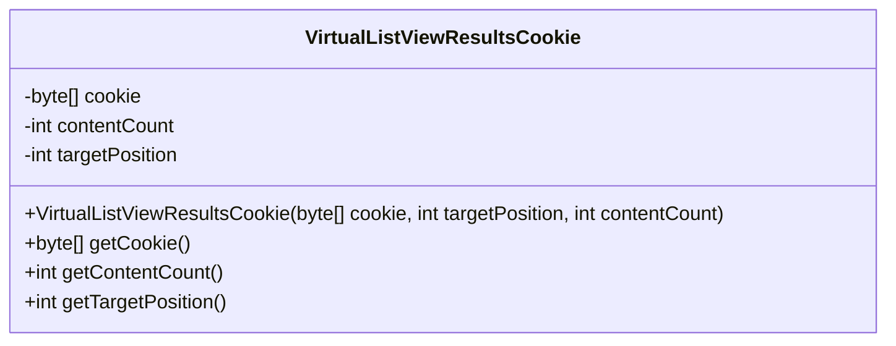
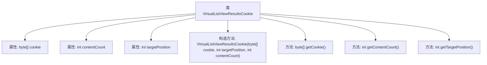

# 基础信息

|      |      |
|------|------|
| 名称 | VirtualListViewResultsCookie |
| 编码语言 | .java |
| 代码路径 | spring-ldap/sandbox/src/main/java/org/springframework/ldap/control/VirtualListViewResultsCookie.java |
| 包名 | org.springframework.ldap.control |
| 依赖项 | [] |
| 概述说明 | VirtualListViewResultsCookie类存储cookie、目标位置和内容计数。 |

# 说明

VirtualListViewResultsCookie类用于存储与虚拟列表视图相关的关键信息，包括cookie、目标位置和内容计数。通过该类的实例，可以有效地管理和追踪列表视图中的数据和状态，确保视图的准确性和一致性。

# 类列表 Class Summary

| 名称   | 类型  | 说明 |
|-------|------|-------------|
| VirtualListViewResultsCookie | class | VirtualListViewResultsCookie类存储cookie、目标位置和内容计数。 |

## 类 VirtualListViewResultsCookie

|      |      |
|------|------|
| 访问范围 | public |
| 类型 | class |
| 名称 | VirtualListViewResultsCookie |
| 说明 | VirtualListViewResultsCookie类存储cookie、目标位置和内容计数。 |

### UML类图

**描述：**  
`VirtualListViewResultsCookie` 类用于存储与虚拟列表视图结果相关的数据，包括一个字节数组 `cookie`、内容数量 `contentCount` 和目标位置 `targetPosition`。该类提供了构造函数来初始化这些属性，并提供了相应的 getter 方法来获取这些属性的值。该类主要用于处理虚拟列表视图响应的控制数据。

### 内部方法调用关系图

这段代码定义了一个名为 `VirtualListViewResultsCookie` 的类，该类包含三个私有属性：`cookie`、`contentCount` 和 `targetPosition`。类中提供了一个构造方法用于初始化这些属性，并提供了三个公共方法分别用于获取这些属性的值。流程图展示了类的结构以及各方法之间的关系，帮助理解类的内部逻辑和功能。

### 字段列表 Field List

| 名称  | 类型  | 说明 |
|-------|-------|------|
| contentCount | int | 私有整型变量contentCount用于计数。 |
| cookie | byte[] | 私有字节数组存储cookie信息。 |
| targetPosition | int | 目标位置私有整型变量。 |

### 方法列表 Method List

| 名称  | 类型  | 说明 |
|-------|-------|------|
| getCookie | byte[] | 获取当前对象的cookie字节数组。 |
| getTargetPosition | int | 获取目标位置的方法，返回当前目标位置值。 |
| getContentCount | int | 获取内容数量的公共方法。 |

