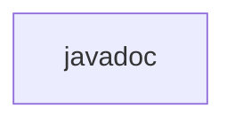

# 基础信息

|      |      |
|------|------|
| 名称 | javadoc |
| 编码语言 | .java |
| 代码路径 | spring-ldap/src/main/javadoc |
| 包名 | spring-ldap.src.main.javadoc |
| 概述说明 | None |

# 说明

None

### 包内部结构视图

流程图描述：该流程图展示了一个简单的路径结构，其中仅包含一个节点 "javadoc"，表示路径的最终文件夹名称。由于路径信息仅提供了一个单一的路径，因此流程图非常简单，没有进一步的层级关系或子节点。

# 文件列表 File List

| 名称   | 类型  | 说明 |
|-------|------|-------------|

