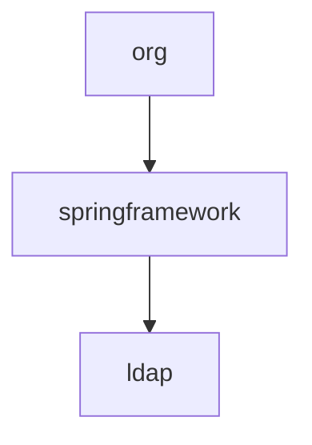

# 基础信息

|      |      |
|------|------|
| 名称 | org |
| 编码语言 | .java |
| 代码路径 | spring-ldap/test-support/src/main/java/org |
| 包名 | spring-ldap.test-support.src.main.java.org |
| 概述说明 | None |

# 说明

None

### 包内部结构视图

这段流程图展示了`spring-ldap/test-support/src/main/java/org`路径下的层级关系。首先，`org`目录下包含`springframework`子目录，而`springframework`目录下又包含`ldap`子目录。该流程图清晰地反映了从`org`到`ldap`的逐级嵌套结构，帮助开发者快速理解项目的目录组织方式。

# 文件列表 File List

| 名称   | 类型  | 说明 |
|-------|------|-------------|
| [springframework](springframework/_module.md) | package | None |

