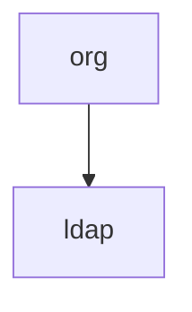

# 基础信息

|      |      |
|------|------|
| 名称 | springframework |
| 编码语言 | .java |
| 代码路径 | spring-ldap/test-support/src/main/java/org/springframework |
| 包名 | spring-ldap.test-support.src.main.java.org.springframework |
| 概述说明 | None |

# 说明

None

### 包内部结构视图

该流程图展示了路径的层级关系，其中`org`是顶级目录，`ldap`是`org`下的子目录。通过这种方式，清晰地表示了路径之间的从属关系，帮助开发者快速理解项目结构。

# 文件列表 File List

| 名称   | 类型  | 说明 |
|-------|------|-------------|
| [ldap](ldap/_module.md) | package | None |

