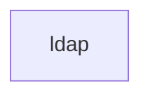

# 基础信息

|      |      |
|------|------|
| 名称 | ldap |
| 编码语言 | .java |
| 代码路径 | spring-ldap/test-support/src/main/java/org/springframework/ldap |
| 包名 | spring-ldap.test-support.src.main.java.org.springframework.ldap |
| 概述说明 | None |

# 说明

None

### 包内部结构视图

该流程图展示了路径的层级关系，`ldap`是路径的最后一个文件夹名称，没有进一步的子文件夹或文件。路径结构简单，仅包含一个节点，表示该路径的最终层级。

# 文件列表 File List

| 名称   | 类型  | 说明 |
|-------|------|-------------|

